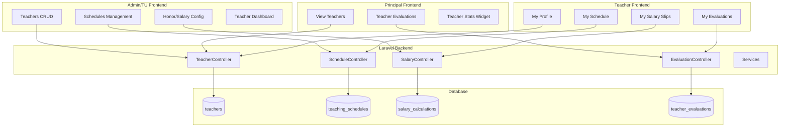

# Teacher Management - Cross-Frontend Implementation Strategy

## Phase 1: Feature Understanding

Teacher Management (TCH) is a P2 priority module that manages teacher employment data, teaching schedules, salary/honor calculation, and performance evaluation. The module has 5 Epics planned across ~5 weeks with 38 story points.

### Data Being Created/Managed

- Teacher profiles (personal data, employment status, subjects taught)
- Teaching schedules (day, time, class, subject assignments)
- Honor/salary configurations and calculations
- Teacher evaluations (4 competencies: Pedagogik, Kepribadian, Sosial, Profesional)

---

## Phase 2: Cross-Frontend Impact Mapping


| Feature             | Owner (Creates)                        | Consumer (Views)                                                                      | Data Flow                                            |
| ------------------- | -------------------------------------- | ------------------------------------------------------------------------------------- | ---------------------------------------------------- |
| Teacher CRUD        | Admin/TU - Create/Edit teacher data    | Principal - View teacher list, Admin - Manage, Teacher - View own profile             | Admin creates -> DB -> All roles view                |
| Teaching Schedule   | Admin/TU - Input schedules             | Teacher - View own schedule, Principal - View all, Parent - (indirect via class info) | Admin creates -> DB -> Teacher/Principal view        |
| Honor/Salary        | Admin/TU - Configure rates & calculate | Teacher - View own salary slip, Principal - View summary                              | Admin configures -> Calculates -> Teacher views slip |
| Teacher Evaluation  | Principal - Create evaluations         | Teacher - View own (read-only), Admin/TU - View all for HR                            | Principal creates -> Publish -> Teacher views        |
| Dashboard & Reports | System - Generates stats               | Admin/Principal - View dashboard                                                      | System aggregates -> Admin/Principal view            |


---

## Phase 3: Missing Implementation Detection

### Owner Side (Data Creation) - Currently in Plan

**Teacher CRUD (Admin):**

- UI form/interface for creating data
- Validation rules
- Edit/Update capability
- Delete/Archive capability (soft delete)
- Preview before publishing (N/A for this feature)
- Bulk operations - **MISSING: Bulk import teachers from Excel**

**Teaching Schedule (Admin):**

- UI form/interface (matrix view)
- Validation rules (conflict detection)
- Edit/Update capability
- Delete capability
- Copy from previous semester
- Bulk operations - **MISSING: Bulk schedule import**

**Honor/Salary (Admin):**

- Configure rates UI
- Trigger calculation
- Approval workflow
- Generate PDF slip
- Export payroll Excel

**Evaluation (Principal):**

- Create evaluation form
- Score 1-5 per competency
- Publish workflow
- Edit before publish
- **MISSING: Bulk evaluation (evaluate multiple teachers)**

### Consumer Side (Data Display)

**Teacher (Viewing Own Data):**

- View own schedule (existing in `Teacher/` pages)
- View own attendance (existing `MyAttendance.vue`)
- **GAP: View own profile - No dedicated page exists**
- **GAP: View own evaluation - Planned but not built**
- **GAP: View own salary slip - Not specified for teacher view**

**Principal (Viewing Teacher Data):**

- **GAP: Teacher list view - No page in Principal frontend**
- **GAP: Teacher evaluation management - No page specified**
- **GAP: Teacher attendance dashboard - Exists but limited**
- **GAP: Salary/payroll overview - Not in Principal frontend**

**Parent (Viewing Teacher Info):**

- **GAP: View child's teachers - No page exists**
- **GAP: Teacher contact info for child's class - Missing**

### Integration Points Needed

**API Endpoints:**

- Admin Teacher CRUD endpoints
- Admin Schedule CRUD endpoints
- Admin Salary calculation endpoints
- Principal Evaluation endpoints
- Teacher profile/evaluation view endpoints

**Navigation Updates:**

- Admin menu: Add "Guru" section with submenus
- Principal menu: Add teacher-related items
- Teacher menu: Add "Profil Saya", "Evaluasi Saya", "Slip Gaji"
- Parent menu: Add "Guru Anak Saya" (optional phase 2)

---

## Phase 4: Gap Analysis

### Critical Gaps (Feature Unusable Without)

**P0 - Teacher Cannot View Own Data:**

- Teacher portal exists for teaching tasks but lacks self-service features
- No "My Profile" page for teachers to view their own data
- No "My Salary" page for teachers to view their honor/slip gaji
- No "My Evaluation" page for teachers to view published evaluations

**P0 - Principal Cannot Evaluate Teachers:**

- Principal frontend has no pages for teacher evaluation
- Principal cannot access teacher list to start evaluation
- Evaluation workflow requires Principal-specific pages

### Important Gaps (Feature Incomplete Without)

**P1 - Principal Missing Teacher Overview:**

- No Teacher Dashboard in Principal frontend
- Cannot see teacher statistics or alerts
- Cannot quick-navigate to individual teacher profiles

**P1 - Mobile Considerations:**

- Schedule matrix needs mobile-friendly alternative (list view)
- Evaluation form needs mobile optimization
- Salary slip PDF needs mobile viewing support

### Nice-to-Have Gaps

**P2 - Parent Teacher Visibility:**

- Parents cannot see who teaches their child
- No teacher contact information in parent portal
- Could be phase 2 feature

---

## Phase 5: Implementation Sequencing

### What Must Be Built FIRST (Dependencies)

1. **Database & Models (Epic 1 - Day 1-2)**
  - `teachers` table migration
  - `subjects` table (if not exists - check existing `teacher_subjects` pivot)
  - `Teacher` model with relationships
  - Foundation for all other features
2. **Admin Teacher CRUD (Epic 1 - Day 2-5)**
  - Controller, routes, form requests
  - Vue pages: Index, Create, Edit, Show
  - Required before schedules, salary, evaluation

### What Can Be Built in PARALLEL (Independent)

After Foundation is complete:

**Stream A - Admin/TU Features:**

- Teaching Schedule Management (Epic 2)
- Honor/Salary Configuration & Calculation (Epic 3)

**Stream B - Principal Features:**

- Teacher Evaluation System (Epic 4)
- Can start after Teacher CRUD is done

**Stream C - Consumer Views (can start mid-development):**

- Teacher profile view for teachers
- Teacher evaluation view for teachers
- Teacher salary slip view for teachers

### What Should Be Built LAST (Dependent)

1. **Dashboard & Reports (Epic 5)**
  - Requires all other features to aggregate data
  - Statistics need schedule, salary, evaluation data
2. **Cross-Frontend Integration**
  - Principal viewing teacher data
  - Teacher viewing own data
  - Navigation updates

---

## Phase 6: Detailed Recommendations

### Admin Frontend Updates

**New Pages Needed:**


| Page                                     | Purpose                       | Priority |
| ---------------------------------------- | ----------------------------- | -------- |
| `Admin/Teachers/Index.vue`               | Teacher list with filters     | P0       |
| `Admin/Teachers/Create.vue`              | Add new teacher form          | P0       |
| `Admin/Teachers/Edit.vue`                | Edit teacher data             | P0       |
| `Admin/Teachers/Show.vue`                | Teacher profile with tabs     | P0       |
| `Admin/Teachers/Dashboard.vue`           | Teacher management dashboard  | P1       |
| `Admin/Teachers/Schedules/Index.vue`     | Schedule list                 | P0       |
| `Admin/Teachers/Schedules/ByTeacher.vue` | Matrix view per teacher       | P0       |
| `Admin/Teachers/Schedules/ByClass.vue`   | Matrix view per class         | P0       |
| `Admin/Teachers/Schedules/Create.vue`    | Add schedule form             | P0       |
| `Admin/Teachers/Salary/Index.vue`        | Salary calculation list       | P0       |
| `Admin/Teachers/Salary/Detail.vue`       | Individual calculation detail | P0       |
| `Admin/Teachers/Salary/Settings.vue`     | Honor rate configuration      | P0       |
| `Admin/Teachers/Evaluations/Index.vue`   | Evaluation list               | P1       |
| `Admin/Teachers/Evaluations/Create.vue`  | Evaluation form               | P1       |
| `Admin/Teachers/Evaluations/Show.vue`    | Evaluation detail             | P1       |


**Navigation Changes:**

```
Admin Menu:
├── Dashboard
├── Manajemen User
├── Data Siswa
├── Guru (NEW)
│   ├── Dashboard Guru
│   ├── Data Guru
│   ├── Jadwal Mengajar
│   ├── Rekap Honor
│   └── Evaluasi Guru (if role = kepala_sekolah)
├── Kehadiran
│   ├── Absensi Siswa
│   └── Presensi Guru (existing)
...
```

### Principal Frontend Updates

**New Pages Needed:**


| Page                                        | Purpose                | Priority |
| ------------------------------------------- | ---------------------- | -------- |
| `Principal/Teachers/Index.vue`              | View all teachers      | P1       |
| `Principal/Teachers/Show.vue`               | View teacher profile   | P1       |
| `Principal/Teachers/Evaluations/Index.vue`  | Manage evaluations     | P0       |
| `Principal/Teachers/Evaluations/Create.vue` | Create evaluation      | P0       |
| `Principal/Teachers/Evaluations/Show.vue`   | View evaluation detail | P0       |


**Updates to Existing Pages:**


| Page                      | Add                       | Priority |
| ------------------------- | ------------------------- | -------- |
| `Principal/Dashboard.vue` | Teacher statistics widget | P1       |
| Navigation                | "Guru" menu with submenus | P0       |


**Navigation Changes:**

```
Principal Menu:
├── Dashboard
├── Data Siswa
├── Guru (NEW)
│   ├── Data Guru
│   └── Evaluasi Guru
├── Kehadiran
├── Akademik
...
```

### Teacher Frontend Updates

**New Pages Needed:**


| Page                            | Purpose                       | Priority |
| ------------------------------- | ----------------------------- | -------- |
| `Teacher/Profile/Index.vue`     | View own profile              | P0       |
| `Teacher/Profile/Edit.vue`      | Edit allowed fields (contact) | P2       |
| `Teacher/Evaluations/Index.vue` | View own evaluations          | P0       |
| `Teacher/Evaluations/Show.vue`  | View evaluation detail        | P0       |
| `Teacher/Salary/Index.vue`      | View salary history           | P1       |
| `Teacher/Salary/Show.vue`       | View salary slip              | P1       |
| `Teacher/Schedule/Index.vue`    | View own full schedule        | P1       |


**Updates to Existing Pages:**


| Page                    | Add                                          | Priority |
| ----------------------- | -------------------------------------------- | -------- |
| `Teacher/Dashboard.vue` | Today's schedule widget, Evaluation alert    | P1       |
| Navigation              | "Profil", "Evaluasi", "Slip Gaji" menu items | P0       |


**Navigation Changes:**

```
Teacher Menu:
├── Dashboard
├── Data Siswa
├── Profil Saya (NEW)
├── Jadwal Saya (NEW - or enhance existing)
├── Presensi
├── Penilaian
├── Perizinan
├── Evaluasi Saya (NEW)
└── Slip Gaji (NEW)
```

### Parent Frontend Updates (Phase 2)

**New Pages (Optional/Phase 2):**


| Page                        | Purpose               | Priority |
| --------------------------- | --------------------- | -------- |
| `Parent/Teachers/Index.vue` | View child's teachers | P2       |


---

## Phase 7: Example User Journeys

### Journey 1: Admin Creates New Teacher

**Owner Journey:**

1. Admin navigates to: `/admin/teachers`
2. Admin clicks: "Tambah Guru Baru" button
3. Admin fills: NIP, NIK, nama, TTL, alamat, no HP, email, status (Tetap/Honorer), mata pelajaran (multi-select), foto (upload)
4. System does: Validates data, creates Teacher record, auto-creates User account with generated password
5. Admin sees: Success notification, redirected to teacher list

**Consumer Journey (Teacher views own profile):**

1. Teacher navigates to: `/teacher/profile`
2. Teacher sees: Personal data, assigned subjects, employment status
3. Teacher can: View details, see related info (schedule, attendance summary)
4. When teacher clicks: "Lihat Jadwal" → redirected to schedule page
5. Teacher achieves: Understands their employment record

### Journey 2: Principal Evaluates Teacher

**Owner Journey:**

1. Principal navigates to: `/principal/teachers/evaluations`
2. Principal clicks: "Buat Evaluasi" for specific teacher
3. Principal fills: Scores (1-5) for 4 competencies, catatan per competency, rekomendasi dropdown
4. System does: Auto-calculates overall score, saves as draft
5. Principal sees: Preview, clicks "Publish" to make visible to teacher

**Consumer Journey (Teacher views evaluation):**

1. Teacher navigates to: `/teacher/evaluations`
2. Teacher sees: List of published evaluations by semester
3. Teacher can: Click to view detail (read-only)
4. When teacher clicks: Detail evaluation → sees scores without evaluator name
5. Teacher achieves: Understands performance feedback

### Journey 3: Admin Calculates Monthly Salary

**Owner Journey:**

1. Admin navigates to: `/admin/teachers/salary`
2. Admin selects: Periode (month-year picker)
3. Admin clicks: "Hitung Gaji Semua Guru"
4. System does: Calculates based on schedule hours, attendance data, configured rates
5. Admin sees: List of all teachers with calculated amounts, status: Draft
6. Admin clicks: "Approve" per teacher or batch approve
7. Admin clicks: "Generate Slip PDF" or "Export Payroll Excel"

**Consumer Journey (Teacher views salary slip):**

1. Teacher navigates to: `/teacher/salary`
2. Teacher sees: Monthly salary history list
3. Teacher can: Select month to view detail
4. When teacher clicks: Specific month → sees breakdown (jam mengajar, tarif, potongan, total)
5. Teacher achieves: Understands salary calculation, can download PDF

---

## Architecture Diagram




---

## Summary: Priority Implementation Order


| Priority | Items                                                                         | Roles Affected            |
| -------- | ----------------------------------------------------------------------------- | ------------------------- |
| P0       | Teacher CRUD (Admin), Evaluation CRUD (Principal), Teacher self-service views | Admin, Principal, Teacher |
| P1       | Schedule Management, Salary Calculation, Dashboard widgets                    | Admin, Teacher            |
| P2       | Exports, Charts, Parent teacher visibility                                    | Admin, Principal, Parent  |


The existing plan in `/temp/` folder is comprehensive for Admin-side implementation but needs supplementation with:

1. Principal-specific pages for evaluation
2. Teacher self-service pages
3. Navigation updates for all roles
4. Mobile considerations for schedule matrix

