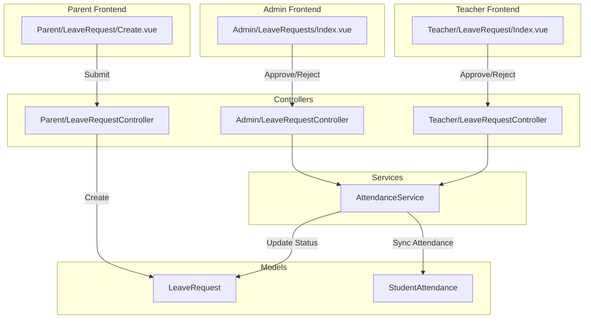

# Sprint B: Admin Leave Verification (P0)

## Context Analysis

**Existing Infrastructure (Reusable):**

- `AttendanceService::approveLeaveRequest()` and `rejectLeaveRequest()` - already support admin/principal roles
- `ApproveLeaveRequestRequest` - already authorizes SUPERADMIN, ADMIN, PRINCIPAL roles
- `Teacher/LeaveRequest/Index.vue` - UI pattern to replicate for Admin
- `LeaveRequest` model with all necessary relationships and scopes

**Current Gap Identified:**

Admin (TU) cannot verify student leave requests because no route/page exists. The backend logic (`ApproveLeaveRequestRequest`) already authorizes Admin roles, but there's no controller or frontend to utilize this.

---

## Phase 1: Backend Implementation

### 1.1 Create Admin Leave Request Controller

**File:** `app/Http/Controllers/Admin/LeaveRequestController.php`

This controller will:

- Inject `AttendanceService` for approval/rejection logic
- List ALL leave requests (not scoped to wali kelas like Teacher)
- Use same `ApproveLeaveRequestRequest` for validation (already supports Admin)

**Key methods:**

```php
public function index(): Response
{
    // Get ALL leave requests with filters
    // - Filter by: status, date range, class, student
    $leaveRequests = LeaveRequest::with(['student.kelas', 'submittedBy', 'reviewedBy'])
        ->when($filters['status'], fn($q, $status) => $q->where('status', $status))
        ->when($filters['class_id'], fn($q, $classId) => $q->whereHas('student', fn($q) => $q->where('kelas_id', $classId)))
        ->latest()
        ->paginate(20);

    return Inertia::render('Admin/LeaveRequests/Index', [...]);
}

public function approve(ApproveLeaveRequestRequest $request, LeaveRequest $leaveRequest)
{
    // Reuse AttendanceService logic (same as Teacher)
}
```

### 1.2 Register Routes

**File:** `routes/web.php`

Add inside Admin middleware group (after line 94):

```php
// Student Leave Request Verification Routes
Route::get('leave-requests', [AdminLeaveRequestController::class, 'index'])
    ->name('leave-requests.index');
Route::post('leave-requests/{leaveRequest}/approve', [AdminLeaveRequestController::class, 'approve'])
    ->name('leave-requests.approve');
```

---

## Phase 2: Frontend Implementation

### 2.1 Page Structure

**File:** `resources/js/pages/Admin/LeaveRequests/Index.vue`

Purpose: Display all student leave requests with verification actions

**Features:**

- Summary stats cards (Pending, Approved, Rejected)
- Filter by: Status (tabs), Date Range, Class
- Table/Card list with: Student name, Class, Type, Dates, Status, Actions
- Approve/Reject buttons (same pattern as `Teacher/LeaveRequest/Index.vue`)
- Rejection modal with reason textarea
- Pagination

**Reuse from existing:**

- `LeaveStatusBadge.vue` component
- `useModal` composable for confirmations
- `useHaptics` composable for feedback
- UI patterns from `Teacher/LeaveRequest/Index.vue`

### 2.2 Key Differences from Teacher Version

| Aspect | Teacher | Admin |

|--------|---------|-------|

| Scope | Only students in their class | ALL students |

| Filters | None | Class filter, date range |

| Stats | Class-scoped | School-wide |

---

## Phase 3: Navigation Updates

### 3.1 Update AppLayout Sidebar

**File:** `resources/js/components/layouts/AppLayout.vue`

Add menu item for Admin role (around line 183):

```typescript
{ name: 'Verifikasi Izin', route: 'admin.leave-requests.index', icon: FileText },
```

Add route mapping (around line 80):

```typescript
'admin.leave-requests.index': adminLeaveRequestsIndex().url,
```

---

## Phase 4: Wayfinder Route Generation

After adding routes, run: `php artisan wayfinder:generate`

This generates TypeScript route helpers in `resources/js/routes/admin/leave-requests/`.

---

## Data Flow Diagram




---

## Key Files Summary

**Create:**

- `app/Http/Controllers/Admin/LeaveRequestController.php`
- `resources/js/pages/Admin/LeaveRequests/Index.vue`

**Modify:**

- `routes/web.php` - Add admin leave request routes
- `resources/js/components/layouts/AppLayout.vue` - Add navigation menu

---

## Acceptance Criteria

- Admin can access `/admin/leave-requests` and see all student leave requests
- Admin can filter by status, class, and date range
- Admin can approve leave requests with confirmation
- Admin can reject leave requests with mandatory reason (min 10 chars)
- Approved leaves auto-sync to student_attendances (via AttendanceService)
- Navigation menu shows "Verifikasi Izin" for Admin role
- Stats show school-wide counts (not scoped to class)

---

## Implementation Notes

1. **Backend authorization already exists** - `ApproveLeaveRequestRequest::authorize()` already checks for ADMIN role
2. **AttendanceService methods are role-agnostic** - Can be called by Teacher or Admin
3. **UI pattern established** - Copy and enhance `Teacher/LeaveRequest/Index.vue`
4. **Class filter needed** - Admin needs to filter by class since they see all requests

