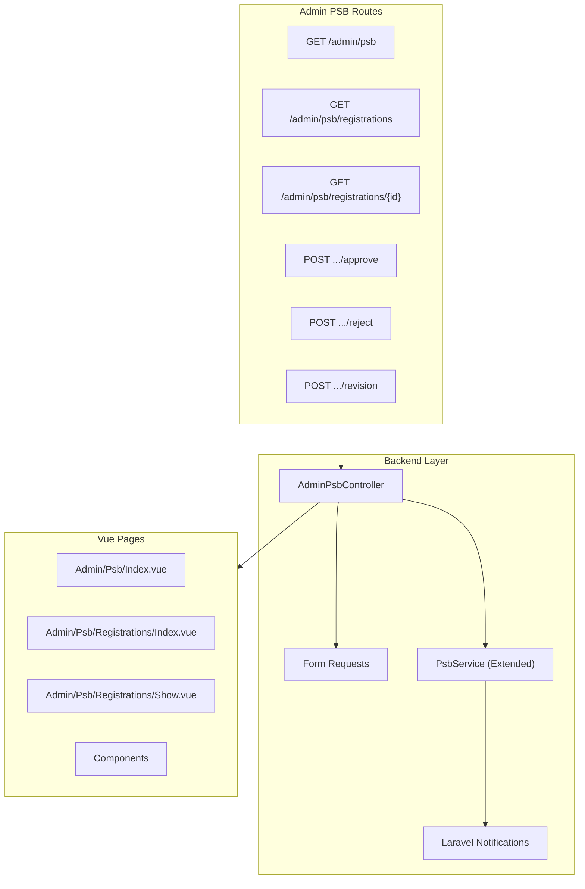

# Epic 2: Admin PSB Verification System

## Overview

Sistem verifikasi PSB untuk Admin/TU yang memungkinkan memproses pendaftaran siswa baru: approve, reject, atau request revision dokumen. System ini terintegrasi dengan foundation PSB dari Epic 1.

## Architecture




## File Structure

```
app/
├── Http/
│   ├── Controllers/Admin/
│   │   └── AdminPsbController.php (new)
│   └── Requests/Psb/
│       ├── ApproveRegistrationRequest.php (new)
│       ├── RejectRegistrationRequest.php (new)
│       └── RequestRevisionRequest.php (new)
├── Notifications/
│   ├── PsbRegistrationApproved.php (new)
│   ├── PsbRegistrationRejected.php (new)
│   └── PsbDocumentRevisionRequested.php (new)
└── Services/
    └── PsbService.php (extend existing)

resources/js/
├── pages/Admin/Psb/
│   ├── Index.vue (dashboard - new)
│   └── Registrations/
│       ├── Index.vue (list - new)
│       └── Show.vue (detail - new)
└── components/features/psb/
    ├── PsbDocumentPreview.vue (new)
    ├── PsbRegistrationTable.vue (new)
    └── PsbActionModal.vue (new)

routes/
└── admin.php (extend existing)
```

---

## Backend Implementation

### 1. Routes - [routes/admin.php](routes/admin.php)

Add PSB routes within existing admin middleware group:

```php
// PSB Management - Verifikasi pendaftaran siswa baru
Route::prefix('psb')->name('psb.')->group(function () {
    Route::get('/', [AdminPsbController::class, 'index'])->name('index');
    Route::get('registrations', [AdminPsbController::class, 'registrations'])->name('registrations.index');
    Route::get('registrations/{registration}', [AdminPsbController::class, 'show'])->name('registrations.show');
    Route::post('registrations/{registration}/approve', [AdminPsbController::class, 'approve'])->name('registrations.approve');
    Route::post('registrations/{registration}/reject', [AdminPsbController::class, 'reject'])->name('registrations.reject');
    Route::post('registrations/{registration}/revision', [AdminPsbController::class, 'requestRevision'])->name('registrations.revision');
});
```

### 2. Controller - `app/Http/Controllers/Admin/AdminPsbController.php`

Key methods:

- `index()` - Dashboard with stats from `PsbService::getSummaryStats()`
- `registrations()` - List with filters (status, search, date range) using `PsbService::getRegistrations()`
- `show()` - Detail view with documents using `PsbService::getRegistrationDetail()`
- `approve()` - Approve registration, dispatch notification
- `reject()` - Reject with reason, dispatch notification
- `requestRevision()` - Request document revision, dispatch notification

### 3. Form Requests

Create 3 form requests in `app/Http/Requests/Psb/`:

- `ApproveRegistrationRequest` - optional notes (max 500 chars)
- `RejectRegistrationRequest` - required rejection_reason (max 1000 chars)
- `RequestRevisionRequest` - required documents array with id and revision_note

### 4. PsbService Extension - [app/Services/PsbService.php](app/Services/PsbService.php)

Add new methods to existing service:

```php
public function approveRegistration(PsbRegistration $registration, User $verifier, ?string $notes = null): bool
public function rejectRegistration(PsbRegistration $registration, User $verifier, string $reason): bool
public function requestDocumentRevision(PsbRegistration $registration, array $documents): bool
public function getRegistrations(array $filters = [], int $perPage = 15): LengthAwarePaginator
public function getRegistrationDetail(PsbRegistration $registration): array
public function getSummaryStats(): array
```

Key logic:

- `approveRegistration()`: Update status to `approved`, set `verified_by`, `verified_at`
- `rejectRegistration()`: Update status to `rejected`, set `rejection_reason`
- `requestDocumentRevision()`: Update registration status to `document_review`, update document statuses to `revision_needed` with notes
- `getSummaryStats()`: Single query using `selectRaw` with `CASE WHEN` for efficient counting

### 5. Notifications - `app/Notifications/`

Create 3 queued notifications:

- `PsbRegistrationApproved` - Email + database notification
- `PsbRegistrationRejected` - Email + database notification with rejection reason
- `PsbDocumentRevisionRequested` - Email + database notification with document list

Each notification:

- Implements `ShouldQueue` for performance
- Uses `mail` and `database` channels
- Includes registration number, student name, and next steps
- Uses Bahasa Indonesia

**Note:** Since PSB registration doesn't have a User account, notifications will be sent to `father_email` or `mother_email` using `Notification::route('mail', $email)->notify()`

---

## Frontend Implementation

### 1. Dashboard Page - `resources/js/pages/Admin/Psb/Index.vue`

Stats cards showing:

- Total registrations
- Pending count (badge)
- Document review count
- Approved/Rejected/Waiting List counts

Quick actions to navigate to filtered lists.

### 2. Registrations List - `resources/js/pages/Admin/Psb/Registrations/Index.vue`

Features:

- Table with columns: No. Registrasi, Nama, Tanggal Daftar, Status, Actions
- Status tabs/filter (all, pending, document_review, approved, rejected, waiting_list)
- Search by nama atau nomor registrasi (debounced)
- Pagination using existing pattern from [UserTable.vue](resources/js/components/features/users/UserTable.vue)
- Status badges with colors:
  - pending: amber
  - document_review: blue
  - approved: emerald
  - rejected: red
  - waiting_list: orange
- Mobile card view (responsive)

### 3. Registration Detail - `resources/js/pages/Admin/Psb/Registrations/Show.vue`

Sections:

- Header: Nomor registrasi, status badge, created date
- Data Siswa: Biodata lengkap
- Data Orang Tua: Ayah & Ibu
- Dokumen: Grid dengan `PsbDocumentPreview` component
- Actions: Approve, Reject, Request Revision buttons
- Timeline: Status history (reuse existing [PsbTimeline.vue](resources/js/components/features/psb/PsbTimeline.vue))

### 4. Components

**PsbDocumentPreview.vue:**

- Thumbnail preview (image or PDF icon)
- Click for lightbox
- Status indicator badge
- Revision note tooltip
- Selectable checkbox for revision request

**PsbActionModal.vue:**

- Approve modal: optional notes textarea, confirm button
- Reject modal: required reason textarea, confirm button
- Revision modal: document checklist with notes per document

**PsbRegistrationTable.vue:**

- Reusable table component following [UserTable.vue](resources/js/components/features/users/UserTable.vue) pattern
- Desktop table + mobile cards
- Skeleton loading states

### 5. Navigation Update - [AppLayout.vue](resources/js/components/layouts/AppLayout.vue)

Add PSB menu item to admin menu (around line 352-393):

```typescript
{
    name: 'PSB',
    icon: UserPlusIcon,
    children: [
        { name: 'Dashboard', route: 'admin.psb.index' },
        { name: 'Pendaftaran', route: 'admin.psb.registrations.index', badge: pendingPsbCount },
    ]
}
```

Badge shows count of pending registrations from page props.

---

## Testing

Feature tests for:

- Admin can view registration list with filters
- Admin can view registration detail
- Admin can approve registration (status changes, notification sent)
- Admin can reject registration (status changes, rejection_reason saved, notification sent)
- Admin can request document revision (document statuses updated, notification sent)
- Non-admin cannot access PSB routes (403)

---

## Integration Notes

- Status updates reflect on public tracking page (Epic 1 Task 1.8 already implemented)
- Notifications use parent email from registration data (no User account)
- Follow existing patterns from LeaveRequest verification flow
- Use existing `BaseModal`, `DialogModal` components
- Follow iOS design system from skill file

