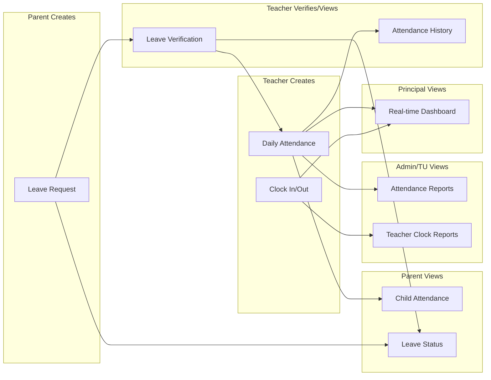
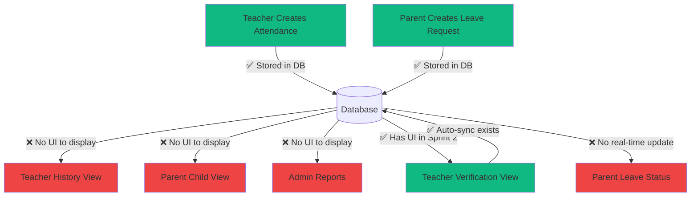
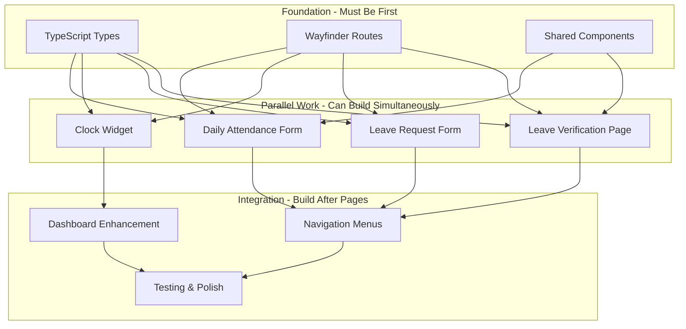

# Sprint 2: Core Attendance Features Implementation

## Executive Summary

Sprint 2 focuses on completing the 4 critical features that enable basic attendance workflow: teachers can record daily attendance, clock in/out, parents can submit leave requests, and teachers can verify them. **All backend infrastructure (migrations, models, services, controllers, routes) is already built in Sprint 1 (P0).** This sprint is **FRONTEND-FOCUSED**: building Vue components and pages that consume existing backend APIs.

## Current State Assessment

### ✅ Already Implemented (Sprint 1 - P0)

- Database migrations for all 5 attendance tables
- Eloquent models: `StudentAttendance`, `LeaveRequest`, `TeacherAttendance`, `SubjectAttendance`, `TeacherLeave`
- [`app/Services/AttendanceService.php`](app/Services/AttendanceService.php) - Complete business logic (462 lines)
- Backend controllers with TODO markers for UI:
  - [`app/Http/Controllers/Teacher/AttendanceController.php`](app/Http/Controllers/Teacher/AttendanceController.php)
  - [`app/Http/Controllers/Teacher/ClockController.php`](app/Http/Controllers/Teacher/ClockController.php)
  - [`app/Http/Controllers/Parent/LeaveRequestController.php`](app/Http/Controllers/Parent/LeaveRequestController.php)
  - [`app/Http/Controllers/Teacher/LeaveRequestController.php`](app/Http/Controllers/Teacher/LeaveRequestController.php)
- Form Request validation classes (all exist in [`app/Http/Requests/`](app/Http/Requests/))
- API routes in [`routes/web.php`](routes/web.php) (lines 90-119, 127-133)

### ❌ Missing (Sprint 2 Scope)

- **Frontend Pages**: All Vue pages return placeholder renders with `TODO Sprint 2` comments
- **UI Components**: Attendance forms, clock widget, leave request cards
- **TypeScript Types**: Attendance-related type definitions
- **Navigation Menu Updates**: Add attendance menu items to sidebars
- **Wayfinder Routes**: TypeScript route definitions

---

## PHASE 1: FEATURE UNDERSTANDING

### Sprint 2 Features

| Feature | Owner (Creates Data) | Consumer (Views Data) | Data Flow |

|---------|---------------------|----------------------|-----------|

| **Daily Attendance Input** | Teacher - [`Teacher/Attendance/Create.vue`](resources/js/pages/Teacher/Attendance/) | Teacher (history), Admin/TU (reports), Parent (view child), Principal (dashboard) | Teacher selects class → Input H/I/S/A for each student → POST `/teacher/attendance/daily` → StudentAttendances table |

| **Clock In/Out Widget** | Teacher - Widget in [`Dashboard/TeacherDashboard.vue`](resources/js/pages/Dashboard/TeacherDashboard.vue) | TU/Admin (payroll report), Principal (presence monitor) | Teacher clicks "Masuk" → Browser requests GPS → POST `/teacher/clock/in` → TeacherAttendances table |

| **Leave Request Form** | Parent - [`Parent/LeaveRequest/Create.vue`](resources/js/pages/Parent/LeaveRequest/) | Teacher (verification), TU (monitor), Parent (history) | Parent fills form → Upload attachment → POST `/parent/leave-requests` → LeaveRequests table (status: PENDING) |

| **Leave Verification** | Teacher - [`Teacher/LeaveRequest/Index.vue`](resources/js/pages/Teacher/LeaveRequest/) | Parent (notification), Admin (monitor) | Teacher reviews request → Click Approve → POST `/teacher/leave-requests/{id}/approve` → Auto-sync to StudentAttendances |

---

## PHASE 2: CROSS-FRONTEND IMPACT MAPPING

### Data Creation vs Consumption Matrix



---

## PHASE 3: MISSING IMPLEMENTATION DETECTION

### Feature 1: Daily Attendance Input

#### Owner Side (Teacher Creates Data)

- ❌ **UI Form**: [`resources/js/pages/Teacher/Attendance/Create.vue`](resources/js/pages/Teacher/Attendance/) - Does not exist
- ✅ **Validation**: [`app/Http/Requests/StoreStudentAttendanceRequest.php`](app/Http/Requests/StoreStudentAttendanceRequest.php) exists
- ❌ **Edit Capability**: Update attendance (controller method exists, no UI)
- ❌ **Bulk Input**: Radio buttons for each student in class
- ❌ **Class Selection**: Dropdown for teacher's classes

#### Consumer Side (Where Data Appears)

- ❌ **Attendance History**: [`Teacher/Attendance/Index.vue`](resources/js/pages/Teacher/Attendance/) - Returns empty render
- ❌ **Parent View**: No attendance tab in [`Parent/Children/Show.vue`](resources/js/pages/Parent/Children/Show.vue)
- ❌ **Admin Reports**: [`Admin/Attendance/StudentsIndex.vue`](resources/js/pages/Admin/Attendance/) - Does not exist
- ❌ **Principal Dashboard**: No attendance card in [`Dashboard/PrincipalDashboard.vue`](resources/js/pages/Dashboard/PrincipalDashboard.vue)

#### Integration Points

- ✅ **API Endpoint**: `POST /teacher/attendance/daily` (exists)
- ✅ **Database Schema**: `student_attendances` table (exists)
- ❌ **TypeScript Types**: `StudentAttendance` interface missing
- ❌ **Navigation Menu**: No "Absensi" menu in Teacher sidebar
- ❌ **Empty State**: When no attendance recorded yet
- ❌ **Loading State**: Skeleton while submitting

### Feature 2: Clock In/Out Widget

#### Owner Side (Teacher Creates Data)

- ❌ **Widget UI**: No clock widget in [`Dashboard/TeacherDashboard.vue`](resources/js/pages/Dashboard/TeacherDashboard.vue)
- ✅ **Validation**: [`app/Http/Requests/ClockInRequest.php`](app/Http/Requests/ClockInRequest.php) exists
- ❌ **GPS Permission**: Browser geolocation API integration
- ❌ **Status Display**: "Belum Clock In" vs "Sudah Clock In 07:15"
- ❌ **Real-time Update**: Widget updates after clock in/out

#### Consumer Side (Where Data Appears)

- ❌ **TU Payroll Report**: [`Admin/Attendance/TeachersIndex.vue`](resources/js/pages/Admin/Attendance/) - Does not exist
- ❌ **Principal Monitor**: No teacher presence card in Principal dashboard

#### Integration Points

- ✅ **API Endpoints**: `POST /teacher/clock/in`, `POST /teacher/clock/out`, `GET /teacher/clock/status` (exist)
- ✅ **Database Schema**: `teacher_attendances` table (exists)
- ❌ **TypeScript Types**: `TeacherAttendance` interface missing
- ❌ **Haptic Feedback**: Medium haptic on clock in/out
- ❌ **Error Handling**: Already clocked in/out today

### Feature 3: Leave Request Form

#### Owner Side (Parent Creates Data)

- ❌ **Form UI**: [`resources/js/pages/Parent/LeaveRequest/Create.vue`](resources/js/pages/Parent/LeaveRequest/) - Does not exist
- ✅ **Validation**: [`app/Http/Requests/StoreLeaveRequestRequest.php`](app/Http/Requests/StoreLeaveRequestRequest.php) exists
- ❌ **File Upload**: Attachment photo (surat dokter)
- ❌ **Date Range Picker**: Start date - End date
- ❌ **Child Selection**: Dropdown for multiple children
- ❌ **Preview Attachment**: Before submit

#### Consumer Side (Where Data Appears)

- ❌ **History View**: [`Parent/LeaveRequest/Index.vue`](resources/js/pages/Parent/LeaveRequest/) - Exists but needs UI enhancement
- ❌ **Status Badge**: Pending/Approved/Rejected with colors
- ❌ **Detail Modal**: View full leave request with attachment

#### Integration Points

- ✅ **API Endpoint**: `POST /parent/leave-requests` (exists)
- ✅ **Database Schema**: `leave_requests` table (exists)
- ❌ **TypeScript Types**: `LeaveRequest` interface missing
- ❌ **Navigation Menu**: No "Pengajuan Izin" menu in Parent sidebar
- ❌ **File Storage**: Attachment upload to `storage/app/public/leave-attachments`

### Feature 4: Leave Verification

#### Owner Side (Teacher/TU Verifies Data)

- ❌ **Verification Page**: [`Teacher/LeaveRequest/Index.vue`](resources/js/pages/Teacher/LeaveRequest/) - Exists but returns empty
- ✅ **Validation**: [`app/Http/Requests/ApproveLeaveRequestRequest.php`](app/Http/Requests/ApproveLeaveRequestRequest.php) exists
- ❌ **Approve/Reject Buttons**: Action buttons with confirmation modal
- ❌ **Rejection Reason**: Textarea for rejection feedback
- ❌ **Attachment Preview**: Lightbox for viewing attachment

#### Consumer Side (Where Data Appears)

- ❌ **Parent Notification**: Real-time or email notification (NOT in Sprint 2, defer to P2)
- ❌ **Badge Notification**: Count of pending requests in Teacher sidebar

#### Integration Points

- ✅ **API Endpoint**: `POST /teacher/leave-requests/{id}/approve` (exists)
- ✅ **Auto-sync Logic**: [`AttendanceService::syncLeaveToAttendance()`](app/Services/AttendanceService.php) line 249 (exists)
- ❌ **Optimistic UI**: Update list immediately after approval
- ❌ **Toast Feedback**: Success/error messages

---

## PHASE 4: GAP ANALYSIS

### Critical Gaps

| Gap | Type | Impact | Priority |

|-----|------|--------|----------|

| ⚠️ No attendance input UI | Frontend | Teachers cannot record attendance at all | **P0 BLOCKER** |

| ⚠️ No clock widget | Frontend | Teachers cannot track presence | **P0 BLOCKER** |

| ⚠️ No leave request form | Frontend | Parents cannot submit leave requests | **P0 BLOCKER** |

| ⚠️ No leave verification UI | Frontend | Leave requests stuck in pending forever | **P0 BLOCKER** |

| ⚠️ Parents cannot see child attendance | Frontend | Parents have no visibility of attendance data | **P1 IMPORTANT** |

| No notification system | Backend | Users don't know when action is needed | **P2 DEFER** |

| No attendance reports | Frontend | Admin cannot export payroll/attendance | **P2 DEFER** |

### Owner-Consumer Alignment



**Gap Summary**: Sprint 2 focuses on **Owner UIs (data creation)**. Consumer UIs beyond basic verification are deferred to P2 (Reports phase).

---

## PHASE 5: IMPLEMENTATION SEQUENCING

### Dependency Chain



### Priority Matrix

| Component | Priority | Estimation | Dependency | Can Parallelize? |

|-----------|----------|-----------|------------|------------------|

| **Foundation** |

| TypeScript Types | P0 | 2 hours | None | ❌ Must be first |

| Wayfinder Routes | P0 | 1 hour | None | ❌ Must be first |

| Shared Components | P0 | 4 hours | Types | ❌ Must be first |

| **Feature Pages** |

| Daily Attendance Form | P0 | 1 day | Foundation | ✅ Parallel |

| Clock In/Out Widget | P0 | 1 day | Foundation | ✅ Parallel |

| Leave Request Form | P0 | 1 day | Foundation | ✅ Parallel |

| Leave Verification Page | P0 | 1 day | Foundation | ✅ Parallel |

| **Integration** |

| Navigation Menus | P1 | 3 hours | Feature Pages | ❌ After pages |

| Dashboard Cards | P1 | 2 hours | Clock Widget | ❌ After widget |

| Testing All Features | P1 | 1 day | All above | ❌ Final step |

**Total Estimation**: 6-7 working days (1.5 weeks with buffer)

---

## PHASE 6: DETAILED RECOMMENDATIONS

### New Files to Create

#### TypeScript Types

- **File**: [`resources/js/types/attendance.ts`](resources/js/types/attendance.ts)
- **Priority**: P0
- **Content**:
```typescript
export interface StudentAttendance {
    id: number;
    student_id: number;
    class_id: number;
    tanggal: string;
    status: 'H' | 'I' | 'S' | 'A';
    keterangan?: string;
    recorded_by: number;
    recorded_at: string;
    student?: Student;
    recorded_by_user?: User;
}

export interface LeaveRequest {
    id: number;
    student_id: number;
    jenis: 'IZIN' | 'SAKIT';
    tanggal_mulai: string;
    tanggal_selesai: string;
    alasan: string;
    attachment_path?: string;
    status: 'PENDING' | 'APPROVED' | 'REJECTED';
    submitted_by: number;
    reviewed_by?: number;
    reviewed_at?: string;
    rejection_reason?: string;
    student?: Student;
}

export interface TeacherAttendance {
    id: number;
    teacher_id: number;
    tanggal: string;
    clock_in?: string;
    clock_out?: string;
    status: 'HADIR' | 'TERLAMBAT' | 'IZIN' | 'SAKIT' | 'ALPHA';
    is_late: boolean;
    duration?: string;
}
```


#### Shared Components (P0)

1. **AttendanceStatusBadge.vue**

   - **Path**: [`resources/js/components/features/attendance/AttendanceStatusBadge.vue`](resources/js/components/features/attendance/)
   - **Props**: `status: 'H' | 'I' | 'S' | 'A'`
   - **Usage**: All attendance displays
   - **Design**: Emerald for H, Amber for I, Sky for S, Red for A

2. **LeaveStatusBadge.vue**

   - **Path**: [`resources/js/components/features/attendance/LeaveStatusBadge.vue`](resources/js/components/features/attendance/)
   - **Props**: `status: 'PENDING' | 'APPROVED' | 'REJECTED'`
   - **Usage**: Leave request cards
   - **Design**: Amber for PENDING, Emerald for APPROVED, Red for REJECTED

3. **ClockWidget.vue**

   - **Path**: [`resources/js/components/features/attendance/ClockWidget.vue`](resources/js/components/features/attendance/)
   - **Props**: `teacher: User`
   - **Features**: Clock in/out buttons, GPS request, status display, duration counter
   - **Usage**: Teacher dashboard

4. **LeaveRequestCard.vue**

   - **Path**: [`resources/js/components/features/attendance/LeaveRequestCard.vue`](resources/js/components/features/attendance/)
   - **Props**: `leaveRequest: LeaveRequest`
   - **Features**: Student info, date range, attachment preview, approve/reject buttons
   - **Usage**: Teacher verification page

#### Feature Pages (P0)

1. **Daily Attendance Input**

   - **Path**: [`resources/js/pages/Teacher/Attendance/Create.vue`](resources/js/pages/Teacher/Attendance/)
   - **Layout**: Class selector dropdown → Student table with radio buttons (H/I/S/A) → Submit button
   - **Features**: 
     - Auto-load class students
     - Default all to "Hadir"
     - Keterangan textarea for non-present
     - Summary count: "Hadir: 28, Alpha: 2"
     - Validation: prevent duplicate for same date
   - **Backend**: Uses existing `POST /teacher/attendance/daily`

2. **Attendance History**

   - **Path**: [`resources/js/pages/Teacher/Attendance/Index.vue`](resources/js/pages/Teacher/Attendance/)
   - **Layout**: Date filter → Class filter → Table with edit buttons
   - **Features**:
     - Pagination
     - Date range picker
     - Edit attendance (update status)
     - Summary cards
   - **Backend**: Create new `GET /teacher/attendance` controller method

3. **Clock In/Out Widget**

   - **Path**: Update [`resources/js/pages/Dashboard/TeacherDashboard.vue`](resources/js/pages/Dashboard/TeacherDashboard.vue)
   - **Location**: Add as first card in dashboard grid
   - **Features**:
     - Check status on mount: `GET /teacher/clock/status`
     - "Masuk" button → request GPS → `POST /teacher/clock/in`
     - "Pulang" button → request GPS → `POST /teacher/clock/out`
     - Display: "Sudah Clock In 07:15 WIB" or "Belum Clock In"
     - Show duration if clocked out
   - **Backend**: Uses existing clock endpoints

4. **Leave Request Form**

   - **Path**: [`resources/js/pages/Parent/LeaveRequest/Create.vue`](resources/js/pages/Parent/LeaveRequest/)
   - **Layout**: Child selector → Leave type (Izin/Sakit) → Date range → Reason textarea → File upload → Submit
   - **Features**:
     - Child dropdown (multi-child support)
     - Date range validation (start <= end)
     - File upload with preview
     - Max file size: 2MB
     - Supported: JPG, PNG, PDF
   - **Backend**: Uses existing `POST /parent/leave-requests`

5. **Leave Request History**

   - **Path**: Update [`resources/js/pages/Parent/LeaveRequest/Index.vue`](resources/js/pages/Parent/LeaveRequest/)
   - **Layout**: Create button → Table with status badges → Detail modal
   - **Features**:
     - Filter by status
     - Filter by child
     - View attachment in modal
     - Status badge with color coding
   - **Backend**: Already implemented, just needs UI enhancement

6. **Leave Verification Page**

   - **Path**: Update [`resources/js/pages/Teacher/LeaveRequest/Index.vue`](resources/js/pages/Teacher/LeaveRequest/)
   - **Layout**: Pending requests grid → Each card has student info, dates, reason, attachment, approve/reject buttons
   - **Features**:
     - Filter: Pending/Approved/Rejected
     - Attachment lightbox preview
     - Approve confirmation: "Izin akan otomatis tercatat di absensi"
     - Reject modal: Textarea for reason
     - Optimistic UI update
   - **Backend**: Uses existing `POST /teacher/leave-requests/{id}/approve`

### Navigation Menu Updates

#### Teacher Sidebar

- **File**: [`resources/js/components/layouts/AppLayout.vue`](resources/js/components/layouts/AppLayout.vue) (navigation section)
- **Add Menu Item**:
  - Icon: `ClipboardCheck` from lucide-vue-next
  - Label: "Absensi"
  - Submenu:
    - "Input Harian" → `/teacher/attendance/daily`
    - "Riwayat" → `/teacher/attendance`
    - "Verifikasi Izin" → `/teacher/leave-requests` (with badge count)

#### Parent Sidebar

- **Add Menu Item**:
  - Icon: `FileText` from lucide-vue-next
  - Label: "Pengajuan Izin"
  - Link: `/parent/leave-requests`

### Wayfinder Routes

- **File**: Create [`resources/js/routes/teacher/attendance.ts`](resources/js/routes/teacher/)
- **File**: Create [`resources/js/routes/teacher/leave-requests.ts`](resources/js/routes/teacher/)
- **File**: Create [`resources/js/routes/parent/leave-requests.ts`](resources/js/routes/parent/)
- **Regenerate**: Run `php artisan wayfinder:generate` after defining routes

---

## PHASE 7: EXAMPLE USER JOURNEYS

### Journey 1: Teacher Records Daily Attendance

**Owner Journey (Teacher)**:

1. Teacher logs in at 07:00, navigates to `/teacher/dashboard`
2. Teacher clicks sidebar menu "Absensi" → "Input Harian"
3. Page loads [`Teacher/Attendance/Create.vue`](resources/js/pages/Teacher/Attendance/Create.vue)
4. System auto-selects teacher's homeroom class (kelas wali)
5. Table displays all 30 students, all pre-checked as "Hadir" (H)
6. Teacher changes 2 students to "Alpha" (A), adds keterangan "Tidak ada kabar"
7. Teacher clicks "Simpan Absensi" button
8. Form validation: checks no duplicate for today's date
9. `POST /teacher/attendance/daily` with payload:
   ```json
   {
     "class_id": 5,
     "tanggal": "2025-12-28",
     "attendances": [
       {"student_id": 1, "status": "H"},
       {"student_id": 2, "status": "A", "keterangan": "Tidak ada kabar"},
       ...
     ]
   }
   ```

10. Backend calls [`AttendanceService::recordDailyAttendance()`](app/Services/AttendanceService.php)
11. Success: Toast "Berhasil menyimpan presensi untuk 30 siswa. Hadir: 28, Alpha: 2"
12. Redirect to `/teacher/attendance` (history page)

**Consumer Journey (Parent Sees Attendance)**:

1. Parent logs in at 19:00, navigates to `/parent/children`
2. Parent clicks child card → [`Parent/Children/Show.vue`](resources/js/pages/Parent/Children/Show.vue)
3. **TODO P2**: Add "Absensi" tab in `StudentDetailTabs.vue`
4. Tab shows attendance calendar with color-coded dates
5. Parent sees today marked red (Alpha), clicks for detail
6. Modal shows: "Alpha - Tidak ada kabar - Dicatat oleh: Ibu Siti"

### Journey 2: Teacher Clock In with GPS

**Owner Journey (Teacher)**:

1. Teacher arrives at school at 07:15, opens dashboard on mobile
2. [`Dashboard/TeacherDashboard.vue`](resources/js/pages/Dashboard/TeacherDashboard.vue) loads
3. `ClockWidget.vue` component calls `GET /teacher/clock/status` on mount
4. Response: `{ "is_clocked_in": false }`
5. Widget displays: "Belum Clock In" with green "Masuk" button
6. Teacher taps "Masuk" button (haptic: medium)
7. Browser prompts: "Allow geolocation?"
8. Teacher allows → GPS captured: `{ lat: -6.2088, lng: 106.8456 }`
9. `POST /teacher/clock/in` with `{ latitude: -6.2088, longitude: 106.8456 }`
10. Backend calls [`AttendanceService::clockIn()`](app/Services/AttendanceService.php)
11. Clock in time: 07:15:34 (late by 15 minutes)
12. Response:
    ```json
    {
      "success": true,
      "data": {
        "clock_in": "07:15:34",
        "status": "TERLAMBAT",
        "is_late": true
      }
    }
    ```

13. Widget updates: "Sudah Clock In pada 07:15 WIB ⚠️ Terlambat"
14. Button changes to "Pulang" (disabled until afternoon)

**Consumer Journey (TU Views Teacher Attendance)**:

1. **TODO P2**: TU navigates to `/admin/attendance/teachers`
2. Table shows: "Pak Budi - Clock In: 07:15 - Status: Terlambat (kuning highlight)"
3. TU clicks "Export Payroll" → Downloads Excel with late penalties

### Journey 3: Parent Submits Leave Request

**Owner Journey (Parent)**:

1. Parent child is sick at 06:30, opens parent portal on phone
2. Parent navigates to sidebar menu "Pengajuan Izin"
3. Page loads [`Parent/LeaveRequest/Create.vue`](resources/js/pages/Parent/LeaveRequest/Create.vue)
4. Form displays:

   - Dropdown: "Pilih Anak" → Selects "Ahmad Fauzi"
   - Radio: "Jenis" → Selects "Sakit"
   - Date Range: Start: 2025-12-28, End: 2025-12-29 (2 days)
   - Textarea: "Alasan" → Types "Demam tinggi 39°C"
   - File Upload: Takes photo of doctor's letter

5. Parent previews attachment (image lightbox)
6. Parent taps "Kirim Pengajuan" (haptic: medium)
7. Form validation passes
8. File uploads to `storage/app/public/leave-attachments/abc123.jpg`
9. `POST /parent/leave-requests` with payload:
   ```json
   {
     "student_id": 15,
     "jenis": "SAKIT",
     "tanggal_mulai": "2025-12-28",
     "tanggal_selesai": "2025-12-29",
     "alasan": "Demam tinggi 39°C",
     "attachment_path": "leave-attachments/abc123.jpg"
   }
   ```

10. Backend calls [`AttendanceService::submitLeaveRequest()`](app/Services/AttendanceService.php)
11. Success: Toast "Permohonan izin berhasil dikirim. Menunggu persetujuan wali kelas."
12. Redirect to `/parent/leave-requests` → Status badge: "PENDING (amber)"

**Consumer Journey (Teacher Verifies Leave)**:

1. Teacher logs in at 07:30, sidebar shows badge notification "1 izin pending"
2. Teacher clicks "Absensi" → "Verifikasi Izin"
3. [`Teacher/LeaveRequest/Index.vue`](resources/js/pages/Teacher/LeaveRequest/Index.vue) loads
4. Card displays:

   - Student: "Ahmad Fauzi - Kelas 4A"
   - Tanggal: "28-29 Des 2025 (2 hari)"
   - Jenis: "Sakit" (sky badge)
   - Alasan: "Demam tinggi 39°C"
   - Attachment: Thumbnail of doctor's letter
   - Buttons: "Setujui (emerald)" | "Tolak (red)"

5. Teacher clicks thumbnail → Lightbox opens with full image
6. Teacher clicks "Setujui" → Confirmation modal:

   - "Permohonan ini akan disetujui dan otomatis tercatat sebagai SAKIT di absensi siswa untuk tanggal 28-29 Desember 2025."

7. Teacher confirms (haptic: medium)
8. `POST /teacher/leave-requests/123/approve` with `{ action: 'approve' }`
9. Backend calls [`AttendanceService::approveLeaveRequest()`](app/Services/AttendanceService.php)
10. Auto-sync: Creates 2 `StudentAttendance` records:

    - Date: 2025-12-28, Status: S, Keterangan: "Auto-generated from leave request: Demam tinggi 39°C"
    - Date: 2025-12-29, Status: S, Keterangan: (same)

11. Success: Toast "Permohonan izin berhasil disetujui"
12. Card removed from pending list (optimistic UI update)
13. **TODO P2**: Parent receives notification "Permohonan izin Ahmad disetujui"

---

## Implementation Tasks Breakdown

### Step 1: Foundation (Day 1 Morning, 4 hours)

1. Create [`resources/js/types/attendance.ts`](resources/js/types/attendance.ts) with all interfaces
2. Run `php artisan wayfinder:generate` (routes already defined in [`routes/web.php`](routes/web.php))
3. Create component folder: [`resources/js/components/features/attendance/`](resources/js/components/features/attendance/)
4. Build `AttendanceStatusBadge.vue` (H/I/S/A colors)
5. Build `LeaveStatusBadge.vue` (Pending/Approved/Rejected colors)

### Step 2: Parallel Feature Development (Day 1 PM - Day 4)

**Track A: Daily Attendance** (1 person)

- Build [`Teacher/Attendance/Create.vue`](resources/js/pages/Teacher/Attendance/Create.vue)
  - Class selector with API call to get classes
  - Student table with radio buttons (H/I/S/A)
  - Keterangan textarea (conditional: show if not H)
  - Summary counter
  - Submit with `useForm` helper
- Update [`Teacher/Attendance/Index.vue`](resources/js/pages/Teacher/Attendance/Index.vue)
  - Attendance history table
  - Date/class filters
  - Edit modal
- Test: Submit attendance → Check database → View history

**Track B: Clock Widget** (1 person)

- Build `ClockWidget.vue` component
  - Fetch status on mount
  - GPS request with permission handling
  - Clock in button → POST with lat/lng
  - Clock out button
  - Display duration
  - Error states (already clocked, GPS denied)
- Update [`Dashboard/TeacherDashboard.vue`](resources/js/pages/Dashboard/TeacherDashboard.vue)
  - Add `ClockWidget` as first stat card
  - Replace static card with dynamic widget
- Test: Clock in → Check database → Clock out → Verify duration

**Track C: Leave Request Form** (1 person)

- Build [`Parent/LeaveRequest/Create.vue`](resources/js/pages/Parent/LeaveRequest/Create.vue)
  - Child selector (fetch from API)
  - Leave type radio (Izin/Sakit)
  - Date range picker
  - Reason textarea
  - File upload with preview
  - Submit with `useForm` and file handling
- Update [`Parent/LeaveRequest/Index.vue`](resources/js/pages/Parent/LeaveRequest/Index.vue)
  - Leave request history table
  - Status filter
  - Attachment preview modal
- Test: Submit leave → Upload file → Check storage → View in history

**Track D: Leave Verification** (1 person)

- Build `LeaveRequestCard.vue` component
  - Student info display
  - Date range display
  - Attachment thumbnail
  - Approve/Reject buttons
  - Rejection reason modal
- Update [`Teacher/LeaveRequest/Index.vue`](resources/js/pages/Teacher/LeaveRequest/Index.vue)
  - Grid of leave request cards
  - Filter by status
  - Approve confirmation modal
  - Reject form with reason
  - Optimistic UI update
- Test: Approve leave → Verify auto-sync to `student_attendances` → Check parent sees approved

### Step 3: Navigation Integration (Day 5 Morning, 3 hours)

1. Update [`resources/js/components/layouts/AppLayout.vue`](resources/js/components/layouts/AppLayout.vue)
2. Add Teacher sidebar: "Absensi" submenu (Input Harian, Riwayat, Verifikasi Izin)
3. Add Parent sidebar: "Pengajuan Izin" menu item
4. Add badge count for pending leave requests (Teacher sidebar)

### Step 4: Testing & Polish (Day 5 PM - Day 6)

1. **Manual Testing**:

   - Full flow: Teacher records attendance → Parent submits leave → Teacher approves → Verify auto-sync
   - Clock widget: Clock in (late) → Clock out → Check duration
   - File upload: Large file rejection, unsupported format
   - Edge cases: Duplicate attendance, already clocked in, GPS denied

2. **UI Polish**:

   - Ensure all iOS design patterns followed (emerald accent, slate bg, refined borders)
   - Haptic feedback on all button taps
   - Loading states (skeleton during data fetch)
   - Empty states ("Belum ada absensi hari ini")

3. **Create PHPUnit Tests**:

   - `php artisan make:test --phpunit Teacher/AttendanceTest`
   - `php artisan make:test --phpunit Parent/LeaveRequestTest`
   - Test validation, authorization, business logic

4. **Run Linter**: `vendor/bin/pint` for backend, `npm run lint` for frontend

---

## Files to Modify vs Create

### New Files (Create)

- [`resources/js/types/attendance.ts`](resources/js/types/attendance.ts)
- [`resources/js/components/features/attendance/AttendanceStatusBadge.vue`](resources/js/components/features/attendance/)
- [`resources/js/components/features/attendance/LeaveStatusBadge.vue`](resources/js/components/features/attendance/)
- [`resources/js/components/features/attendance/ClockWidget.vue`](resources/js/components/features/attendance/)
- [`resources/js/components/features/attendance/LeaveRequestCard.vue`](resources/js/components/features/attendance/)
- [`resources/js/pages/Teacher/Attendance/Create.vue`](resources/js/pages/Teacher/Attendance/)
- [`resources/js/pages/Teacher/Attendance/Index.vue`](resources/js/pages/Teacher/Attendance/)
- [`resources/js/pages/Parent/LeaveRequest/Create.vue`](resources/js/pages/Parent/LeaveRequest/)

### Existing Files (Modify)

- [`resources/js/pages/Dashboard/TeacherDashboard.vue`](resources/js/pages/Dashboard/TeacherDashboard.vue) - Add `ClockWidget`
- [`resources/js/pages/Parent/LeaveRequest/Index.vue`](resources/js/pages/Parent/LeaveRequest/Index.vue) - Enhance UI
- [`resources/js/pages/Teacher/LeaveRequest/Index.vue`](resources/js/pages/Teacher/LeaveRequest/Index.vue) - Build verification UI
- [`resources/js/components/layouts/AppLayout.vue`](resources/js/components/layouts/AppLayout.vue) - Add navigation items

### Backend (NO CHANGES NEEDED - Already Complete)

- ✅ All controllers, services, models, migrations, validation exist
- ✅ Routes defined in [`routes/web.php`](routes/web.php)
- ✅ Only frontend work required

---

## Success Criteria

### Sprint 2 is complete when:

1. ✅ Teacher can input daily attendance via web form
2. ✅ Teacher can clock in/out via dashboard widget with GPS
3. ✅ Parent can submit leave request with photo attachment
4. ✅ Teacher can approve/reject leave requests
5. ✅ Approved leave requests auto-sync to student attendance
6. ✅ All navigation menus updated with attendance items
7. ✅ All pages follow iOS design system (emerald accent, slate bg, refined aesthetic)
8. ✅ Haptic feedback on all interactive elements
9. ✅ PHPUnit tests cover all 4 features
10. ✅ Code passes `vendor/bin/pint` and `npm run lint`

### Deferred to Sprint 3 (P2):

- Real-time notifications
- Attendance reports with Excel export
- Principal real-time dashboard cards
- Parent view child attendance tab
- Subject attendance input
- Teacher leave management

---

## Risk Mitigation

| Risk | Mitigation |

|------|-----------|

| GPS permission denied | Provide fallback: manual input with lat/lng (admin can correct later) |

| File upload too large | Frontend validation: max 2MB, show file size before upload |

| Duplicate attendance submission | Backend prevents (already implemented), show clear error message |

| Teacher not wali kelas | Backend checks authorization (already implemented), show 403 error page |

| Parent has no children | Show empty state: "Belum ada anak terdaftar. Hubungi TU." |

---

## Technical Notes

### Using Wayfinder Routes

```typescript
// Import routes
import { index as attendanceIndex, create as attendanceCreate } from '@/routes/teacher/attendance';

// Use with Link (accepts object directly)
<Link :href="attendanceCreate()">Input Harian</Link>

// Use with router.visit (needs .url)
router.visit(attendanceIndex().url);

// Use with useForm (needs .url)
form.post(attendanceCreate().url, data);
```

### File Upload with Inertia

```typescript
import { useForm } from '@inertiajs/vue3';

const form = useForm({
  attachment: null as File | null,
});

// In template
<input type="file" @input="form.attachment = $event.target.files[0]" />

// Submit with multipart/form-data
form.post('/parent/leave-requests', {
  forceFormData: true,
  onSuccess: () => form.reset('attachment'),
});
```

### GPS Geolocation

```typescript
const requestLocation = () => {
  if (!navigator.geolocation) {
    modal.error('Browser tidak mendukung GPS');
    return;
  }

  navigator.geolocation.getCurrentPosition(
    (position) => {
      clockIn(position.coords.latitude, position.coords.longitude);
    },
    (error) => {
      modal.error('Gagal mendapatkan lokasi. Pastikan GPS aktif.');
    }
  );
};
```
