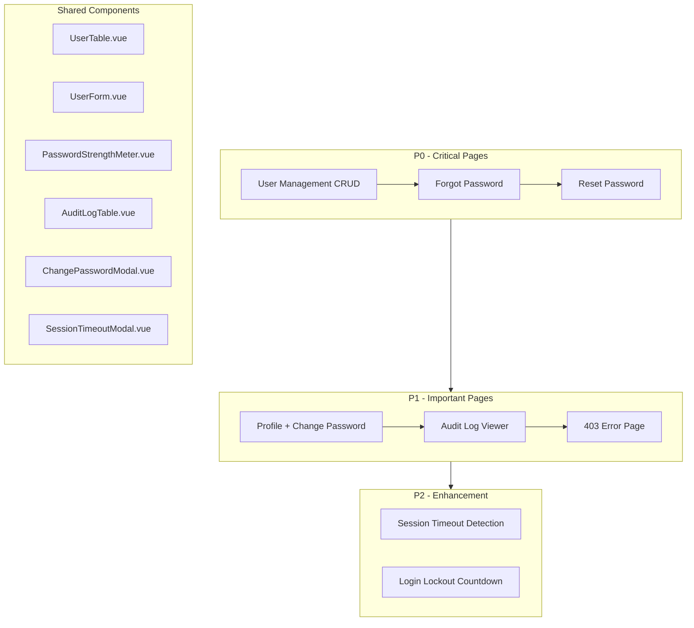

# Frontend Authentication & Authorization Implementation

## Overview

Implementasi frontend untuk melengkapi backend Authentication & Authorization yang sudah complete. Fokus pada User Experience dengan iOS-like design standard, performance optimization untuk low-end devices, dan mobile-first approach.**Backend Status:** ✅ Complete (20+ files, semua routes & controllers ready)**Frontend Status:** ⚠️ Missing 10 pages + 8 components**Target:** Build production-ready frontend dalam sequence P0 → P1 → P2---

## Architecture Flow



---

## P0 - Critical Pages (Cannot Ship Without)

### 1. User Management CRUD Pages

**Files to Create:**

- [`resources/js/pages/Admin/Users/Index.vue`](resources/js/pages/Admin/Users/Index.vue) - User list dengan search, filter, pagination
- [`resources/js/pages/Admin/Users/Create.vue`](resources/js/pages/Admin/Users/Create.vue) - Form tambah user baru
- [`resources/js/pages/Admin/Users/Edit.vue`](resources/js/pages/Admin/Users/Edit.vue) - Form edit user existing
- [`resources/js/components/ui/UserTable.vue`](resources/js/components/ui/UserTable.vue) - Reusable table component
- [`resources/js/components/ui/UserForm.vue`](resources/js/components/ui/UserForm.vue) - Reusable form component

**Key Features:**

- **Index Page:** Table dengan search (nama/email/username), filter by role & status, pagination, quick actions (edit, reset password, toggle status, delete)
- **Create Page:** Form dengan auto-generated password, email notification preview, role dropdown, status toggle
- **Edit Page:** Similar to create, pre-filled data, warning sebelum ubah role/status
- **Mobile-First:** Table → Cards di mobile, touch-friendly buttons (min 44x44px)
- **Performance:** Lazy load pagination, debounced search, optimistic UI updates

**Backend Routes (sudah ready):**

```php
GET    /admin/users              -> admin.users.index
POST   /admin/users              -> admin.users.store
GET    /admin/users/create       -> admin.users.create
GET    /admin/users/{user}/edit  -> admin.users.edit
PUT    /admin/users/{user}       -> admin.users.update
DELETE /admin/users/{user}       -> admin.users.destroy
POST   /admin/users/{user}/reset-password  -> admin.users.reset-password
PATCH  /admin/users/{user}/toggle-status   -> admin.users.toggle-status
```

**UX Considerations:**

- Haptic feedback pada semua actions (light untuk tap, medium untuk submit, heavy untuk delete)
- Confirmation modal untuk destructive actions (delete, deactivate)
- Success toast dengan auto-dismiss (3 seconds)
- Empty state dengan illustration "Belum ada user"
- Loading skeleton saat fetch data

---

### 2. Forgot Password Page

**Files to Create:**

- [`resources/js/pages/Auth/ForgotPassword.vue`](resources/js/pages/Auth/ForgotPassword.vue) - Request reset link page

**Key Features:**

- **Form Fields:** Email input dengan validation real-time
- **Rate Limiting UI:** Disable button selama 60 detik setelah submit, tampilkan countdown
- **Success State:** "Link reset telah dikirim ke email Anda" dengan icon checkmark
- **Error Handling:** Email tidak ditemukan, user inactive, rate limit exceeded
- **Design:** Consistent dengan [`Login.vue`](resources/js/pages/Auth/Login.vue) (split-screen layout desktop, stacked mobile)

**Backend Routes (sudah ready):**

```php
GET  /forgot-password  -> password.request
POST /forgot-password  -> password.email (throttle:3,60)
```

**UX Considerations:**

- Link "Kembali ke Login" di bawah form
- Info text: "Link reset valid selama 1 jam"
- Icon email animation saat success
- Spring animations dengan stiffness: 300, damping: 30

**Update Needed:**

- [`resources/js/pages/Auth/Login.vue`](resources/js/pages/Auth/Login.vue) line 284: Ubah href dari "#" ke wayfinder route `password.request`

---

### 3. Reset Password Page

**Files to Create:**

- [`resources/js/pages/Auth/ResetPassword.vue`](resources/js/pages/Auth/ResetPassword.vue) - Execute password reset dengan token

**Key Features:**

- **URL:** `/reset-password?token=xxx`
- **Form Fields:** Email (pre-filled, readonly), Password Baru, Konfirmasi Password
- **Password Strength Meter:** Real-time indicator (Lemah/Sedang/Kuat)
- **Token Validation:** Check token valid/expired di mounted, redirect ke forgot-password jika invalid
- **Success Flow:** Toast success → auto redirect ke login setelah 2 detik

**Backend Routes (sudah ready):**

```php
GET  /reset-password/{token}  -> password.reset
POST /reset-password          -> password.update
```

**UX Considerations:**

- Expired token message: "Link reset sudah kadaluarsa. Silakan request ulang."
- Password requirements list (min 8 chars, letters, numbers)
- Toggle password visibility dengan icon Eye/EyeOff
- Haptic feedback medium saat submit

---

## P1 - Important Pages (Complete Feature Set)

### 4. Profile Page + Change Password Modal

**Files to Create:**

- [`resources/js/pages/Profile/Show.vue`](resources/js/pages/Profile/Show.vue) - User profile page
- [`resources/js/components/ui/ChangePasswordModal.vue`](resources/js/components/ui/ChangePasswordModal.vue) - Modal ganti password

**Key Features:**

- **Profile Page:** Display user info (nama, email, username, role), button "Ganti Password"
- **Change Password Modal:** 3 fields (Password Lama, Password Baru, Konfirmasi), password strength meter
- **Validation:** Current password check, new password must be different, password requirements
- **Success:** Close modal, toast success, optional logout other devices (future)

**Backend Routes (sudah ready):**

```php
GET  /profile           -> profile.show
POST /profile/password  -> profile.password.update
```

**UX Considerations:**

- Modal dengan backdrop blur (fake glass: bg-white/95)
- Press feedback scale: 0.97 pada button
- Auto-focus ke Password Lama saat modal open
- Error inline validation dengan Indonesian messages

**Update Needed:**

- [`resources/js/components/layouts/AppLayout.vue`](resources/js/components/layouts/AppLayout.vue): Tambah "Profil Saya" di user dropdown menu (line 100+)

---

### 5. Audit Log Viewing Page

**Files to Create:**

- [`resources/js/pages/Admin/AuditLogs/Index.vue`](resources/js/pages/Admin/AuditLogs/Index.vue) - Audit log viewer
- [`resources/js/components/ui/AuditLogTable.vue`](resources/js/components/ui/AuditLogTable.vue) - Table dengan advanced filters

**Key Features:**

- **Table Columns:** Timestamp, User, Action (badge), Status (green/red), IP Address, User Agent (truncated)
- **Filters:** Date range (default: last 7 days), User dropdown, Action multi-select, Status (success/failed)
- **Search:** By IP address or identifier
- **Pagination:** 50 per page (sesuai backend)
- **Expandable Rows:** Click row untuk lihat old_values & new_values JSON
- **Color Coding:** Success = green badge, Failed = red badge

**Backend Routes (sudah ready):**

```php
GET /admin/audit-logs  -> admin.audit-logs.index (Super Admin + TU)
GET /audit-logs        -> audit-logs.index (Principal - read only)
```

**UX Considerations:**

- Skeleton loading untuk table rows
- Date range picker dengan presets (Today, Last 7 days, Last 30 days, Custom)
- Empty state: "Belum ada log aktivitas"
- Export CSV button (optional, nice to have)
- Mobile: Collapse ke cards, show essentials only

**Update Needed:**

- [`resources/js/components/layouts/AppLayout.vue`](resources/js/components/layouts/AppLayout.vue): Menu item sudah ada di line 120, tapi route "/admin/audit-logs" hardcoded. Update dengan wayfinder route.

---

### 6. 403 Access Denied Page

**Files to Create:**

- [`resources/js/pages/Errors/403.vue`](resources/js/pages/Errors/403.vue) - Custom error page

**Key Features:**

- **Design:** iOS-like clean design dengan illustration (locked door/shield SVG)
- **Message:** "Anda tidak memiliki akses ke halaman ini"
- **Actions:** Button "Kembali ke Dashboard" (blue primary)
- **Branding:** Consistent dengan color scheme (blue-600)

**UX Considerations:**

- Centering layout (min-h-screen flex)
- Spring animation untuk illustration entrance
- Haptic heavy saat page load (error feedback)
- Auto-detect user role untuk redirect ke dashboard yang benar

---

## P2 - Enhancement (Can Ship Later)

### 7. Session Timeout Detection + Warning Modal

**Files to Create:**

- [`resources/js/composables/useSessionTimeout.ts`](resources/js/composables/useSessionTimeout.ts) - Idle detection logic
- [`resources/js/components/ui/SessionTimeoutModal.vue`](resources/js/components/ui/SessionTimeoutModal.vue) - Warning modal

**Key Features:**

- **Idle Detection:** Track mouse/keyboard activity, default 30min untuk user biasa, 15min untuk admin
- **Warning Modal:** Muncul 2 menit sebelum timeout, countdown timer, actions: "Perpanjang Session" / "Keluar"
- **Backend Integration:** Detect Inertia 419 response (CSRF token mismatch), auto-redirect ke login dengan message "Session Anda telah berakhir"
- **Extend Session:** POST request ke backend untuk refresh session

**UX Considerations:**

- Modal priority tinggi (z-index: 9999)
- Countdown dalam format "X menit Y detik"
- Haptic heavy saat modal muncul
- Auto-logout saat countdown reach 0

**Update Needed:**

- [`resources/js/components/layouts/AppLayout.vue`](resources/js/components/layouts/AppLayout.vue): Import & integrate `useSessionTimeout` di setup script

---

### 8. Failed Login Countdown Timer

**Files to Update:**

- [`resources/js/pages/Auth/Login.vue`](resources/js/pages/Auth/Login.vue) - Tambah countdown display

**Key Features:**

- **Backend Data:** Backend sudah return `locked_until` timestamp dalam error response (implemented di [`LoginController.php`](app/Http/Controllers/Auth/LoginController.php))
- **Frontend Display:** Show countdown "Akun terkunci. Coba lagi dalam X menit Y detik"
- **Real-time Update:** setInterval untuk update countdown setiap detik
- **Auto-enable Form:** Saat countdown reach 0, enable login form kembali

**UX Considerations:**

- Red error banner dengan icon Lock
- Countdown dalam format user-friendly (contoh: "14 menit 32 detik")
- Disable login button selama lockout
- Clear countdown saat user navigate away

---

## Shared Components Library

### Component Details

**1. PasswordStrengthMeter.vue**

- Props: `password` (string), `minLength` (number, default 8)
- Display: Progress bar horizontal (red → yellow → green)
- Labels: Lemah (0-40%), Sedang (41-70%), Kuat (71-100%)
- Logic: Check length, has uppercase, has lowercase, has numbers, has special chars

**2. UserTable.vue**

- Props: `users` (array), `loading` (boolean)
- Features: Search input, role filter, status filter, pagination controls
- Mobile: Responsive cards dengan avatar, nama, email, role badge
- Actions: Edit (blue), Reset Password (yellow), Toggle Status (gray), Delete (red)

**3. UserForm.vue**

- Props: `user` (optional, untuk edit mode), `roles` (array), `isEdit` (boolean)
- Fields: Nama (text), Email (email), Username (text), Role (select), Status (toggle)
- Validation: Real-time dengan Indonesian messages
- Auto-generate password display (create mode only)

**4. AuditLogTable.vue**

- Props: `logs` (array), `filters` (object), `loading` (boolean)
- Features: Date range picker, user filter, action filter, search input
- Expandable: Click row untuk detail (old_values & new_values)
- Export: Optional CSV export button

**5. ChangePasswordModal.vue**

- Props: `show` (boolean)
- Emits: `close`, `success`
- Features: 3 password fields, strength meter, toggle visibility
- Validation: Current password check, new password requirements

**6. SessionTimeoutModal.vue**

- Props: `show` (boolean), `remainingSeconds` (number)
- Emits: `extend`, `logout`
- Features: Countdown display, 2 action buttons
- Priority: High z-index, backdrop no-dismiss

---

## Navigation Updates

**AppLayout.vue Changes:**

```javascript
// Menu items update (line 109+)
const menuItems = computed(() => {
    if (role === 'SUPERADMIN' || role === 'ADMIN') {
        return [
            { name: 'Dashboard', route: 'dashboard', icon: Home },
            { name: 'Manajemen User', route: 'admin.users.index', icon: Users }, // NEW
            { name: 'Audit Log', route: 'admin.audit-logs.index', icon: Activity }, // UPDATE label
        ];
    }
    
    if (role === 'PRINCIPAL') {
        return [
            { name: 'Dashboard', route: 'dashboard', icon: Home },
            { name: 'Aktivitas User', route: 'audit-logs.index', icon: Activity }, // NEW route
        ];
    }
    
    // ... other roles
});

// User dropdown menu (add)
const userMenuItems = [
    { name: 'Profil Saya', route: 'profile.show', icon: User }, // NEW
    { name: 'Pengaturan', route: 'settings', icon: Settings },
    { name: 'Keluar', action: logout, icon: LogOut },
];
```

---

## Implementation Strategy

### Build Order (Optimal Sequence)

**Week 1: P0 Critical**

- Day 1-2: Shared components (PasswordStrengthMeter, UserTable, UserForm)
- Day 3-4: User Management CRUD (Index, Create, Edit)
- Day 5: Forgot + Reset Password pages

**Week 2: P1 Important**

- Day 1: Profile + Change Password Modal
- Day 2: Audit Log Viewing (AuditLogTable + Index page)
- Day 3: 403 Error Page + Navigation updates
- Day 4-5: Testing, bug fixes, design polish

**Week 3: P2 Enhancement (Optional)**

- Day 1: Session Timeout Detection + Modal
- Day 2: Login Lockout Countdown
- Day 3: Final testing, performance optimization

---

## Code Quality Standards

**Design Consistency:**

- ✅ Use existing [`Login.vue`](resources/js/pages/Auth/Login.vue) sebagai reference untuk auth pages
- ✅ Follow [`AppLayout.vue`](resources/js/components/layouts/AppLayout.vue) navigation pattern
- ✅ Reuse [`BaseModal.vue`](resources/js/components/ui/BaseModal.vue) & [`DialogModal.vue`](resources/js/components/ui/DialogModal.vue)
- ✅ Leverage [`useModal`](resources/js/composables/useModal.ts) & [`useHaptics`](resources/js/composables/useHaptics.ts)

**iOS-like Design Rules:**

- ✅ Spring animations: stiffness 300, damping 25-30
- ✅ Press feedback: `:whileTap="{ scale: 0.97 }"`
- ✅ Fake glass: `bg-white/95` atau `bg-white/98` (no heavy blur)
- ✅ Borders over shadows: `border border-gray-200 shadow-sm`
- ✅ Touch targets: min 44x44px
- ✅ Haptic feedback: light (tap), medium (submit), heavy (delete/error)

**Performance Optimizations:**

- ✅ Lazy load pagination data
- ✅ Debounce search input (300ms)
- ✅ Skeleton loading states (no blank screens)
- ✅ Optimistic UI updates (instant feedback, rollback on error)
- ✅ Images lazy loading (`loading="lazy"`)
- ✅ Avoid heavy backdrop-blur (use high opacity instead)

**Indonesian Language:**

- ✅ All UI text, buttons, labels, errors dalam Bahasa Indonesia
- ✅ Examples: "Simpan" (not "Save"), "Batal" (not "Cancel"), "Berhasil" (not "Success")
- ✅ Error messages: "Password lama salah" (not "Old password is incorrect")
- ✅ Formal tone: "Anda tidak memiliki akses" (not "Kamu gak bisa akses")

**Validation & Error Handling:**

- ✅ Real-time validation dengan inline errors
- ✅ Indonesian error messages dari backend (sudah implemented)
- ✅ Toast notifications untuk feedback global
- ✅ Confirmation modals untuk destructive actions
- ✅ Empty states untuk data kosong
- ✅ Loading states untuk async operations

---

## Testing Checklist (Per Page)

**Functional Testing:**

- [ ] Form submission success case
- [ ] Form validation error cases
- [ ] Backend error handling (500, 422, 403)
- [ ] Pagination navigation
- [ ] Search & filter functionality
- [ ] Quick actions (edit, delete, toggle)
- [ ] Modal open/close
- [ ] Navigation links

**UX Testing:**

- [ ] Mobile responsive (320px - 1920px)
- [ ] Touch targets min 44x44px
- [ ] Haptic feedback working
- [ ] Spring animations smooth (no jank)
- [ ] Loading states visible
- [ ] Empty states displayed
- [ ] Error messages clear
- [ ] Success feedback immediate

**Performance Testing:**

- [ ] No layout shifts (CLS < 0.1)
- [ ] Fast interaction (FID < 100ms)
- [ ] Smooth scrolling (60fps)
- [ ] No memory leaks (check DevTools)
- [ ] Lazy loading working
- [ ] Debounce working

**Design Testing:**

- [ ] Colors consistent (blue-600 primary)
- [ ] Typography hierarchy clear
- [ ] Spacing consistent (p-4, p-6)
- [ ] Borders over shadows
- [ ] High contrast text
- [ ] Dark mode support (if applicable)

---

## Final Deliverables

**Pages (10):**

1. Admin/Users/Index.vue
2. Admin/Users/Create.vue
3. Admin/Users/Edit.vue
4. Auth/ForgotPassword.vue
5. Auth/ResetPassword.vue
6. Profile/Show.vue
7. Admin/AuditLogs/Index.vue
8. Errors/403.vue
9. (P2) Session timeout integration
10. (P2) Login lockout countdown

**Components (6):**

1. ui/UserTable.vue
2. ui/UserForm.vue
3. ui/PasswordStrengthMeter.vue
4. ui/AuditLogTable.vue
5. ui/ChangePasswordModal.vue
6. ui/SessionTimeoutModal.vue (P2)

**Composables (1):**

1. useSessionTimeout.ts (P2)

**Updates (2):**

1. components/layouts/AppLayout.vue (navigation)
2. pages/Auth/Login.vue (forgot password link + lockout countdown)

---

## Success Criteria

✅ **P0 Complete:** Admin dapat create users, users dapat forgot/reset password✅ **P1 Complete:** Users dapat change password, admin dapat view audit logs, 403 page exists✅ **P2 Complete:** Session timeout detected, lockout countdown displayed✅ **Design Consistent:** iOS-like feel, performance optimized, mobile-first✅ **Code Quality:** Laravel Pint passed, ESLint passed, no console errors