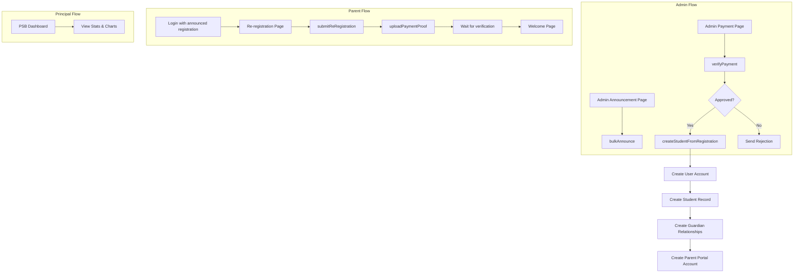
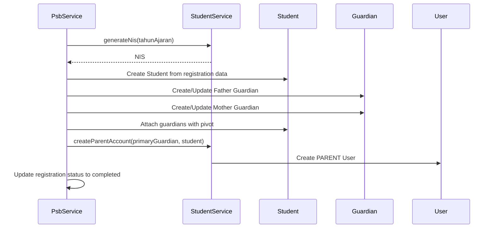

# Epic 3: PSB Announcement & Re-registration Backend Implementation

## Architecture Overview




## Existing Infrastructure to Leverage

- **PsbService** (`[app/Services/PsbService.php](app/Services/PsbService.php)`): Extend with announcement, re-registration, and payment methods
- **StudentService** (`[app/Services/StudentService.php](app/Services/StudentService.php)`): Reuse `attachGuardiansToStudent()`, `createParentAccount()`, `generateNis()`
- **PsbRegistration** (`[app/Models/PsbRegistration.php](app/Models/PsbRegistration.php)`): Status constants already defined (approved, re_registration, completed)
- **PsbPayment** (`[app/Models/PsbPayment.php](app/Models/PsbPayment.php)`): Payment types, methods, and statuses already defined

---

## Task 3.1: Admin Announcement Controller & Routes

### Routes (add to `[routes/admin.php](routes/admin.php)`)

```php
// Add inside psb prefix group after existing routes
Route::prefix('announcements')->name('announcements.')->group(function () {
    Route::get('/', [AdminPsbAnnouncementController::class, 'index'])->name('index');
    Route::post('/bulk-announce', [AdminPsbAnnouncementController::class, 'bulkAnnounce'])
        ->middleware('throttle:10,1')
        ->name('bulk-announce');
});
```

### New Controller: `app/Http/Controllers/Admin/AdminPsbAnnouncementController.php`

Methods:

- `index()`: List registrations with status `approved` ready for announcement
- `bulkAnnounce(BulkAnnounceRequest $request)`: Update `announced_at`, send notifications

### New Form Request: `app/Http/Requests/Psb/BulkAnnounceRequest.php`

Validates array of registration IDs.

---

## Task 3.2: Parent Re-registration Controller & Routes

### Routes (add to `[routes/parent.php](routes/parent.php)`)

```php
// Add inside parent prefix group
Route::prefix('psb')->name('psb.')->group(function () {
    Route::get('/re-register', [ParentPsbController::class, 'reRegister'])->name('re-register');
    Route::post('/re-register', [ParentPsbController::class, 'submitReRegister'])->name('submit-re-register');
    Route::post('/payment', [ParentPsbController::class, 'uploadPayment'])->name('upload-payment');
    Route::get('/welcome', [ParentPsbController::class, 'welcome'])->name('welcome');
});
```

### New Controller: `app/Http/Controllers/Parent/ParentPsbController.php`

Methods:

- `reRegister()`: Show re-registration form if status is `approved` and `announced_at` is set
- `submitReRegister(SubmitReRegistrationRequest $request)`: Update additional data, change status to `re_registration`
- `uploadPayment(UploadPaymentRequest $request)`: Upload proof, create PsbPayment record
- `welcome()`: Show welcome page if status is `completed`

### Access Control Logic

```php
// Get registration linked to parent via guardian NIK matching
public function getParentRegistration(User $parent): ?PsbRegistration
{
    $guardian = $parent->guardian;
    if (!$guardian) return null;
    
    return PsbRegistration::where(function ($q) use ($guardian) {
        $q->where('father_nik', $guardian->nik)
          ->orWhere('mother_nik', $guardian->nik);
    })
    ->whereIn('status', ['approved', 're_registration', 'completed'])
    ->whereNotNull('announced_at')
    ->first();
}
```

### New Form Requests

- `app/Http/Requests/Psb/SubmitReRegistrationRequest.php`
- `app/Http/Requests/Psb/UploadPaymentRequest.php`

---

## Task 3.3: PsbService Methods Extension

### Add to `[app/Services/PsbService.php](app/Services/PsbService.php)`

```php
/**
 * Bulk announce registrations dengan single query update
 */
public function bulkAnnounce(array $registrationIds): int
{
    return PsbRegistration::whereIn('id', $registrationIds)
        ->where('status', self::STATUS_APPROVED)
        ->update(['announced_at' => now()]);
}

/**
 * Submit re-registration dengan update data tambahan
 */
public function submitReRegistration(PsbRegistration $registration, array $data): bool;

/**
 * Upload bukti pembayaran dan create PsbPayment record
 */
public function uploadPaymentProof(
    PsbRegistration $registration, 
    UploadedFile $file, 
    array $data
): PsbPayment;

/**
 * Verify payment (approve/reject)
 */
public function verifyPayment(
    PsbPayment $payment, 
    User $verifier, 
    bool $approved, 
    ?string $notes = null
): bool;

/**
 * Create student from completed registration
 * - Generate NIS
 * - Create Student record
 * - Create Guardian records (ayah, ibu)
 * - Link Parent account
 * - Update status to completed
 */
public function createStudentFromRegistration(PsbRegistration $registration): Student;

/**
 * Get parent's PSB registration based on guardian NIK
 */
public function getParentRegistration(User $parent): ?PsbRegistration;
```

### createStudentFromRegistration Flow




---

## Task 3.4: Principal PSB Dashboard

### Routes (add to `[routes/principal.php](routes/principal.php)`)

```php
// Add inside principal prefix group
Route::prefix('psb')->name('psb.')->group(function () {
    Route::get('/', [PrincipalPsbController::class, 'dashboard'])->name('dashboard');
});
```

### New Controller: `app/Http/Controllers/Principal/PrincipalPsbController.php`

```php
public function dashboard(): Response
{
    $stats = $this->psbService->getRegistrationStats();
    $dailyRegistrations = $this->psbService->getDailyRegistrations();
    $genderDistribution = $this->psbService->getGenderDistribution();
    $statusDistribution = $this->psbService->getStatusDistribution();
    
    return Inertia::render('Principal/Psb/Dashboard', [
        'summary' => $stats,
        'dailyRegistrations' => $dailyRegistrations,
        'genderDistribution' => $genderDistribution,
        'statusDistribution' => $statusDistribution,
    ]);
}
```

### Add Chart Data Methods to PsbService

```php
public function getDailyRegistrations(int $days = 30): array;
public function getGenderDistribution(): array;
public function getStatusDistribution(): array;
```

---

## Task 3.5: Payment Verification Controller

### Routes (add to `[routes/admin.php](routes/admin.php)`)

```php
// Add inside psb prefix group
Route::prefix('payments')->name('payments.')->group(function () {
    Route::get('/', [AdminPsbPaymentController::class, 'index'])->name('index');
    Route::post('/{payment}/verify', [AdminPsbPaymentController::class, 'verify'])
        ->middleware('throttle:10,1')
        ->name('verify');
});
```

### New Controller: `app/Http/Controllers/Admin/AdminPsbPaymentController.php`

Methods:

- `index()`: List payments with filter by status
- `verify(VerifyPaymentRequest $request, PsbPayment $payment)`: Approve/reject payment

### Payment Verification Logic

When approved:

1. Update payment status to `verified`
2. Call `createStudentFromRegistration()` if all payments verified
3. Send notification to parent with welcome info

### New Form Request: `app/Http/Requests/Psb/VerifyPaymentRequest.php`

---

## New Notification: PsbAnnouncementNotification

### Create: `app/Notifications/PsbAnnouncementNotification.php`

Sent when registration is announced (bulk announce). Contains:

- Congratulations message
- Re-registration deadline
- Payment information
- Link to parent portal

---

## Database Considerations

### PsbRegistration Model Updates

Add relationship and helper methods:

```php
// Check if registration can proceed to re-registration
public function canReRegister(): bool
{
    return $this->status === self::STATUS_APPROVED 
        && $this->announced_at !== null;
}

// Check if all payments are verified
public function allPaymentsVerified(): bool
{
    return $this->payments()->count() > 0 
        && $this->payments()->where('status', '!=', 'verified')->doesntExist();
}
```

### No New Migrations Required

Existing tables support all requirements:

- `psb_registrations`: Has `announced_at`, status enum includes all needed states
- `psb_payments`: Has `proof_file_path`, `status`, verification fields

---

## Files to Create


| Type         | Path                                                            |
| ------------ | --------------------------------------------------------------- |
| Controller   | `app/Http/Controllers/Admin/AdminPsbAnnouncementController.php` |
| Controller   | `app/Http/Controllers/Admin/AdminPsbPaymentController.php`      |
| Controller   | `app/Http/Controllers/Parent/ParentPsbController.php`           |
| Controller   | `app/Http/Controllers/Principal/PrincipalPsbController.php`     |
| Request      | `app/Http/Requests/Psb/BulkAnnounceRequest.php`                 |
| Request      | `app/Http/Requests/Psb/SubmitReRegistrationRequest.php`         |
| Request      | `app/Http/Requests/Psb/UploadPaymentRequest.php`                |
| Request      | `app/Http/Requests/Psb/VerifyPaymentRequest.php`                |
| Notification | `app/Notifications/PsbAnnouncementNotification.php`             |
| Test         | `tests/Feature/Psb/AnnouncementTest.php`                        |
| Test         | `tests/Feature/Psb/ReRegistrationTest.php`                      |
| Test         | `tests/Feature/Psb/PaymentVerificationTest.php`                 |
| Test         | `tests/Feature/Psb/PrincipalDashboardTest.php`                  |


---

## Files to Modify


| File                                                               | Changes                             |
| ------------------------------------------------------------------ | ----------------------------------- |
| `[routes/admin.php](routes/admin.php)`                             | Add announcement and payment routes |
| `[routes/parent.php](routes/parent.php)`                           | Add PSB re-registration routes      |
| `[routes/principal.php](routes/principal.php)`                     | Add PSB dashboard route             |
| `[app/Services/PsbService.php](app/Services/PsbService.php)`       | Add 7 new methods                   |
| `[app/Models/PsbRegistration.php](app/Models/PsbRegistration.php)` | Add helper methods                  |


---

## Testing Strategy

### Feature Tests Coverage

1. **AnnouncementTest**
  - Admin can view approved registrations
  - Admin can bulk announce
  - Notifications sent on announce
  - Non-approved registrations cannot be announced
2. **ReRegistrationTest**
  - Parent can access re-register page only if announced
  - Parent can submit additional data
  - Parent can upload payment proof
  - Parent redirected to welcome after completion
3. **PaymentVerificationTest**
  - Admin can view pending payments
  - Admin can approve payment
  - Admin can reject payment with reason
  - Student created on payment approval
4. **PrincipalDashboardTest**
  - Principal can view PSB dashboard
  - Stats are accurate
  - Chart data formatted correctly

