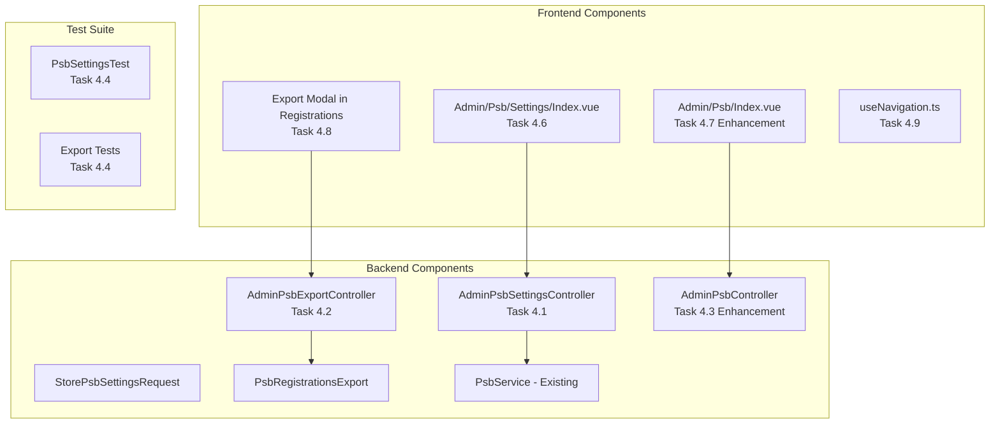

# Epic-4: Dashboard & Enhancement Implementation Plan

## Overview

Epic-4 focuses on completing the PSB (Penerimaan Siswa Baru) module with Settings management, Excel export, enhanced Admin dashboard, comprehensive testing, and UI polish. The backend foundation is mostly complete; this sprint adds the missing Settings/Export features and finalizes testing.

---

## Architecture Summary




---

## Backend Tasks

### Task 4.1: PSB Settings Controller & Routes (P1) - 5 SP

**Files to Create:**

- [app/Http/Controllers/Admin/AdminPsbSettingsController.php](app/Http/Controllers/Admin/AdminPsbSettingsController.php)
- [app/Http/Requests/Psb/StorePsbSettingsRequest.php](app/Http/Requests/Psb/StorePsbSettingsRequest.php)
- [app/Http/Requests/Psb/UpdatePsbSettingsRequest.php](app/Http/Requests/Psb/UpdatePsbSettingsRequest.php) (optional, dapat reuse Store)

**Routes to add in [routes/admin.php](routes/admin.php):**

```php
// Inside psb prefix group (after line 100)
Route::prefix('settings')->name('settings.')->group(function () {
    Route::get('/', [AdminPsbSettingsController::class, 'index'])->name('index');
    Route::post('/', [AdminPsbSettingsController::class, 'store'])->name('store');
    Route::put('/{setting}', [AdminPsbSettingsController::class, 'update'])->name('update');
});
```

**Controller Methods:**

- `index()` - Return settings page with current settings, academic years list, and history
- `store()` - Create new PSB period settings with validation
- `update()` - Update existing settings with date validation

**Existing Support:**

- `PsbSetting` model already exists with all required fields
- `PsbService::getActiveSettings()` method available

---

### Task 4.2: Export to Excel (P2) - 5 SP

**Files to Create:**

- [app/Http/Controllers/Admin/AdminPsbExportController.php](app/Http/Controllers/Admin/AdminPsbExportController.php)
- [app/Exports/PsbRegistrationsExport.php](app/Exports/PsbRegistrationsExport.php)

**Reference Pattern:** Follow existing [app/Exports/StudentExport.php](app/Exports/StudentExport.php)

**Route to add:**

```php
Route::get('export', [AdminPsbExportController::class, 'export'])->name('export');
```

**Export Columns (per Epic-4 spec):**

- No. Registrasi, Nama Siswa, NIK, TTL, Jenis Kelamin, Agama, Alamat
- Nama Ayah, No. HP Ayah, Nama Ibu, No. HP Ibu
- Status, Tanggal Daftar, Tanggal Verifikasi, Status Pembayaran

**Dependencies:** `maatwebsite/excel` already installed (v3.1)

---

### Task 4.3: Admin PSB Dashboard Enhancement (P1) - 3 SP

**File to modify:** [app/Http/Controllers/Admin/AdminPsbController.php](app/Http/Controllers/Admin/AdminPsbController.php)

**Enhancements needed:**

- Add `recentRegistrations` - Latest 5 registrations
- Add `pendingActionsCount` - Count of items needing attention
- Add `activeSettings` - Current PSB period info

**Update index method:**

```php
public function index(): Response
{
    $stats = $this->psbService->getRegistrationStats();
    $recentRegistrations = PsbRegistration::query()
        ->where('academic_year_id', $this->getActiveAcademicYearId())
        ->latest()
        ->take(5)
        ->get(['id', 'registration_number', 'student_name', 'status', 'created_at']);
    $activeSettings = $this->psbService->getActiveSettings();
    
    return Inertia::render('Admin/Psb/Index', [
        'title' => 'Dashboard PSB',
        'stats' => $stats,
        'recentRegistrations' => $recentRegistrations,
        'activeSettings' => $activeSettings,
    ]);
}
```

---

### Task 4.4: Comprehensive Testing (P0) - 8 SP

**Files to Create:**

- [tests/Feature/Psb/PsbSettingsTest.php](tests/Feature/Psb/PsbSettingsTest.php)
- [tests/Feature/Psb/PsbExportTest.php](tests/Feature/Psb/PsbExportTest.php)

**Test Pattern Reference:** Follow [tests/Feature/Psb/AnnouncementTest.php](tests/Feature/Psb/AnnouncementTest.php)

**Settings Test Scenarios:**

- Admin can access settings index
- Admin can create new PSB period settings
- Validation: dates must be logical (close > open, announcement > close)
- Only one active setting per academic year
- Non-admin cannot access settings

**Export Test Scenarios:**

- Admin can export registrations
- Filters applied correctly (status, date range)
- Download response is xlsx format
- Non-admin cannot export

---

### Task 4.5: Wayfinder Generation (P1) - 2 SP

**Command to run:**

```bash
php artisan wayfinder:generate
```

**Verification:**

- Check `resources/js/routes/admin/psb/settings/index.ts` generated
- Check `resources/js/routes/admin/psb/export.ts` generated
- Verify TypeScript types correct

---

## Frontend Tasks

### Task 4.6: Admin PSB Settings Page (P1) - 5 SP

**File to Create:** [resources/js/pages/Admin/Psb/Settings/Index.vue](resources/js/pages/Admin/Psb/Settings/Index.vue)

**Sections:**

1. **Active Period Info Card** - Current academic year, status (Open/Closed), countdown timer
2. **Settings Form** - Academic year selector, date pickers (open/close/announcement), re-registration deadline days, registration fee (Rp format), quota per class, waiting list toggle
3. **History Section** - Previous PSB periods with stats per period

**UI Pattern:** Follow existing Admin pages with Motion-v animations, dark mode support

---

### Task 4.7: Admin PSB Dashboard Enhancement (P1) - 5 SP

**File to Modify:** [resources/js/pages/Admin/Psb/Index.vue](resources/js/pages/Admin/Psb/Index.vue)

**Enhancements:**

- Add Quick Action buttons: Verifikasi Pending, Pengumuman, Pengaturan, Export Data
- Add Recent Registrations section (5 items with links)
- Add Pending Actions alerts

---

### Task 4.8: Export UI (P2) - 3 SP

**Location:** Add to [resources/js/pages/Admin/Psb/Registrations/Index.vue](resources/js/pages/Admin/Psb/Registrations/Index.vue)

**Components:**

- Export button in page header
- Filter modal with: status filter, date range picker, column selection checkboxes
- Download progress indicator

---

### Task 4.9: Navigation Updates (P1) - 3 SP

**File to Modify:** [resources/js/composables/useNavigation.ts](resources/js/composables/useNavigation.ts)

**Add Settings menu item (around line 298):**

```typescript
{
    name: 'PSB',
    icon: UserPlus,
    children: [
        { name: 'Dashboard', route: 'admin.psb.index', icon: Home, badge: 0 },
        { name: 'Pendaftaran', route: 'admin.psb.registrations.index', icon: Users, badge: pendingCounts.value.pendingPsb || 0 },
        { name: 'Pengumuman', route: 'admin.psb.announcements.index', icon: Megaphone, badge: 0 },
        { name: 'Verifikasi Bayar', route: 'admin.psb.payments.index', icon: CreditCard, badge: pendingCounts.value.pendingPsbPayments || 0 },
        { name: 'Pengaturan', route: 'admin.psb.settings.index', icon: Settings, badge: 0 }, // NEW
    ]
}
```

---

### Task 4.10: UI Polish & Mobile Testing (P1) - 5 SP

**Polish Items:**

- Motion-v animations on all transitions
- Loading skeletons for deferred props
- Error states with retry buttons
- Empty states with illustrations
- Toast notifications consistency

**Mobile Testing Checklist:**

- Registration form responsive on mobile
- Tables use card view on mobile
- Touch targets minimum 44px
- Smooth scroll behaviors
- No horizontal scroll issues

---

### Task 4.11: Frontend Testing (P2) - 3 SP

**Component Tests:**

- PsbTimeline.vue
- PsbMultiStepForm.vue
- PsbDocumentPreview.vue

**E2E Documentation:**

- Document registration flow
- Document verification flow
- Document re-registration flow

---

## Implementation Order (Recommended)

```mermaid
gantt
    title Implementation Sequence
    dateFormat X
    axisFormat %s
    
    section Backend
    Task 4.1 Settings Controller    :b1, 0, 5
    Task 4.2 Export Controller      :b2, 0, 5
    Task 4.3 Dashboard Enhancement  :b3, 5, 3
    Task 4.5 Wayfinder Generation   :b5, 8, 2
    Task 4.4 Testing                :b4, 10, 8
    
    section Frontend
    Task 4.9 Navigation Updates     :f9, 10, 2
    Task 4.6 Settings Page          :f6, 12, 5
    Task 4.7 Dashboard Enhancement  :f7, 12, 5
    Task 4.8 Export UI              :f8, 17, 3
    Task 4.10 UI Polish             :f10, 20, 5
    Task 4.11 Frontend Testing      :f11, 25, 3
```




**Phase 1 (Backend):** Tasks 4.1, 4.2 dapat dilakukan paralel
**Phase 2:** Task 4.3 setelah 4.1 selesai (menggunakan settings data)
**Phase 3:** Task 4.5 setelah semua routes dibuat
**Phase 4 (Frontend):** Tasks 4.6, 4.7 dapat dilakukan paralel setelah Wayfinder
**Phase 5:** Task 4.8 setelah Export backend siap
**Phase 6:** Tasks 4.10, 4.11 sebagai finishing

---

## Key Files Summary

**New Files:**

- `app/Http/Controllers/Admin/AdminPsbSettingsController.php`
- `app/Http/Controllers/Admin/AdminPsbExportController.php`
- `app/Http/Requests/Psb/StorePsbSettingsRequest.php`
- `app/Exports/PsbRegistrationsExport.php`
- `resources/js/pages/Admin/Psb/Settings/Index.vue`
- `tests/Feature/Psb/PsbSettingsTest.php`
- `tests/Feature/Psb/PsbExportTest.php`

**Modified Files:**

- `routes/admin.php` - Add settings and export routes
- `app/Http/Controllers/Admin/AdminPsbController.php` - Enhance dashboard data
- `resources/js/pages/Admin/Psb/Index.vue` - Add quick actions, recent registrations
- `resources/js/pages/Admin/Psb/Registrations/Index.vue` - Add export UI
- `resources/js/composables/useNavigation.ts` - Add settings menu item

---

## Acceptance Criteria Summary

- All CRUD operations for PSB settings working
- Excel export with filters functional
- Admin dashboard shows quick actions and recent registrations
- Navigation includes all PSB menu items with badges
- All tests passing with 80%+ coverage for PSB code
- Mobile-friendly UI on all PSB pages
- No lint errors (`yarn run lint`, `vendor/bin/pint --dirty`)

