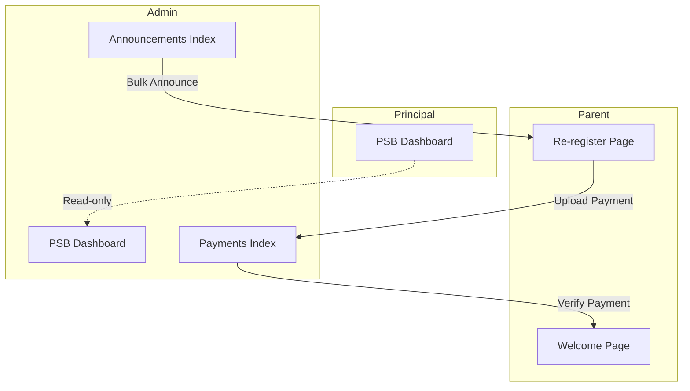

# Epic 3: Frontend Implementation Plan

## Overview

This plan covers the frontend implementation for PSB (Penerimaan Siswa Baru) announcement and re-registration features across Admin, Parent, and Principal roles.

## Architecture




## File Structure

```
resources/js/
├── pages/
│   ├── Admin/Psb/
│   │   ├── Announcements/
│   │   │   └── Index.vue          # Task 3.6
│   │   └── Payments/
│   │       └── Index.vue          # Task 3.5 (Frontend)
│   ├── Parent/Psb/
│   │   ├── ReRegister.vue         # Task 3.7
│   │   └── Welcome.vue            # Task 3.8
│   └── Principal/Psb/
│       └── Dashboard.vue          # Task 3.9
├── routes/
│   ├── admin/psb/
│   │   ├── announcements/index.ts # New route file
│   │   └── payments/index.ts      # New route file
│   ├── parent/psb/index.ts        # New route file
│   └── principal/psb/index.ts     # New route file
└── composables/
    └── useNavigation.ts           # Task 3.10 (Updates)
```

---

## Task 3.6: Admin Announcement Page

**File:** `[resources/js/pages/Admin/Psb/Announcements/Index.vue](resources/js/pages/Admin/Psb/Announcements/Index.vue)`

**Key Features:**

- Table with checkbox selection (reference: `[StudentTable.vue](resources/js/components/features/students/StudentTable.vue)`)
- "Select All" checkbox in header
- Bulk announce action with confirmation modal
- Filter by academic year
- Selected count indicator

**Props Interface:**

```typescript
interface Registration {
    id: number;
    registration_number: string;
    student_name: string;
    parent_name: string;
    parent_phone: string;
    status: string;
    approved_at: string;
}

interface Props {
    registrations: {
        data: Registration[];
        links: any;
        meta: any;
    };
    filters: {
        academic_year_id?: number;
        search?: string;
    };
    academicYears: { id: number; name: string }[];
}
```

**UI Components:**

- Header with icon and title (pattern from `[Admin/Psb/Index.vue](resources/js/pages/Admin/Psb/Index.vue)`)
- Filter section (academic year dropdown, search)
- Table with columns: Checkbox, No. Pendaftaran, Nama Siswa, Orang Tua, No. HP, Tanggal Diterima, Aksi
- Selected count badge: "X dipilih"
- "Umumkan Terpilih" button (disabled when none selected)
- Confirmation modal using `[DialogModal.vue](resources/js/components/ui/DialogModal.vue)`

---

## Task 3.7: Parent Re-registration Page

**File:** `[resources/js/pages/Parent/Psb/ReRegister.vue](resources/js/pages/Parent/Psb/ReRegister.vue)`

**Key Features:**

- Congratulations banner
- Registration summary display
- Payment information section
- File upload for payment proof
- Status tracking timeline

**Props Interface:**

```typescript
interface Props {
    registration: {
        id: number;
        registration_number: string;
        student_name: string;
        status: string;
        announced_at: string;
    };
    paymentInfo: {
        amount: number;
        formatted_amount: string;
        bank_name: string;
        account_number: string;
        account_name: string;
    };
    payment: {
        id: number;
        status: string;
        proof_path: string;
        uploaded_at: string;
    } | null;
}
```

**Sections:**

1. **Status Banner** - Green gradient with confetti icon, "Selamat! Anda diterima di [Sekolah]"
2. **Registration Summary** - Card showing submitted data
3. **Payment Section** - Bank info, amount, upload form
4. **Timeline** - Status progress: Diterima -> Pembayaran -> Verifikasi -> Selesai

**Upload Component:** Use pattern from `[PhotoUpload.vue](resources/js/components/features/students/PhotoUpload.vue)` with drag-drop support

---

## Task 3.8: Parent Welcome Page

**File:** `[resources/js/pages/Parent/Psb/Welcome.vue](resources/js/pages/Parent/Psb/Welcome.vue)`

**Key Features:**

- Personalized welcome message
- Next steps information
- Link to parent dashboard
- Celebration animation (confetti)

**Props Interface:**

```typescript
interface Props {
    student: {
        name: string;
        nis: string;
        class_name: string;
    };
    nextSteps: {
        orientation_date?: string;
        first_day?: string;
        required_items?: string[];
    };
}
```

**UI Elements:**

- Trophy/celebration icon with gradient background
- "Selamat Bergabung, [Nama Siswa]!" heading
- NIS and class assignment info
- Timeline/checklist of next steps
- CTA button to parent dashboard
- CSS confetti animation using Motion-v

---

## Task 3.9: Principal PSB Dashboard

**File:** `[resources/js/pages/Principal/Psb/Dashboard.vue](resources/js/pages/Principal/Psb/Dashboard.vue)`

**Key Features:**

- Summary stat cards (clickable)
- Charts: Line/Bar for daily registrations, Doughnut for status distribution, Pie for gender
- Quick links section

**Props Interface:**

```typescript
interface Props {
    summary: {
        total: number;
        pending: number;
        approved: number;
        rejected: number;
        re_registration: number;
        completed: number;
    };
    dailyRegistrations: { date: string; count: number }[];
    genderDistribution: { gender: string; count: number }[];
    statusDistribution: { status: string; count: number }[];
}
```

**Chart Implementation:**

- Use `vue-chartjs` (already installed) with `Bar`, `Doughnut`, `Pie` components
- Pattern from `[Principal/Financial/Reports.vue](resources/js/pages/Principal/Financial/Reports.vue)`
- Register ChartJS components: `Title`, `Tooltip`, `Legend`, `BarElement`, `CategoryScale`, `LinearScale`, `ArcElement`, `PointElement`, `LineElement`

**Layout:**

- 2x3 grid of stat cards (mobile: 2 columns)
- 2-column chart grid (mobile: stacked)
- Quick links at bottom

---

## Task 3.5 (Frontend): Admin Payment Verification Page

**File:** `[resources/js/pages/Admin/Psb/Payments/Index.vue](resources/js/pages/Admin/Psb/Payments/Index.vue)`

**Key Features:**

- List pending payments
- Payment proof preview (image lightbox)
- Approve/Reject actions with modal
- Filter by status

**Props Interface:**

```typescript
interface Props {
    payments: {
        data: {
            id: number;
            registration: {
                registration_number: string;
                student_name: string;
            };
            amount: number;
            formatted_amount: string;
            proof_url: string;
            status: string;
            uploaded_at: string;
        }[];
        links: any;
        meta: any;
    };
    filters: {
        status?: string;
    };
}
```

---

## Task 3.10: Navigation Updates

**File:** `[resources/js/composables/useNavigation.ts](resources/js/composables/useNavigation.ts)`

### Admin Navigation (extend existing PSB dropdown)

Add to existing PSB children:

```typescript
{ name: 'Pengumuman', route: 'admin.psb.announcements.index', icon: Megaphone, badge: 0 },
{ name: 'Verifikasi Bayar', route: 'admin.psb.payments.index', icon: CreditCard, badge: pendingPaymentCount },
```

### Principal Navigation (new PSB menu item)

Add to Principal menu items array:

```typescript
{ name: 'PSB', route: 'principal.psb.dashboard', icon: UserPlus, badge: 0 },
```

### Parent Navigation (conditional)

Add conditional menu item based on `hasAnnouncedRegistration` from page props:

```typescript
// Conditional: show only if has announced registration
...(hasAnnouncedRegistration ? [
    { name: 'Daftar Ulang', route: 'parent.psb.re-register', icon: ClipboardDocumentCheck, badge: 0 }
] : [])
```

---

## Wayfinder Routes to Create

### 1. Admin PSB Announcements

**File:** `[resources/js/routes/admin/psb/announcements/index.ts](resources/js/routes/admin/psb/announcements/index.ts)`

```typescript
export const index = (options?) => ({ method: 'get', url: '/admin/psb/announcements', ... })
export const bulkAnnounce = (options?) => ({ method: 'post', url: '/admin/psb/announcements/bulk-announce', ... })
```

### 2. Admin PSB Payments

**File:** `[resources/js/routes/admin/psb/payments/index.ts](resources/js/routes/admin/psb/payments/index.ts)`

```typescript
export const index = (options?) => ({ method: 'get', url: '/admin/psb/payments', ... })
export const verify = (payment, options?) => ({ method: 'post', url: `/admin/psb/payments/${payment}/verify`, ... })
```

### 3. Parent PSB

**File:** `[resources/js/routes/parent/psb/index.ts](resources/js/routes/parent/psb/index.ts)`

```typescript
export const reRegister = (options?) => ({ method: 'get', url: '/parent/psb/re-register', ... })
export const submitReRegister = (options?) => ({ method: 'post', url: '/parent/psb/re-register', ... })
export const uploadPayment = (options?) => ({ method: 'post', url: '/parent/psb/payment', ... })
export const welcome = (options?) => ({ method: 'get', url: '/parent/psb/welcome', ... })
```

### 4. Principal PSB

**File:** `[resources/js/routes/principal/psb/index.ts](resources/js/routes/principal/psb/index.ts)`

```typescript
export const dashboard = (options?) => ({ method: 'get', url: '/principal/psb', ... })
```

---

## Dependencies

- `chart.js` v4.5.1 (installed)
- `vue-chartjs` v5.3.3 (installed)
- `motion-v` (installed)
- `lucide-vue-next` (installed)

---

## Reusable Components to Leverage


| Component        | Location                                        | Purpose                |
| ---------------- | ----------------------------------------------- | ---------------------- |
| AppLayout        | `components/layouts/AppLayout.vue`              | Page wrapper           |
| BaseModal        | `components/ui/BaseModal.vue`                   | Custom modals          |
| DialogModal      | `components/ui/DialogModal.vue`                 | Confirmation dialogs   |
| Badge            | `components/ui/Badge.vue`                       | Status badges          |
| FormInput/Select | `components/ui/Form/`                           | Form fields            |
| StudentTable     | `components/features/students/StudentTable.vue` | Checkbox table pattern |
| PsbTimeline      | `components/features/psb/PsbTimeline.vue`       | Status timeline        |


---

## Build Step

After implementation, run:

```bash
yarn run build
```

