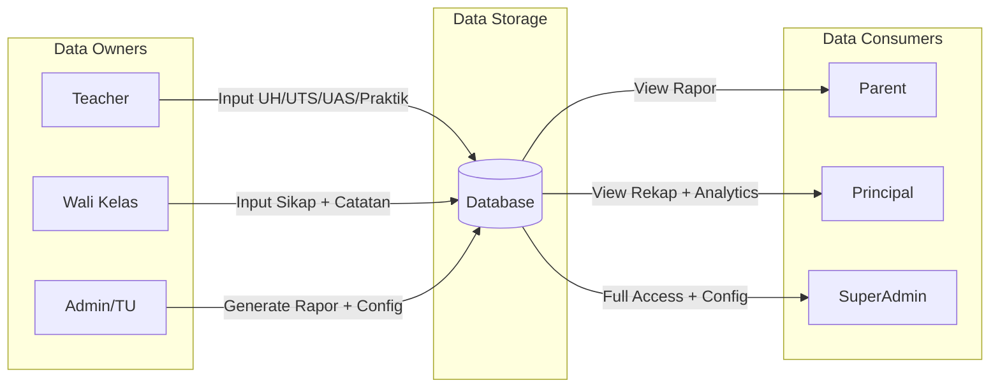
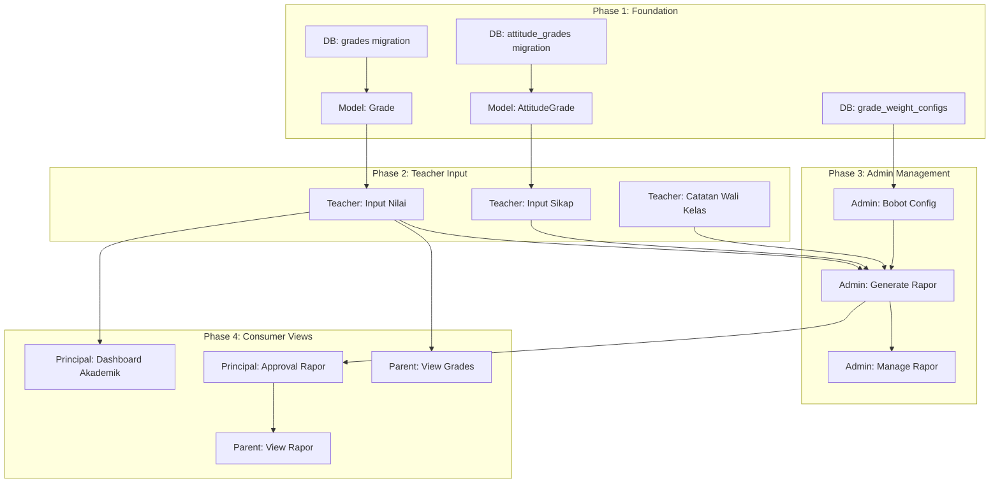

# Grades & Report Cards Implementation Strategy

## Phase 1: Feature Understanding

### Data Flow Overview

Module Grades & Report Cards menangani input nilai siswa (UH, UTS, UAS, sikap, praktik), perhitungan nilai akhir, dan generate rapor digital sesuai Kurikulum 2013 (K13).




### Primary User Goals


| Role                 | Primary Goal                                                         |
| -------------------- | -------------------------------------------------------------------- |
| Teacher (Guru Mapel) | Input nilai komponen (UH, UTS, UAS, Praktik) untuk siswa di kelasnya |
| Teacher (Wali Kelas) | Input nilai sikap + catatan wali kelas untuk rapor                   |
| Admin/TU             | Konfigurasi bobot, generate rapor bulk, unlock rapor                 |
| Principal            | Monitor performa akademik, approve/release rapor                     |
| Parent               | Lihat rekap nilai + download rapor anak                              |


---

## Phase 2: Cross-Frontend Impact Mapping


| Feature                | Owner (Creates)           | Consumer (Views)              | Data Flow                                   |
| ---------------------- | ------------------------- | ----------------------------- | ------------------------------------------- |
| Input Nilai UH/UTS/UAS | Teacher (Guru Mapel)      | Admin, Principal, Parent      | Teacher Input → Store → Rekap/Rapor         |
| Input Nilai Praktik    | Teacher (Guru Mapel)      | Admin, Principal, Parent      | Teacher Input → Store → Rekap/Rapor         |
| Input Nilai Sikap      | Teacher (Wali Kelas)      | Admin, Principal, Parent      | Wali Kelas Input → Store → Rapor            |
| Catatan Wali Kelas     | Teacher (Wali Kelas)      | Parent                        | Wali Kelas Input → Store → Rapor            |
| Konfigurasi Bobot      | Admin/SuperAdmin          | All (implicit in calculation) | Admin Config → Store → Calculation          |
| Generate Rapor PDF     | Admin/TU/Wali Kelas       | Parent, Principal             | Generate → Store → Download                 |
| Approval Rapor         | Principal                 | Parent (after release)        | Principal Approve → Release → Parent Access |
| Lihat Rekap Nilai      | Teacher, Admin, Principal | Self                          | View only                                   |
| Lihat Rapor Online     | Parent                    | Self                          | View/Download                               |
| Dashboard Akademik     | Principal                 | Self                          | Analytics view                              |
| Export Nilai Excel     | Admin/TU/Principal        | Self                          | Export action                               |


---

## Phase 3: Implementation Checklist by Feature

### US-GRD-001: Input Nilai Siswa (UH/UTS/UAS/Praktik)

**Owner Side (Teacher):**

- UI form untuk pilih kelas, mapel, semester, jenis penilaian
- Table input nilai per siswa (0-100)
- Validasi rules (0-100, required)
- Edit/Update nilai yang sudah diinput
- Bulk action: set nilai sama untuk semua
- Auto-save draft (prevent data loss)

**Consumer Side (View):**

- Rekap nilai per siswa (Teacher, Admin, Principal)
- Detail breakdown komponen (expandable rows)
- Chart visualisasi (radar/bar chart)

**Integration:**

- API: GET /teacher/grades, POST /teacher/grades
- DB: `grades` table migration
- Wayfinder routes: `teacher.grades.`*

---

### US-GRD-002: Set Bobot Komponen Nilai

**Owner Side (Admin):**

- UI form konfigurasi bobot (UH %, UTS %, UAS %)
- Validasi total = 100%
- Per mata pelajaran override (optional)
- History perubahan bobot

**Consumer Side:**

- View current bobot (implicitly used in calculation)

**Integration:**

- API: GET/PUT /admin/settings/grade-weights
- DB: `grade_weight_configs` table or `settings` JSON

---

### US-GRD-003: Lihat Rekap Nilai

**Frontend Needs by Role:**


| Role      | Page Needed                    | Features                          |
| --------- | ------------------------------ | --------------------------------- |
| Teacher   | `/teacher/grades/summary`      | View kelas yang diajar, per siswa |
| Admin     | `/admin/grades/summary`        | View semua kelas, filter          |
| Principal | `/principal/academic/grades`   | View semua, analytics             |
| Parent    | `/parent/children/{id}/grades` | View anak sendiri only            |


---

### US-GRD-004: Input Nilai Sikap

**Owner Side (Wali Kelas):**

- UI form pilih kelas + semester
- Per siswa: dropdown Spiritual (A/B/C/D), dropdown Sosial (A/B/C/D)
- Textarea deskripsi sikap (max 200 char)
- Bulk action: set predikat sama

**Integration:**

- API: GET/POST /teacher/attitude-grades
- DB: `attitude_grades` table migration

---

### US-GRD-005: Generate Rapor PDF

**Owner Side (Admin/TU/Wali Kelas):**

- Wizard: Step 1 (Selection) → Step 2 (Validation/Preview) → Step 3 (Generate)
- Preview rapor (HTML or PDF viewer)
- Bulk generate (per kelas)
- Finalize & lock values
- Download ZIP (bulk) or individual PDF

**Integration:**

- API: POST /admin/report-cards/generate
- DB: `report_cards` table (optional for tracking)
- PDF generation (Laravel PDF package: barryvdh/laravel-dompdf or snappy)
- Storage: `storage/app/report-cards/`

---

### US-GRD-006: Lihat Rapor Online (Parent)

**Consumer Side (Parent):**

- Dashboard: List rapor per semester
- Status badge: Tersedia/Draft/Belum
- View online (HTML responsive)
- Download PDF button
- Empty state jika belum ada

**Integration:**

- API: GET /parent/children/{id}/report-cards
- Access control: only finalized rapor visible

---

### US-GRD-007: Approval & Release Rapor (Principal)

**Owner Side (Principal):**

- List rapor pending approval per kelas
- Preview sample rapor
- Approve & Release button
- Reject with notes (return to wali kelas)

**Integration:**

- API: POST /principal/report-cards/{id}/approve
- Notification to parent after release

---

### US-GRD-008: Catatan Wali Kelas

**Owner Side (Wali Kelas):**

- Per siswa textarea for catatan
- Max 500 characters
- Template catatan (optional)

**Integration:**

- Field in `report_cards` or separate table
- Included in PDF generation

---

### US-GRD-011: Dashboard Akademik (Principal)

**Consumer Side (Principal):**

- Page: `/principal/academic/dashboard`
- Rata-rata nilai per mapel (chart)
- Distribusi predikat A/B/C/D (pie chart)
- Highlight mapel dengan rata-rata < KKM
- Filter per kelas, semester

---

## Phase 4: Gap Analysis

### Critical Gaps Identified


| Gap                            | Description                                            | Impact             | Priority |
| ------------------------------ | ------------------------------------------------------ | ------------------ | -------- |
| Teacher has no grades menu     | Teacher creates grades but no UI exists                | Feature unusable   | P0       |
| Parent has no rapor menu       | Parent should view rapor but no UI                     | Feature incomplete | P0       |
| Principal has no academic menu | Principal should monitor grades/approve rapor          | Feature incomplete | P0       |
| No semester model              | Academic year exists but semester (1/2) not structured | Calculation issues | P0       |
| No grades DB tables            | Database structure missing                             | Cannot store data  | P0       |


### Missing Frontend Implementation

**Teacher Frontend (`/teacher/`):**

- `/grades` - Index: list penilaian yang sudah diinput
- `/grades/create` - Create: form input nilai baru
- `/grades/{id}/edit` - Edit: edit nilai
- `/attitude-grades` - Input nilai sikap (wali kelas only)
- `/report-cards` - Catatan wali kelas + preview rapor (wali kelas only)

**Admin Frontend (`/admin/`):**

- `/grades` - Index: rekap semua nilai
- `/grades/summary` - Summary: rekap per kelas/siswa
- `/settings/grade-weights` - Konfigurasi bobot nilai
- `/report-cards` - Generate & manage rapor
- `/report-cards/generate` - Wizard generate rapor

**Principal Frontend (`/principal/`):**

- `/academic/dashboard` - Dashboard akademik analytics
- `/academic/grades` - View rekap nilai semua kelas
- `/report-cards` - Approval rapor list
- `/report-cards/{id}` - Preview & approve/reject rapor

**Parent Frontend (`/parent/`):**

- `/children/{id}/grades` - Rekap nilai anak
- `/children/{id}/report-cards` - List rapor anak
- `/children/{id}/report-cards/{semester}` - View rapor online

---

## Phase 5: Implementation Sequencing

### Dependency Graph




### Priority Matrix


| Task                                    | Priority | Reason                             |
| --------------------------------------- | -------- | ---------------------------------- |
| DB migrations (grades, attitude_grades) | P0       | Nothing works without data storage |
| Models (Grade, AttitudeGrade)           | P0       | Business logic foundation          |
| Teacher: Input Nilai                    | P0       | Primary data creation              |
| Teacher: Input Sikap                    | P0       | Required for complete rapor        |
| Admin: Bobot Config                     | P0       | Required for calculation           |
| Admin: Generate Rapor                   | P0       | Core deliverable                   |
| Parent: View Rapor                      | P0       | Primary consumer goal              |
| Parent: View Grades Rekap               | P1       | Enhancement to transparency        |
| Principal: Approval Flow                | P1       | Quality control                    |
| Principal: Dashboard Akademik           | P1       | Monitoring                         |
| Export Excel                            | P2       | Nice to have                       |
| Import Excel                            | P2       | Future phase                       |


---

## Phase 6: Detailed Implementation

### Database Schema

**Migration: `grades` table**

```
- id
- student_id (FK students)
- subject_id (FK subjects)
- class_id (FK classes)
- teacher_id (FK users)
- tahun_ajaran (string: "2024/2025")
- semester (enum: 1, 2)
- assessment_type (enum: UH, UTS, UAS, PRAKTIK, PROYEK)
- assessment_number (int, nullable: for UH1, UH2, etc.)
- title (string: "UH 1: Perkalian")
- assessment_date (date)
- score (decimal 5,2: 0-100)
- notes (text, nullable)
- is_locked (boolean, default false)
- locked_at (timestamp, nullable)
- locked_by (FK users, nullable)
- timestamps
- softDeletes
```

**Migration: `attitude_grades` table**

```
- id
- student_id (FK students)
- class_id (FK classes)
- teacher_id (FK users, wali kelas)
- tahun_ajaran (string)
- semester (enum: 1, 2)
- spiritual_grade (enum: A, B, C, D)
- spiritual_description (string 200, nullable)
- social_grade (enum: A, B, C, D)
- social_description (string 200, nullable)
- homeroom_notes (text 500, nullable: catatan wali kelas)
- timestamps
- unique: (student_id, tahun_ajaran, semester)
```

**Migration: `report_cards` table**

```
- id
- student_id (FK students)
- class_id (FK classes)
- tahun_ajaran (string)
- semester (enum: 1, 2)
- status (enum: DRAFT, PENDING_APPROVAL, APPROVED, RELEASED)
- generated_at (timestamp, nullable)
- generated_by (FK users, nullable)
- approved_at (timestamp, nullable)
- approved_by (FK users, nullable)
- released_at (timestamp, nullable)
- pdf_path (string, nullable)
- average_score (decimal 5,2, nullable)
- rank (int, nullable)
- timestamps
```

### Routes Structure

**Teacher Routes** ([routes/teacher.php](routes/teacher.php)):

```php
// Grades Input
Route::prefix('grades')->group(function () {
    Route::get('/', [GradeController::class, 'index'])->name('teacher.grades.index');
    Route::get('/create', [GradeController::class, 'create'])->name('teacher.grades.create');
    Route::post('/', [GradeController::class, 'store'])->name('teacher.grades.store');
    Route::get('/{grade}/edit', [GradeController::class, 'edit'])->name('teacher.grades.edit');
    Route::put('/{grade}', [GradeController::class, 'update'])->name('teacher.grades.update');
    Route::delete('/{grade}', [GradeController::class, 'destroy'])->name('teacher.grades.destroy');
});

// Attitude Grades (Wali Kelas only)
Route::prefix('attitude-grades')->group(function () {
    Route::get('/', [AttitudeGradeController::class, 'index'])->name('teacher.attitude-grades.index');
    Route::get('/create', [AttitudeGradeController::class, 'create'])->name('teacher.attitude-grades.create');
    Route::post('/', [AttitudeGradeController::class, 'store'])->name('teacher.attitude-grades.store');
});

// Report Card (Wali Kelas)
Route::prefix('report-cards')->group(function () {
    Route::get('/', [TeacherReportCardController::class, 'index'])->name('teacher.report-cards.index');
    Route::get('/{reportCard}', [TeacherReportCardController::class, 'show'])->name('teacher.report-cards.show');
});
```

**Admin Routes** ([routes/admin.php](routes/admin.php)):

```php
// Grade Management
Route::prefix('grades')->group(function () {
    Route::get('/', [AdminGradeController::class, 'index'])->name('admin.grades.index');
    Route::get('/summary', [AdminGradeController::class, 'summary'])->name('admin.grades.summary');
});

// Grade Weight Config
Route::prefix('settings/grade-weights')->group(function () {
    Route::get('/', [GradeWeightController::class, 'index'])->name('admin.settings.grade-weights.index');
    Route::put('/', [GradeWeightController::class, 'update'])->name('admin.settings.grade-weights.update');
});

// Report Cards
Route::prefix('report-cards')->group(function () {
    Route::get('/', [AdminReportCardController::class, 'index'])->name('admin.report-cards.index');
    Route::get('/generate', [AdminReportCardController::class, 'generate'])->name('admin.report-cards.generate');
    Route::post('/generate', [AdminReportCardController::class, 'processGenerate'])->name('admin.report-cards.process-generate');
    Route::post('/{reportCard}/unlock', [AdminReportCardController::class, 'unlock'])->name('admin.report-cards.unlock');
});
```

**Principal Routes** ([routes/principal.php](routes/principal.php)):

```php
// Academic Dashboard
Route::prefix('academic')->group(function () {
    Route::get('/dashboard', [AcademicDashboardController::class, 'index'])->name('principal.academic.dashboard');
    Route::get('/grades', [PrincipalGradeController::class, 'index'])->name('principal.academic.grades');
});

// Report Card Approval
Route::prefix('report-cards')->group(function () {
    Route::get('/', [PrincipalReportCardController::class, 'index'])->name('principal.report-cards.index');
    Route::get('/{reportCard}', [PrincipalReportCardController::class, 'show'])->name('principal.report-cards.show');
    Route::post('/{reportCard}/approve', [PrincipalReportCardController::class, 'approve'])->name('principal.report-cards.approve');
    Route::post('/{reportCard}/reject', [PrincipalReportCardController::class, 'reject'])->name('principal.report-cards.reject');
});
```

**Parent Routes** ([routes/parent.php](routes/parent.php)):

```php
// Children Grades
Route::get('/children/{student}/grades', [ParentGradeController::class, 'show'])->name('parent.children.grades');

// Children Report Cards
Route::prefix('children/{student}/report-cards')->group(function () {
    Route::get('/', [ParentReportCardController::class, 'index'])->name('parent.children.report-cards.index');
    Route::get('/{reportCard}', [ParentReportCardController::class, 'show'])->name('parent.children.report-cards.show');
    Route::get('/{reportCard}/download', [ParentReportCardController::class, 'download'])->name('parent.children.report-cards.download');
});
```

### Frontend Pages Structure

**Teacher Pages** (`resources/js/Pages/Teacher/`):

```
Grades/
├── Index.vue       # List penilaian yang sudah diinput
├── Create.vue      # Form input nilai baru (wizard-style)
└── Edit.vue        # Edit nilai yang sudah ada
AttitudeGrades/
├── Index.vue       # List nilai sikap
└── Create.vue      # Form input nilai sikap
ReportCards/
├── Index.vue       # List rapor kelas (wali kelas)
└── Show.vue        # Preview rapor + input catatan
```

**Admin Pages** (`resources/js/Pages/Admin/`):

```
Grades/
├── Index.vue       # Rekap semua nilai
└── Summary.vue     # Summary per kelas/siswa
Settings/
└── GradeWeights.vue # Konfigurasi bobot
ReportCards/
├── Index.vue       # List semua rapor
└── Generate.vue    # Wizard generate rapor
```

**Principal Pages** (`resources/js/Pages/Principal/`):

```
Academic/
├── Dashboard.vue   # Dashboard akademik dengan charts
└── Grades.vue      # Rekap nilai semua kelas
ReportCards/
├── Index.vue       # List rapor pending approval
└── Show.vue        # Preview & approve/reject
```

**Parent Pages** (`resources/js/Pages/Parent/`):

```
Children/
├── Grades.vue      # Rekap nilai anak (add to existing)
└── ReportCards/
    ├── Index.vue   # List rapor per semester
    └── Show.vue    # View rapor online
```

### Navigation Menu Updates

**Teacher Menu** (add to existing):

```vue
{ name: 'Nilai', href: teacherGrades.index(), icon: AcademicCapIcon }
{ name: 'Nilai Sikap', href: teacherAttitudeGrades.index(), icon: HeartIcon } // wali kelas only
{ name: 'Rapor', href: teacherReportCards.index(), icon: DocumentTextIcon } // wali kelas only
```

**Admin Menu** (add to existing):

```vue
{ name: 'Nilai', href: adminGrades.index(), icon: AcademicCapIcon }
{ name: 'Rapor', href: adminReportCards.index(), icon: DocumentTextIcon }
{ name: 'Bobot Nilai', href: adminSettingsGradeWeights.index(), icon: CogIcon } // under Settings
```

**Principal Menu** (add new section):

```vue
{ name: 'Akademik', icon: AcademicCapIcon, children: [
    { name: 'Dashboard', href: principalAcademicDashboard() },
    { name: 'Rekap Nilai', href: principalAcademicGrades() },
    { name: 'Approval Rapor', href: principalReportCards.index() }
]}
```

**Parent Menu** (add to existing children section):

```vue
// In child detail page, add tabs:
- Profil (existing)
- Kehadiran (existing)
- Nilai (new) // link to /children/{id}/grades
- Rapor (new) // link to /children/{id}/report-cards
```

### Reusable Components to Create

**Feature Components** (`resources/js/Components/features/Grades/`):

```
GradeInputForm.vue       # Form input nilai dengan table siswa
GradeInputTable.vue      # Table input nilai per siswa
GradeSummaryTable.vue    # Table rekap nilai
GradeChart.vue           # Radar/bar chart nilai
AttitudeGradeForm.vue    # Form input nilai sikap
ReportCardPreview.vue    # Preview rapor (HTML)
ReportCardStatusBadge.vue # Badge status rapor
HomeroomNotesForm.vue    # Form catatan wali kelas
```

---

## Phase 7: Example User Journeys

### Journey 1: Teacher Input Nilai UH

**Owner Journey (Teacher):**

1. Teacher navigates to: `/teacher/grades`
2. Teacher clicks: "Tambah Penilaian Baru" button
3. Teacher fills:
  - Kelas: dropdown (from teacher's classes)
  - Mata Pelajaran: dropdown (from teacher's subjects)
  - Semester: dropdown (1/2)
  - Jenis: dropdown (UH/UTS/UAS/Praktik)
  - Judul: "UH 1: Perkalian"
  - Tanggal: date picker
4. System loads: List siswa di kelas tersebut with input fields
5. Teacher inputs: Nilai per siswa (0-100)
6. Teacher clicks: "Simpan"
7. System does: Validate (0-100), store grades, show success toast
8. Teacher sees: Redirect to index with success message

**Consumer Journey (Parent views child's grade):**

1. Parent navigates to: `/parent/children` → click child card
2. Parent clicks: "Nilai" tab
3. Parent sees: Table nilai per mata pelajaran (Pengetahuan, Keterampilan, Nilai Akhir, Predikat)
4. Parent can: Expand row to see breakdown (UH1, UH2, UTS, UAS, Praktik)
5. Parent sees: Chart visualisasi performa per mapel

### Journey 2: Admin Generate Rapor

**Owner Journey (Admin/TU):**

1. Admin navigates to: `/admin/report-cards/generate`
2. Admin fills (Step 1):
  - Tahun Ajaran: "2024/2025"
  - Semester: 1
  - Kelas: All or specific (e.g., "1A")
3. Admin clicks: "Preview Rapor"
4. System does: Validate all nilai complete, calculate final grades
5. Admin sees (Step 2): List siswa with status (Complete/Incomplete)
  - If incomplete: show warning "Siswa X: UAS Matematika belum diinput"
6. Admin clicks: "Finalize & Generate" (only if all complete)
7. System does:
  - Lock all grades for semester
  - Generate PDF for each student
  - Store PDFs in storage
  - Create report_card records with status PENDING_APPROVAL
8. Admin sees (Step 3): Success message "30 rapor berhasil di-generate"
9. Admin can: Download ZIP, send to principal for approval

**Consumer Journey (Principal Approves):**

1. Principal navigates to: `/principal/report-cards`
2. Principal sees: List rapor pending approval per kelas
3. Principal clicks: "Kelas 1A" → preview sample rapor
4. Principal reviews: Check nilai, sikap, catatan wali kelas
5. Principal clicks: "Approve & Release"
6. System does: Update status to RELEASED, send notification to parents
7. Parent receives: Push notification "Rapor Semester 1 sudah tersedia"

### Journey 3: Parent View Rapor Online

**Consumer Journey (Parent):**

1. Parent receives: Notification "Rapor Semester 1 sudah tersedia"
2. Parent navigates to: `/parent/children/{id}/report-cards`
3. Parent sees: Card list per semester with status badges
  - "Semester 1 - 2024/2025" (Status: Tersedia, Rata-rata: 85, Ranking: #3)
4. Parent clicks: "Lihat Rapor"
5. Parent sees: HTML view of rapor (responsive, mobile-friendly):
  - Biodata siswa
  - Table nilai per mapel
  - Nilai sikap + deskripsi
  - Catatan wali kelas
  - Kehadiran summary
6. Parent clicks: "Download PDF"
7. System does: Stream PDF file for download
8. Parent achieves: Has digital copy of report card

---

## Critical Reminders Checklist

- Data creation WITH display coverage: Teacher creates → Parent can view
- Mobile consideration: All pages need mobile-responsive design
- Navigation verified: New menu items for all roles
- Empty states defined: "Rapor belum tersedia" for parent
- Filters included: Per kelas, semester, tahun ajaran
- Role-based access: Teacher only own class/subject, Parent only own child

## Files/Directories to Create

### Backend

- `app/Models/Grade.php`
- `app/Models/AttitudeGrade.php`
- `app/Models/ReportCard.php`
- `app/Http/Controllers/Teacher/GradeController.php`
- `app/Http/Controllers/Teacher/AttitudeGradeController.php`
- `app/Http/Controllers/Teacher/ReportCardController.php`
- `app/Http/Controllers/Admin/GradeController.php`
- `app/Http/Controllers/Admin/ReportCardController.php`
- `app/Http/Controllers/Admin/GradeWeightController.php`
- `app/Http/Controllers/Principal/AcademicDashboardController.php`
- `app/Http/Controllers/Principal/GradeController.php`
- `app/Http/Controllers/Principal/ReportCardController.php`
- `app/Http/Controllers/Parent/GradeController.php`
- `app/Http/Controllers/Parent/ReportCardController.php`
- `app/Services/GradeCalculationService.php`
- `app/Services/ReportCardService.php`
- `database/migrations/xxxx_create_grades_table.php`
- `database/migrations/xxxx_create_attitude_grades_table.php`
- `database/migrations/xxxx_create_report_cards_table.php`
- `database/migrations/xxxx_create_grade_weight_configs_table.php`

### Frontend

- `resources/js/Pages/Teacher/Grades/Index.vue`
- `resources/js/Pages/Teacher/Grades/Create.vue`
- `resources/js/Pages/Teacher/Grades/Edit.vue`
- `resources/js/Pages/Teacher/AttitudeGrades/Index.vue`
- `resources/js/Pages/Teacher/AttitudeGrades/Create.vue`
- `resources/js/Pages/Teacher/ReportCards/Index.vue`
- `resources/js/Pages/Teacher/ReportCards/Show.vue`
- `resources/js/Pages/Admin/Grades/Index.vue`
- `resources/js/Pages/Admin/Grades/Summary.vue`
- `resources/js/Pages/Admin/Settings/GradeWeights.vue`
- `resources/js/Pages/Admin/ReportCards/Index.vue`
- `resources/js/Pages/Admin/ReportCards/Generate.vue`
- `resources/js/Pages/Principal/Academic/Dashboard.vue`
- `resources/js/Pages/Principal/Academic/Grades.vue`
- `resources/js/Pages/Principal/ReportCards/Index.vue`
- `resources/js/Pages/Principal/ReportCards/Show.vue`
- `resources/js/Pages/Parent/Children/Grades.vue`
- `resources/js/Pages/Parent/Children/ReportCards/Index.vue`
- `resources/js/Pages/Parent/Children/ReportCards/Show.vue`
- `resources/js/Components/features/Grades/*.vue` (multiple)

