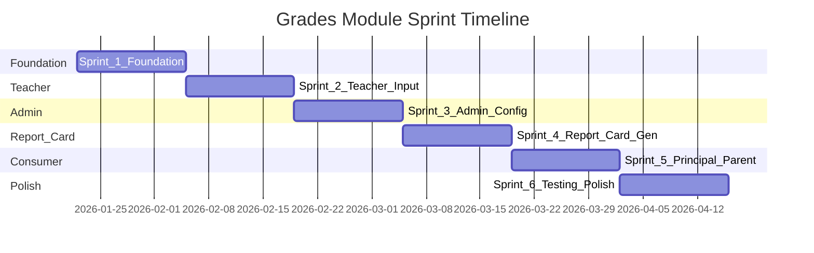

# Grades & Report Cards - Sprint Planning

## Sprint Overview

Implementasi dibagi menjadi **6 Sprint** dengan total estimasi 12 minggu kerja.




---

## Sprint 1: Foundation (Database & Models)

**Goal:** Menyiapkan infrastruktur database dan models dasar

### Backend Tasks

- **T1.1** Create migration `grades` table
  - Fields: student_id, subject_id, class_id, teacher_id, tahun_ajaran, semester, assessment_type, assessment_number, title, assessment_date, score, notes, is_locked, locked_at, locked_by, timestamps, softDeletes
- **T1.2** Create migration `attitude_grades` table
  - Fields: student_id, class_id, teacher_id, tahun_ajaran, semester, spiritual_grade, spiritual_description, social_grade, social_description, homeroom_notes
  - Unique constraint: (student_id, tahun_ajaran, semester)
- **T1.3** Create migration `report_cards` table
  - Fields: student_id, class_id, tahun_ajaran, semester, status (enum: DRAFT, PENDING_APPROVAL, APPROVED, RELEASED), generated_at/by, approved_at/by, released_at, pdf_path, average_score, rank
- **T1.4** Create migration `grade_weight_configs` table
  - Fields: tahun_ajaran, subject_id (nullable), uh_weight, uts_weight, uas_weight, praktik_weight, is_default
- **T1.5** Create Model `Grade.php` with relationships
  - BelongsTo: student, subject, class, teacher
  - Scopes: byTahunAjaran, bySemester, byAssessmentType
  - Accessors: predikat (A/B/C/D)
- **T1.6** Create Model `AttitudeGrade.php` with relationships
  - BelongsTo: student, class, teacher
- **T1.7** Create Model `ReportCard.php` with relationships
  - BelongsTo: student, class, generatedBy, approvedBy
  - Enum casts for status
- **T1.8** Create Model `GradeWeightConfig.php`
  - Validation: total weight = 100%

### Deliverables Sprint 1

- 4 migration files created and migrated
- 4 models with relationships and business logic
- Factories dan seeders untuk testing

---

## Sprint 2: Teacher Grade Input

**Goal:** Guru dapat input nilai UH/UTS/UAS/Praktik

### Backend Tasks

- **T2.1** Create `GradeController` for Teacher
  - index(): List penilaian yang sudah diinput (filter by semester, mapel)
  - create(): Form data (kelas, mapel, siswa)
  - store(): Bulk insert grades per kelas
  - edit(): Edit existing assessment
  - update(): Update grades
  - destroy(): Soft delete assessment
- **T2.2** Create `AttitudeGradeController` for Teacher (Wali Kelas)
  - index(): List nilai sikap kelas
  - create(): Form input nilai sikap
  - store(): Store attitude grades
  - Middleware: check isWaliKelas
- **T2.3** Create Form Requests
  - `StoreGradeRequest`: validate score 0-100, required fields
  - `StoreAttitudeGradeRequest`: validate enum grades
- **T2.4** Create Teacher Routes
  - `/teacher/grades` (CRUD)
  - `/teacher/attitude-grades` (index, create, store)

### Frontend Tasks

- **T2.5** Create `Teacher/Grades/Index.vue`
  - Table list penilaian: Judul, Kelas, Mapel, Tanggal, Jumlah Siswa
  - Filters: Semester, Mapel
  - Action buttons: Edit, Delete
- **T2.6** Create `Teacher/Grades/Create.vue` (Wizard Style)
  - Step 1: Pilih Kelas, Mapel, Semester, Jenis, Judul, Tanggal
  - Step 2: Table input nilai per siswa (Nama, NIS, Score input)
  - Bulk actions: Set nilai sama untuk semua
  - Validation: 0-100, required
- **T2.7** Create `Teacher/Grades/Edit.vue`
  - Load existing grades
  - Update values
  - Lock indicator if already locked
- **T2.8** Create `Teacher/AttitudeGrades/Index.vue`
  - Table: Siswa, Spiritual, Sosial, Deskripsi
  - Filter: Semester
- **T2.9** Create `Teacher/AttitudeGrades/Create.vue`
  - Per siswa: Dropdown Spiritual (A/B/C/D), Dropdown Sosial, Textarea deskripsi
  - Bulk action: Set predikat sama
- **T2.10** Update Teacher Navigation
  - Add menu item "Nilai" with icon AcademicCapIcon
  - Add menu item "Nilai Sikap" (conditional: wali kelas only)

### Deliverables Sprint 2

- Teacher dapat input nilai UH/UTS/UAS/Praktik
- Wali Kelas dapat input nilai sikap
- Mobile-responsive forms

---

## Sprint 3: Admin Configuration & Grade Summary

**Goal:** Admin dapat konfigurasi bobot nilai dan melihat rekap

### Backend Tasks

- **T3.1** Create `GradeWeightController` for Admin
  - index(): Get current weight config
  - update(): Update weight config with validation (total = 100%)
  - history(): Audit trail perubahan bobot
- **T3.2** Create `AdminGradeController`
  - index(): List semua nilai dengan filters
  - summary(): Rekap per kelas/siswa dengan calculated final grade
- **T3.3** Create `GradeCalculationService`
  - calculateFinalGrade(student, subject, semester): Apply weight formula
  - calculateClassAverage(class, subject, semester)
  - calculateRanking(class, semester)
  - getPredikat(score): A/B/C/D based on ranges
- **T3.4** Create Admin Routes
  - `/admin/settings/grade-weights` (index, update)
  - `/admin/grades` (index, summary)

### Frontend Tasks

- **T3.5** Create `Admin/Settings/GradeWeights.vue`
  - Form: UH %, UTS %, UAS %, Praktik %
  - Live validation: total = 100%
  - Per mapel override toggle (optional)
  - History table
- **T3.6** Create `Admin/Grades/Index.vue`
  - Table: Kelas, Mapel, Guru, Jumlah Penilaian, Last Updated
  - Filters: Tahun Ajaran, Semester, Kelas, Mapel
  - Search by nama siswa
- **T3.7** Create `Admin/Grades/Summary.vue`
  - Rekap nilai per siswa
  - Table: Siswa, Mapel columns (Nilai Akhir, Predikat)
  - Expandable rows: breakdown komponen (UH, UTS, UAS, Praktik)
  - Export Excel button
- **T3.8** Create Reusable Components
  - `GradeSummaryTable.vue`: Reusable table untuk rekap nilai
  - `GradeChart.vue`: Radar chart performa per mapel
  - `GradePredikatBadge.vue`: Badge A/B/C/D dengan warna
- **T3.9** Update Admin Navigation
  - Add "Nilai" menu item
  - Add "Bobot Nilai" under Settings dropdown

### Deliverables Sprint 3

- Admin dapat set bobot nilai K13
- Rekap nilai dengan perhitungan otomatis
- Export Excel functionality

---

## Sprint 4: Report Card Generation

**Goal:** Admin/Wali Kelas dapat generate rapor PDF

### Backend Tasks

- **T4.1** Create `ReportCardService`
  - generateReportCard(student, semester): Create report card record
  - generatePDF(reportCard): Generate PDF using dompdf
  - generateBulk(class, semester): Batch generate
  - validateCompleteness(class, semester): Check all grades complete
  - lockGrades(class, semester): Lock grades after finalization
- **T4.2** Create `AdminReportCardController`
  - index(): List semua rapor dengan status
  - generate(): Wizard view
  - processGenerate(): Execute generation
  - show(): Preview rapor
  - unlock(): Unlock rapor for edit
- **T4.3** Create `TeacherReportCardController` (Wali Kelas)
  - index(): List rapor kelas sendiri
  - show(): Preview + input catatan
  - updateNotes(): Save homeroom notes
- **T4.4** Install and configure `barryvdh/laravel-dompdf`
  - PDF template dengan format rapor K13
  - Header sekolah, biodata siswa, table nilai, sikap, kehadiran
- **T4.5** Create Blade template for PDF
  - `resources/views/pdf/report-card.blade.php`
  - K13 format dengan semua komponen

### Frontend Tasks

- **T4.6** Create `Admin/ReportCards/Index.vue`
  - Table: Kelas, Semester, Status, Generated At, Actions
  - Filters: Tahun Ajaran, Semester, Status
  - Batch actions: Download ZIP
- **T4.7** Create `Admin/ReportCards/Generate.vue` (Wizard)
  - Step 1: Selection (Tahun Ajaran, Semester, Kelas)
  - Step 2: Validation (List siswa dengan status Complete/Incomplete)
  - Step 3: Progress + Result (Success count, download ZIP)
  - Warning messages untuk incomplete data
- **T4.8** Create `Teacher/ReportCards/Index.vue`
  - List rapor siswa di kelas (wali kelas)
  - Status badges
- **T4.9** Create `Teacher/ReportCards/Show.vue`
  - Preview rapor (HTML)
  - Form input catatan wali kelas
  - Submit for approval button
- **T4.10** Create Reusable Components
  - `ReportCardPreview.vue`: HTML preview rapor
  - `ReportCardStatusBadge.vue`: Status badges
  - `HomeroomNotesForm.vue`: Form catatan wali kelas

### Deliverables Sprint 4

- Generate rapor PDF per siswa atau bulk per kelas
- Preview rapor online
- Wali kelas dapat input catatan

---

## Sprint 5: Principal Approval & Parent View

**Goal:** Principal approve rapor, Parent lihat nilai dan rapor

### Backend Tasks

- **T5.1** Create `PrincipalReportCardController`
  - index(): List rapor pending approval
  - show(): Preview rapor
  - approve(): Approve dan release
  - reject(): Reject dengan notes
- **T5.2** Create `AcademicDashboardController` for Principal
  - index(): Dashboard data (rata-rata per mapel, distribusi predikat, alerts)
  - gradesIndex(): Rekap nilai semua kelas
- **T5.3** Create `ParentGradeController`
  - show(student): Rekap nilai anak dengan authorization check
- **T5.4** Create `ParentReportCardController`
  - index(student): List rapor anak
  - show(reportCard): View rapor online
  - download(reportCard): Download PDF
- **T5.5** Create Notifications
  - `ReportCardReleasedNotification`: Notify parent when rapor released
  - Database + optional push notification

### Frontend Tasks

- **T5.6** Create `Principal/ReportCards/Index.vue`
  - Table: Kelas, Semester, Status, Pending Count
  - Filter by status
  - Bulk approve action
- **T5.7** Create `Principal/ReportCards/Show.vue`
  - Preview rapor sample
  - Approve/Reject buttons
  - Reject with notes modal
- **T5.8** Create `Principal/Academic/Dashboard.vue`
  - Chart: Rata-rata nilai per mapel (bar chart)
  - Chart: Distribusi predikat A/B/C/D (pie chart)
  - Alerts: Mapel dengan rata-rata < KKM
  - Filters: Semester, Kelas
- **T5.9** Create `Principal/Academic/Grades.vue`
  - Rekap nilai semua kelas
  - Drill-down per kelas/siswa
- **T5.10** Create `Parent/Children/Grades.vue`
  - Table nilai per mapel: Pengetahuan, Keterampilan, Nilai Akhir, Predikat
  - Expandable breakdown (UH, UTS, UAS, Praktik)
  - Radar chart performa
- **T5.11** Create `Parent/Children/ReportCards/Index.vue`
  - Card list per semester
  - Status badge: Tersedia/Draft/Belum
  - Rata-rata dan ranking display
- **T5.12** Create `Parent/Children/ReportCards/Show.vue`
  - Full rapor view (HTML responsive, mobile-first)
  - Download PDF button
  - Empty state if not available
- **T5.13** Update Navigation Menus
  - Principal: Add "Akademik" section with Dashboard, Rekap Nilai, Approval Rapor
  - Parent: Add "Nilai" and "Rapor" tabs in child detail

### Deliverables Sprint 5

- Principal dapat approve/reject rapor
- Dashboard akademik dengan analytics
- Parent dapat view nilai dan download rapor

---

## Sprint 6: Testing, Polish & Integration

**Goal:** Testing menyeluruh, bug fixes, dan polish UI/UX

### Testing Tasks

- **T6.1** Feature Tests: GradeController
  - Test CRUD operations
  - Test authorization (only own class/subject)
  - Test validation rules
- **T6.2** Feature Tests: AttitudeGradeController
  - Test wali kelas middleware
  - Test CRUD operations
- **T6.3** Feature Tests: ReportCardController
  - Test generation flow
  - Test approval flow
  - Test PDF generation
- **T6.4** Feature Tests: GradeCalculationService
  - Test weight calculation
  - Test ranking calculation
  - Test predikat assignment
- **T6.5** Feature Tests: Parent Access
  - Test authorization (only own child)
  - Test released-only visibility

### Polish Tasks

- **T6.6** Mobile Responsiveness Audit
  - Test all pages on mobile viewport
  - Fix any layout issues
- **T6.7** Empty States & Loading States
  - Add empty state illustrations
  - Add skeleton loaders for deferred props
- **T6.8** Error Handling
  - User-friendly error messages
  - Validation error display
- **T6.9** Performance Optimization
  - Eager loading for N+1 queries
  - Pagination for large datasets
- **T6.10** Documentation
  - API documentation update
  - User guide untuk admin

### Integration Tasks

- **T6.11** Wayfinder Routes Generation
  - Run `php artisan wayfinder:generate`
  - Verify all route imports
- **T6.12** Run `yarn run build`
  - Verify production build
  - Fix any build errors
- **T6.13** Run Full Test Suite
  - `php artisan test`
  - Fix any failing tests

### Deliverables Sprint 6

- All tests passing
- Production-ready build
- Mobile-responsive UI
- Complete documentation

---

## Sprint Summary Table


| Sprint | Focus           | Key Deliverables                          |
| ------ | --------------- | ----------------------------------------- |
| 1      | Foundation      | 4 migrations, 4 models, relationships     |
| 2      | Teacher Input   | Guru input nilai, Wali Kelas input sikap  |
| 3      | Admin Config    | Bobot nilai, rekap nilai, export Excel    |
| 4      | Report Card Gen | Generate PDF, preview, catatan wali kelas |
| 5      | Consumer Views  | Principal approval, Parent view rapor     |
| 6      | Testing/Polish  | Full test coverage, mobile responsive     |


---

## Dependencies & Prerequisites

### Packages to Install (Sprint 4)

```bash
composer require barryvdh/laravel-dompdf
```

### Existing Components to Leverage

- `[DataTable.vue](resources/js/Components/ui/DataTable.vue)` - untuk semua table views
- `[Modal.vue](resources/js/Components/ui/Modal.vue)` - untuk confirm dialogs
- `[Badge.vue](resources/js/Components/ui/Badge.vue)` - untuk status badges
- `[Card.vue](resources/js/Components/ui/Card.vue)` - untuk dashboard cards
- Existing layout components per role

### Key Files Reference

- Student model: `[app/Models/Student.php](app/Models/Student.php)`
- Subject model: `[app/Models/Subject.php](app/Models/Subject.php)`
- ClassRoom model: `[app/Models/ClassRoom.php](app/Models/ClassRoom.php)`
- Existing Teacher routes: `[routes/teacher.php](routes/teacher.php)`
- Existing Admin routes: `[routes/admin.php](routes/admin.php)`

