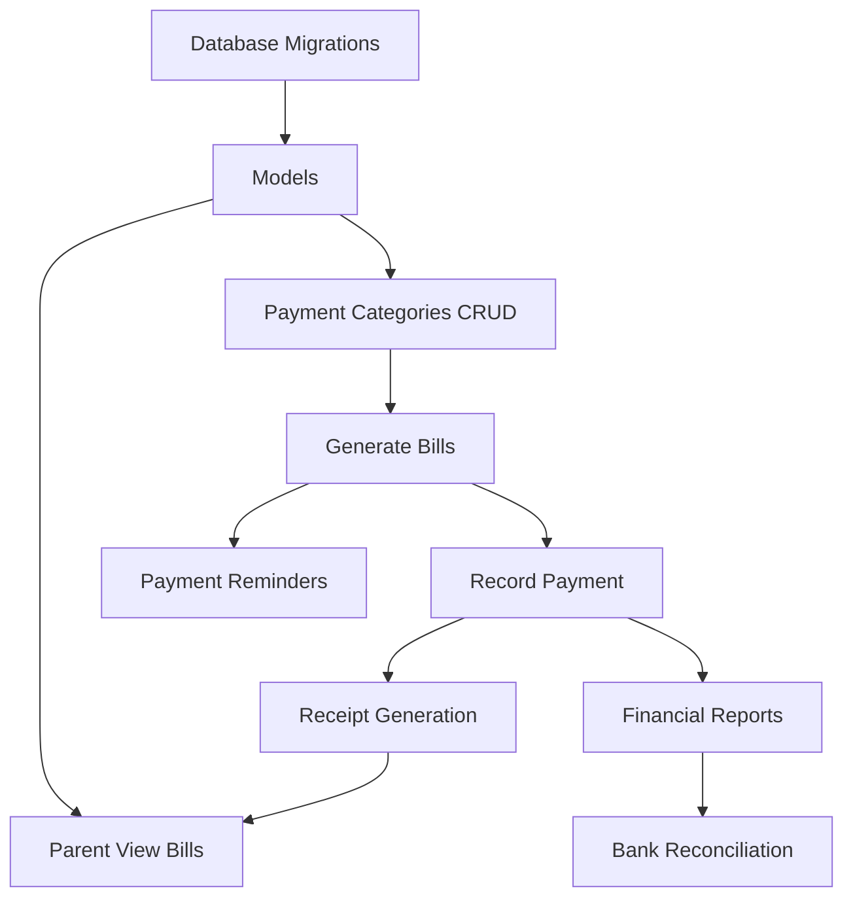

# Payment System Development Strategy

## Phase 1: Feature Understanding

### Core Purpose

Digitalisasi pencatatan pembayaran sekolah (SPP, uang gedung, seragam, kegiatan) dengan tracking status real-time, reminder otomatis, dan laporan keuangan.

### Data Entities

- **Payment Categories**: Jenis pembayaran (SPP, Uang Gedung, Seragam, Kegiatan, Donasi)
- **Bills (Tagihan)**: Generated invoice per siswa
- **Payments (Pembayaran)**: Recorded transactions
- **Payment Receipts (Kwitansi)**: Generated PDF receipts
- **Bank Reconciliation**: Matching bank statements with payments

---

## Phase 2: Cross-Frontend Impact Mapping

### Feature Ownership Matrix

| Feature | Owner (Who Creates) | Consumer (Who Views) | Data Flow |

|---------|---------------------|---------------------|-----------|

| Payment Categories | Admin/TU → CRUD | Admin/TU, Principal | Create → Store → Display |

| Generate SPP Bills | Admin/TU → Generate | Parent → View Bills | Generate → Store → Parent Dashboard |

| Manual Payment Recording | Admin/TU → Input | Parent → View Receipt, Principal → Reports | Input → Store → Receipt/Report |

| Payment Receipt | System → Generate | Parent → Download, Admin/TU → Print | Generate → Store → Download |

| Payment Reminder | System → Auto-send | Parent → Receive WhatsApp/Email | Cron → Query Unpaid → Send |

| Financial Reports | System → Generate | Principal, Admin/TU → View/Export | Query → Calculate → Display |

| Bank Reconciliation | Admin/TU → Upload/Match | Admin/TU → Verify | Upload → Match → Verify |

| Custom Payment/Bill | Admin/TU → Create | Parent → View Bills | Create → Store → Parent View |

| Payment Verification | Parent → Upload Bukti | Admin/TU → Verify | Upload → Pending → Verify → Confirm |

### Role-Based Feature Access

| Feature | SuperAdmin | Admin/TU | Principal | Teacher | Parent |

|---------|:----------:|:--------:|:---------:|:-------:|:------:|

| Payment Categories CRUD | Full | Full | Read | - | - |

| Generate SPP Bills | - | Full | - | - | - |

| Record Payment | - | Full | - | - | - |

| View All Payments | Full | Full | Full | - | - |

| Financial Reports | Full | Full | Full | - | - |

| Bank Reconciliation | - | Full | - | - | - |

| View Own Bills | - | - | - | - | Full |

| Download Receipt | - | Full | - | - | Full (own) |

| Upload Bukti Transfer | - | - | - | - | Full |

| Verify Payment | Full | Full | - | - | - |

| Payment Cancellation | Full | Full | - | - | - |

| Audit Trail View | Full | - | Full | - | - |

---

## Phase 3: Missing Implementation Detection

### Owner Side (Data Creation)

**Payment Categories Management:**

- UI form for CRUD categories
- Validation rules for category data
- Price per class configuration (optional)
- History of price changes

**Generate Bills:**

- Form to select month/year/class
- Preview before generate
- Bulk generation logic
- Duplicate prevention

**Payment Recording:**

- Student search autocomplete
- Unpaid bills list per student
- Payment form (amount, method, date)
- Partial payment handling
- Receipt auto-generation
- Print dialog integration

**Bank Reconciliation:**

- File upload (Excel/CSV)
- Auto-matching algorithm
- Manual matching UI
- Verification workflow

### Consumer Side (Data Display)

**Parent Portal:**

- Dashboard summary cards (SPP status, total tunggakan, due date)
- Tab: Active bills list with status badges
- Tab: Payment history with receipt download
- Upload bukti transfer form
- Empty states for no bills/payments

**Principal Dashboard:**

- Financial summary cards
- Charts (income trend, breakdown by category)
- Delinquent students list
- Export functionality

**Admin Dashboard:**

- Quick actions (generate bills, record payment)
- Pending verification count
- Today's cash flow summary

### Integration Points

**Missing Database Schema:**

- `payment_categories` table
- `bills` table
- `payments` table
- `payment_receipts` table (or stored in payments)
- `bank_reconciliations` table
- `notification_logs` table (for reminders)

**Missing API Endpoints:**

- Payment category CRUD
- Bill generation
- Payment recording
- Receipt PDF generation
- Report data endpoints
- Bank reconciliation endpoints

**Navigation Updates:**

- Admin sidebar: "Pembayaran" menu group
- Parent sidebar: "Pembayaran" menu item
- Principal sidebar: "Laporan Keuangan" menu item

---

## Phase 4: Gap Analysis

### Critical Gaps Identified

1. **Teacher Role**: Specifications mention Teacher has NO access to payment info (privacy) - confirmed, no action needed.
2. **Parent Portal**: Parent can view bills and history but needs:
  - Route: `parent/payments` or `parent/children/{student}/payments`
  - Dashboard widget showing payment status
3. **Principal Reports**: Has view access but no dedicated route in current codebase for financial reports.
4. **SuperAdmin vs Admin**: Both have same payment access - SuperAdmin can view audit trail, Admin/TU cannot.
5. **Receipt Download**: Parent should be able to download receipts for paid bills - needs endpoint and UI.
6. **WhatsApp Integration**: Uses existing `config/whatsapp.php` - leverage existing notification infrastructure.

---

## Phase 5: Implementation Sequencing

### Dependency Graph




### Priority Matrix

**P0 - Critical (Core Functionality):**

1. Database migrations (payment_categories, bills, payments)
2. Models (PaymentCategory, Bill, Payment)
3. Payment Categories CRUD (Admin)
4. Generate Monthly SPP Bills (Admin)
5. Manual Payment Recording (Admin)
6. Parent View Bills & Status
7. Receipt PDF Generation

**P1 - Important (Complete Feature):**

1. Payment History (Parent)
2. Download Receipt (Parent)
3. Financial Reports (Principal, Admin)
4. Partial Payment Support
5. Payment Verification (for transfer uploads)
6. Custom Bill Creation

**P2 - Enhancement (Nice to Have):**

1. Bank Reconciliation
2. Payment Cancellation with Audit
3. Auto Reminders (WhatsApp)
4. Dashboard Widgets
5. Export to Excel/PDF

---

## Phase 6: Detailed Recommendations

### New Files Needed

**Backend - Controllers:**

- `app/Http/Controllers/Admin/PaymentCategoryController.php` - P0
- `app/Http/Controllers/Admin/BillController.php` - P0
- `app/Http/Controllers/Admin/PaymentController.php` - P0
- `app/Http/Controllers/Parent/PaymentController.php` - P0
- `app/Http/Controllers/Principal/FinancialReportController.php` - P1

**Backend - Models:**

- `app/Models/PaymentCategory.php` - P0
- `app/Models/Bill.php` - P0
- `app/Models/Payment.php` - P0

**Backend - Form Requests:**

- `app/Http/Requests/StorePaymentCategoryRequest.php` - P0
- `app/Http/Requests/UpdatePaymentCategoryRequest.php` - P0
- `app/Http/Requests/StoreBillRequest.php` - P0
- `app/Http/Requests/StorePaymentRequest.php` - P0

**Backend - Services:**

- `app/Services/PaymentService.php` - P0 (handles receipt generation, bill calculations)
- `app/Services/BillGenerationService.php` - P0

**Backend - Jobs:**

- `app/Jobs/SendPaymentReminderJob.php` - P2

**Frontend - Pages:**

- `resources/js/pages/Admin/Payments/Categories/Index.vue` - P0
- `resources/js/pages/Admin/Payments/Categories/Create.vue` - P0
- `resources/js/pages/Admin/Payments/Categories/Edit.vue` - P0
- `resources/js/pages/Admin/Payments/Bills/Index.vue` - P0
- `resources/js/pages/Admin/Payments/Bills/Generate.vue` - P0
- `resources/js/pages/Admin/Payments/Record/Index.vue` - P0 (payment list)
- `resources/js/pages/Admin/Payments/Record/Create.vue` - P0 (record payment)
- `resources/js/pages/Admin/Payments/Verification/Index.vue` - P1
- `resources/js/pages/Admin/Payments/Reports/Index.vue` - P1
- `resources/js/pages/Admin/Payments/Reconciliation/Index.vue` - P2
- `resources/js/pages/Parent/Payments/Index.vue` - P0
- `resources/js/pages/Parent/Payments/History.vue` - P1
- `resources/js/pages/Principal/Financial/Reports.vue` - P1

**Frontend - Components:**

- `resources/js/components/features/payments/PaymentStatusBadge.vue` - P0
- `resources/js/components/features/payments/BillCard.vue` - P0
- `resources/js/components/features/payments/PaymentForm.vue` - P0
- `resources/js/components/features/payments/StudentBillsTable.vue` - P0
- `resources/js/components/features/payments/ReceiptPreview.vue` - P1
- `resources/js/components/features/payments/FinancialChart.vue` - P1
- `resources/js/components/dashboard/PaymentSummaryCard.vue` - P1

**Database Migrations:**

- `create_payment_categories_table.php` - P0
- `create_bills_table.php` - P0
- `create_payments_table.php` - P0

### Route File Updates

**[routes/admin.php](routes/admin.php)** - Add Payment routes:

```php
// Payment Categories
Route::resource('payment-categories', PaymentCategoryController::class);

// Bills Management
Route::prefix('payments/bills')->name('payments.bills.')->group(function () {
    Route::get('/', [BillController::class, 'index'])->name('index');
    Route::get('generate', [BillController::class, 'showGenerate'])->name('generate');
    Route::post('generate', [BillController::class, 'generate'])->name('generate.store');
    Route::get('preview', [BillController::class, 'preview'])->name('preview');
});

// Payment Recording
Route::prefix('payments')->name('payments.')->group(function () {
    Route::get('/', [PaymentController::class, 'index'])->name('index');
    Route::get('create', [PaymentController::class, 'create'])->name('create');
    Route::post('/', [PaymentController::class, 'store'])->name('store');
    Route::get('{payment}/receipt', [PaymentController::class, 'receipt'])->name('receipt');
    Route::post('{payment}/cancel', [PaymentController::class, 'cancel'])->name('cancel');
    Route::get('verification', [PaymentController::class, 'verification'])->name('verification');
    Route::post('verification/{payment}/approve', [PaymentController::class, 'approveVerification'])->name('verification.approve');
    Route::get('reports', [PaymentController::class, 'reports'])->name('reports');
    Route::get('reports/export', [PaymentController::class, 'exportReports'])->name('reports.export');
});
```

**[routes/parent.php](routes/parent.php)** - Add Payment routes:

```php
Route::prefix('payments')->name('payments.')->group(function () {
    Route::get('/', [PaymentController::class, 'index'])->name('index');
    Route::get('history', [PaymentController::class, 'history'])->name('history');
    Route::get('{payment}/receipt', [PaymentController::class, 'downloadReceipt'])->name('receipt');
    Route::post('upload-proof', [PaymentController::class, 'uploadProof'])->name('upload-proof');
});
```

**[routes/principal.php](routes/principal.php)** - Add Financial routes:

```php
Route::prefix('financial')->name('financial.')->group(function () {
    Route::get('reports', [FinancialReportController::class, 'index'])->name('reports');
    Route::get('reports/export', [FinancialReportController::class, 'export'])->name('reports.export');
    Route::get('delinquents', [FinancialReportController::class, 'delinquents'])->name('delinquents');
});
```

### Navigation Menu Updates

**Admin Sidebar** - Add under existing menu:

- Pembayaran (icon: wallet)
  - Kategori Pembayaran
  - Generate Tagihan
  - Catat Pembayaran
  - Verifikasi Transfer
  - Laporan

**Parent Sidebar** - Add:

- Pembayaran (icon: credit-card)

**Principal Sidebar** - Add:

- Keuangan (icon: chart-bar)
  - Laporan Keuangan
  - Siswa Menunggak

---

## Phase 7: Example User Journeys

### Journey 1: Admin Records Manual Payment

**Owner Journey (Admin/TU):**

1. Navigate to: `/admin/payments/create`
2. Search student by name/NIS using autocomplete
3. System displays unpaid bills for selected student
4. Admin selects bill(s) to pay, amount auto-fills
5. Admin selects payment method (Tunai/Transfer), fills date
6. Clicks "Simpan & Cetak Kwitansi"
7. System: saves payment, updates bill status, generates receipt
8. Print dialog opens with receipt PDF
9. Success notification: "Pembayaran berhasil dicatat - KWT/2026/01/0001"

**Consumer Journey (Parent):**

1. Navigate to: `/parent/payments`
2. Sees dashboard cards: SPP status (Lunas), total tunggakan (Rp 0)
3. Tab "Riwayat Pembayaran" shows recent payment
4. Clicks "Download Kwitansi"
5. PDF receipt downloads

### Journey 2: Generate Monthly SPP Bills

**Owner Journey (Admin/TU):**

1. Navigate to: `/admin/payments/bills/generate`
2. Select: Bulan = Februari, Tahun = 2026, Kelas = Semua
3. Click "Preview"
4. System shows: 180 siswa, Total Tagihan Rp 54,000,000
5. Review table with student list
6. Click "Generate"
7. Loading indicator (2-3 seconds)
8. Success: "180 tagihan SPP berhasil di-generate"

**Consumer Journey (Parent):**

1. Login to portal
2. Dashboard shows: SPP Februari - Belum Bayar (yellow badge)
3. Navigate to Tab "Tagihan Aktif"
4. Sees: SPP Februari 2026 - Rp 300,000 - Due: 10 Feb 2026
5. Can view detail but cannot pay online (Phase 1)

### Journey 3: Principal Views Financial Report

**Consumer Journey (Principal):**

1. Navigate to: `/principal/financial/reports`
2. Filter: Bulan = Januari 2026, Jenis = Semua
3. Click "Tampilkan"
4. Dashboard shows:
  - Total Pemasukan: Rp 45,000,000
  - Total Piutang: Rp 9,000,000
  - Kolektibilitas: 83%
5. Bar chart shows breakdown by payment type
6. Line chart shows 6-month trend
7. Click "Export Excel" - downloads formatted report
8. Click "Siswa Menunggak" - sees list sorted by total debt

---

## Summary

### Build Order (Recommended Sprints)

**Sprint 1 (Foundation):**

- Database migrations
- Models with relationships
- Payment Categories CRUD (Admin)

**Sprint 2 (Core Billing):**

- Generate Bills feature
- Parent View Bills page
- Bill status tracking

**Sprint 3 (Payment Recording):**

- Manual Payment Recording
- Receipt PDF generation
- Print functionality

**Sprint 4 (Parent Portal):**

- Payment history view
- Receipt download
- Upload bukti transfer
- Dashboard widget

**Sprint 5 (Reports):**

- Financial reports (Admin/Principal)
- Export Excel/PDF
- Charts implementation

**Sprint 6 (Advanced):**

- Bank reconciliation
- Payment cancellation
- Auto reminders (WhatsApp)
- Audit trail enhancements

