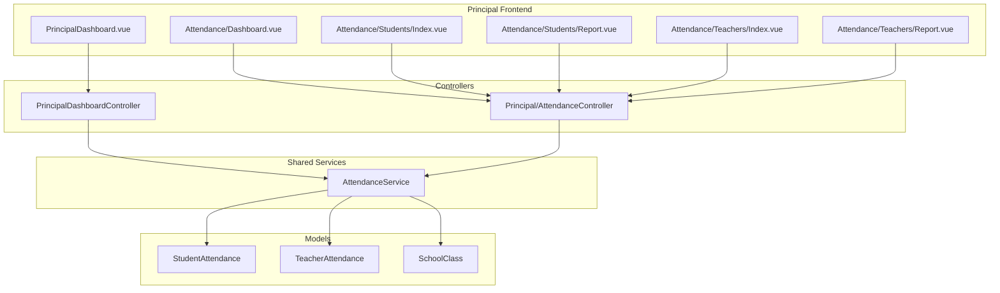

# Sprint A: Principal Attendance Access (P0)

## Context Analysis

Based on the current implementation state:

**Existing Infrastructure (Reusable):**

- `AttendanceService` - already has all query methods
- `Admin/AttendanceController` - has report generation logic
- `Admin/TeacherAttendanceController` - has teacher attendance logic  
- `AttendanceSummaryCard.vue`, `TeacherPresenceWidget.vue` - dashboard components
- `AttendanceStatusBadge.vue`, `LeaveStatusBadge.vue` - UI components

**Current Principal State:**

- Dashboard exists with attendance widgets (real-time polling implemented)
- Quick action buttons point to `/admin/attendance/*` routes (unauthorized)
- No dedicated Principal attendance pages exist

**Gap Identified:**

Principal cannot access attendance reports because routes are protected by `role:SUPERADMIN,ADMIN` middleware.

---

## Implementation Strategy

### Approach: Dedicated Principal Controller (Recommended)

Create a new `Principal/AttendanceController` that wraps the `AttendanceService` for read-only access. This maintains proper role separation while reusing business logic.

---

## Phase 1: Backend (Routes + Controller)

### 1.1 Create Principal Attendance Controller

**File:** `app/Http/Controllers/Principal/AttendanceController.php`

This controller will:

- Inject `AttendanceService` for data retrieval
- Implement read-only methods (no update/delete)
- Render Principal-specific Vue pages

Key methods to implement:

- `dashboard()` - Attendance overview with real-time stats
- `studentsIndex()` - Student attendance list with filters
- `studentReport()` - Detailed student attendance report
- `teachersIndex()` - Teacher attendance list
- `teacherReport()` - Teacher attendance report with clock data

### 1.2 Register Routes

**File:** `routes/web.php`

Add under Principal middleware group:

```php
// Principal Attendance Routes (read-only)
Route::prefix('attendance')->name('attendance.')->group(function () {
    Route::get('dashboard', [PrincipalAttendanceController::class, 'dashboard'])
        ->name('dashboard');
    Route::get('students', [PrincipalAttendanceController::class, 'studentsIndex'])
        ->name('students.index');
    Route::get('students/report', [PrincipalAttendanceController::class, 'studentReport'])
        ->name('students.report');
    Route::get('teachers', [PrincipalAttendanceController::class, 'teachersIndex'])
        ->name('teachers.index');
    Route::get('teachers/report', [PrincipalAttendanceController::class, 'teacherReport'])
        ->name('teachers.report');
});
```

---

## Phase 2: Frontend (Vue Pages)

### 2.1 Page Structure

```
resources/js/pages/Principal/
├── Attendance/
│   ├── Dashboard.vue      # Real-time attendance dashboard
│   ├── Students/
│   │   ├── Index.vue      # Student attendance list
│   │   └── Report.vue     # Student attendance report
│   └── Teachers/
│       ├── Index.vue      # Teacher attendance list
│       └── Report.vue     # Teacher attendance report
```

### 2.2 Dashboard Page (`Principal/Attendance/Dashboard.vue`)

Purpose: Centralized attendance monitoring hub

Features:

- Summary cards: Total students, hadir hari ini, alpha, kelas belum input
- Class attendance status grid (checkmark for input, warning for pending)
- Quick filters by date
- Export actions (link to report pages)

Reuse: `AttendanceSummaryCard.vue`, `TeacherPresenceWidget.vue`

### 2.3 Student Attendance Pages

**Index.vue** - List view with filters:

- Filter: kelas, tanggal, status
- Table: Tanggal, Nama, Kelas, Status, Keterangan
- PaginationP
- Link to detailed report

**Report.vue** - Analytics view:

- Date range picker
- Class filter
- Statistics cards (H/I/S/A counts, percentage)
- Chart visualization (pie chart, bar chart)
- Export to Excel/PDF buttons

### 2.4 Teacher Attendance Pages

**Index.vue** - Daily clock status:

- Filter: tanggal, status (hadir/terlambat/alpha)
- Table: Nama Guru, Jam Masuk, Jam Keluar, Status, Keterangan
- Highlight late teachers

**Report.vue** - Summary report:

- Date range picker
- Individual teacher filter
- Statistics: Total hadir, terlambat, total jam kerja
- Export buttons

---

## Phase 3: Navigation Updates

### 3.1 Update AppLayout Sidebar

**File:** `resources/js/components/layouts/AppLayout.vue`

Add Principal navigation section:

```typescript
// Principal menu items
{ 
  name: 'Kehadiran', 
  icon: ClipboardCheck,
  children: [
    { name: 'Dashboard', href: '/principal/attendance/dashboard' },
    { name: 'Siswa', href: '/principal/attendance/students' },
    { name: 'Guru', href: '/principal/attendance/teachers' },
  ]
}
```

### 3.2 Fix Dashboard Quick Actions

**File:** `resources/js/pages/Dashboard/PrincipalDashboard.vue`

Update button hrefs from `/admin/attendance/*` to `/principal/attendance/*`

---

## Phase 4: Wayfinder Route Generation

Run `php artisan wayfinder:generate` after adding routes to generate TypeScript route helpers.

---

## Data Flow Diagram




---

## Key Files to Create/Modify

**Create:**

- `app/Http/Controllers/Principal/AttendanceController.php`
- `resources/js/pages/Principal/Attendance/Dashboard.vue`
- `resources/js/pages/Principal/Attendance/Students/Index.vue`
- `resources/js/pages/Principal/Attendance/Students/Report.vue`
- `resources/js/pages/Principal/Attendance/Teachers/Index.vue`
- `resources/js/pages/Principal/Attendance/Teachers/Report.vue`

**Modify:**

- `routes/web.php` - Add principal attendance routes
- `resources/js/components/layouts/AppLayout.vue` - Add navigation menu
- `resources/js/pages/Dashboard/PrincipalDashboard.vue` - Fix quick action URLs

---

## Acceptance Criteria

- Principal can access `/principal/attendance/dashboard` and see real-time attendance overview
- Principal can view student attendance with filters (class, date, status)
- Principal can view student attendance reports with statistics and charts
- Principal can view teacher clock-in/out status
- Principal can view teacher attendance reports
- All pages are read-only (no edit/delete actions)
- Navigation menu shows Attendance section for Principal role
- Dashboard quick actions link to correct Principal routes

