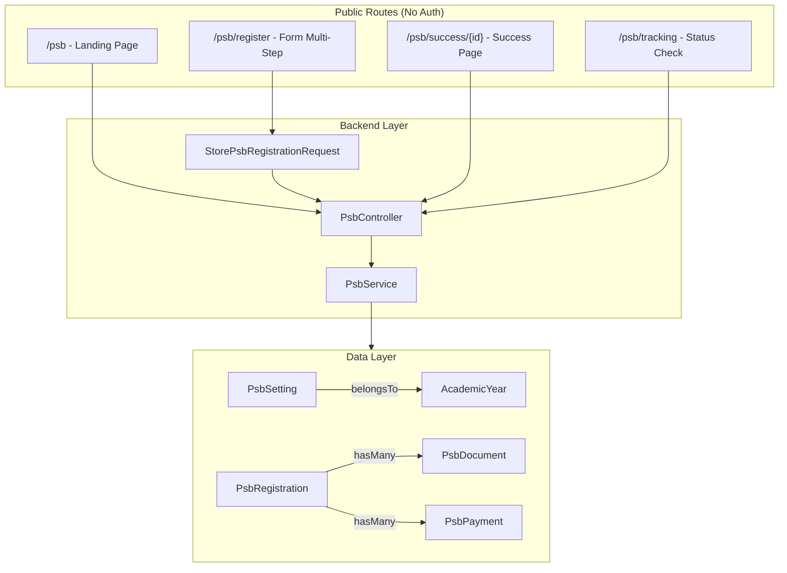

# Epic 1: PSB Foundation & Public Registration Implementation

## Overview

Implementasi sistem PSB (Penerimaan Siswa Baru) untuk pendaftaran publik calon siswa baru, yaitu: database structure, business logic service, public-facing controller, dan Vue pages untuk landing, form pendaftaran multi-step, success page, dan tracking status.

---

## Architecture

