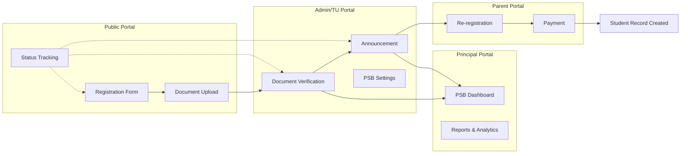
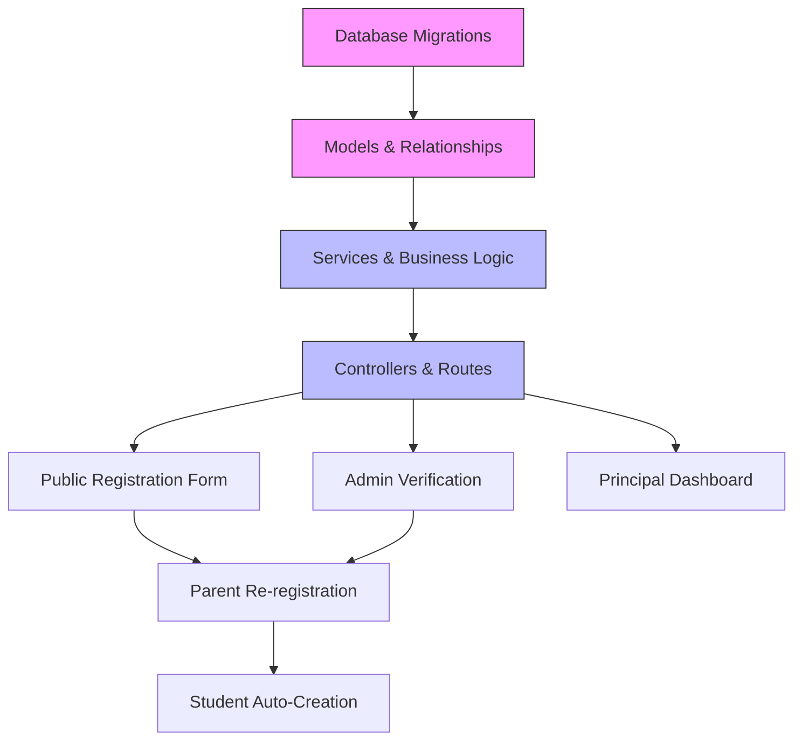

# PSB (New Student Registration) Implementation Strategy

## Phase 1: Feature Understanding

PSB (Penerimaan Siswa Baru) is an online new student registration module that digitizes the entire enrollment process from registration to becoming an active student.

### Core Data Flow




## Phase 2: Cross-Frontend Impact Mapping


| Feature                | Owner (Creates)    | Consumer (Views)       | Data Flow                                  |
| ---------------------- | ------------------ | ---------------------- | ------------------------------------------ |
| Registration Form      | Public (Parents)   | Admin/TU               | Submit -> Store -> Verify                  |
| Document Upload        | Public (Parents)   | Admin/TU               | Upload -> Preview -> Verify                |
| Document Verification  | Admin/TU           | Parents (via tracking) | Review -> Approve/Reject -> Notify         |
| Test Scheduling        | Admin/TU           | Parents (via tracking) | Create -> Notify -> Track                  |
| Selection Announcement | Admin/TU           | Parents                | Bulk Action -> Notify -> Display           |
| Re-registration        | Parents (Accepted) | Admin/TU               | Submit -> Verify Payment -> Create Student |
| PSB Dashboard          | System (auto)      | Principal, Admin       | Aggregate -> Display -> Analyze            |
| PSB Settings           | Admin              | System                 | Configure -> Enforce                       |
| Status Tracking        | System (auto)      | Public (Parents)       | Calculate -> Display Timeline              |
| Export Data            | System             | Admin/TU, Principal    | Generate -> Download                       |


## Phase 3: Missing Implementation Detection

### Backend (100% Missing)

- Models: `PsbRegistration`, `PsbDocument`, `PsbSetting`, `PsbPayment`
- Migrations for all PSB tables
- Controllers: `PsbRegistrationController`, `PsbVerificationController`, `PsbSettingsController`, `PsbDashboardController`
- Form Requests for validation
- Services: `PsbService` for business logic
- Notifications: Email & WhatsApp templates
- Export: Excel export for registrations

### Public Portal (Owner: Parents - Data Creation)

- Multi-step registration form (`/psb/register`)
- Document upload interface
- Preview before submit
- Success page with registration number
- Status tracking page (`/psb/tracking`)

### Admin/TU Portal (Consumer & Owner)

- Verification dashboard with list/filter
- Detail view with document preview
- Approve/Reject/Request Revision actions
- Announcement page (bulk selection)
- PSB Settings page (period, quota, fees)
- Payment verification for re-registration
- Export to Excel

### Principal Portal (Consumer: View Only)

- PSB Dashboard with summary stats
- Funnel conversion visualization
- Trend charts (registrations over time)
- Demographics analysis
- Quick access to detailed reports

### Parent Portal (Owner: Re-registration)

- Re-registration form (for accepted students)
- Payment upload
- Welcome page after registration complete

### Teacher Portal

- **No PSB features required** - Teachers have no role in PSB process

## Phase 4: Gap Analysis

### Critical Gaps Identified

1. **Public portal does not exist** - No `/psb/`* routes or pages for public registration/tracking
2. **Admin PSB section not created** - Dashboard placeholder shows `pending_psb: 0` but no actual implementation
3. **Principal has no PSB visibility** - Cannot monitor registration process
4. **Parent re-registration flow missing** - Accepted parents cannot complete enrollment
5. **Navigation not updated** - No PSB menu items in any role's navigation

### Data Creation vs Display Gaps


| Gap Type                 | Description                                             | Impact                     |
| ------------------------ | ------------------------------------------------------- | -------------------------- |
| Owner without Consumer   | Public can register but Admin cannot verify             | Critical - Process blocked |
| Consumer without Owner   | Principal dashboard expects data but nothing creates it | Medium - Empty dashboard   |
| Backend without Frontend | None (both missing)                                     | N/A                        |
| Missing Integration      | PSB -> Student Management auto-create                   | High - Manual work needed  |


## Phase 5: Implementation Sequencing

### Dependencies




### Priority Matrix

**P0 - Critical (Feature unusable without):**

1. Database schema & migrations
2. Models with relationships
3. Public registration form
4. Admin verification dashboard
5. Status tracking page

**P1 - Important (Feature incomplete without):**

1. Admin announcement page
2. Parent re-registration form
3. PSB settings page
4. Payment verification
5. Principal PSB dashboard
6. Navigation menu updates

**P2 - Enhancement (Can ship later):**

1. Export to Excel
2. Demographics charts
3. Trend analytics
4. WhatsApp notifications
5. Bulk verification
6. Test scheduling (optional)

## Phase 6: Detailed Recommendations

### New Routes Needed

**Public Routes** (`routes/web.php`):

- `GET /psb` - PSB landing/info page - P0
- `GET /psb/register` - Multi-step registration form - P0
- `POST /psb/register` - Submit registration - P0
- `GET /psb/tracking` - Status tracking page - P0
- `POST /psb/tracking` - Check status - P0

**Admin Routes** (`routes/admin.php`):

- `GET /admin/psb` - PSB dashboard overview - P1
- `GET /admin/psb/registrations` - List registrations - P0
- `GET /admin/psb/registrations/{id}` - View detail - P0
- `POST /admin/psb/registrations/{id}/approve` - Approve - P0
- `POST /admin/psb/registrations/{id}/reject` - Reject - P0
- `POST /admin/psb/registrations/{id}/revision` - Request revision - P1
- `GET /admin/psb/announcements` - Announcement page - P1
- `POST /admin/psb/announcements` - Bulk announce - P1
- `GET /admin/psb/settings` - PSB settings - P1
- `POST /admin/psb/settings` - Update settings - P1
- `GET /admin/psb/export` - Export Excel - P2

**Principal Routes** (`routes/principal.php`):

- `GET /principal/psb` - PSB Dashboard - P1
- `GET /principal/psb/reports` - PSB Reports - P2

**Parent Routes** (`routes/parent.php`):

- `GET /parent/psb/re-register` - Re-registration form - P1
- `POST /parent/psb/re-register` - Submit re-registration - P1
- `POST /parent/psb/payment` - Upload payment proof - P1

### New Pages Needed

**Public Pages** (`resources/js/pages/Psb/`):

- `Landing.vue` - PSB info & CTA - P0
- `Register.vue` - Multi-step form (4 steps) - P0
- `Success.vue` - Success page with registration number - P0
- `Tracking.vue` - Status tracking with timeline - P0

**Admin Pages** (`resources/js/pages/Admin/Psb/`):

- `Index.vue` - Dashboard overview - P1
- `Registrations/Index.vue` - List with filters - P0
- `Registrations/Show.vue` - Detail with document preview - P0
- `Announcements/Index.vue` - Bulk announcement - P1
- `Settings/Index.vue` - PSB configuration - P1
- `Payments/Index.vue` - Payment verification - P1

**Principal Pages** (`resources/js/pages/Principal/Psb/`):

- `Dashboard.vue` - Summary & charts - P1
- `Reports.vue` - Detailed analytics - P2

**Parent Pages** (`resources/js/pages/Parent/Psb/`):

- `ReRegister.vue` - Re-registration form - P1
- `Payment.vue` - Payment upload - P1

### Navigation Updates

**Admin Navigation** (`[AppLayout.vue](resources/js/components/AppLayout.vue)`):

```typescript
{
  label: 'PSB',
  icon: UserPlusIcon,
  children: [
    { label: 'Dashboard', href: admin.psb.index },
    { label: 'Pendaftaran', href: admin.psb.registrations.index, badge: pendingPsbCount },
    { label: 'Pengumuman', href: admin.psb.announcements.index },
    { label: 'Pengaturan', href: admin.psb.settings.index },
  ]
}
```

**Principal Navigation**:

```typescript
{
  label: 'PSB',
  icon: UserPlusIcon,
  href: principal.psb.dashboard
}
```

**Parent Navigation** (conditional - only if accepted):

```typescript
// Show only if user has accepted PSB registration
{
  label: 'Daftar Ulang',
  icon: ClipboardDocumentCheckIcon,
  href: parent.psb.reRegister
}
```

### Database Schema

```sql
-- psb_settings
id, academic_year_id, registration_open_date, registration_close_date,
announcement_date, re_registration_deadline_days, registration_fee,
quota_per_class, waiting_list_enabled, created_at, updated_at

-- psb_registrations  
id, registration_number, academic_year_id, status, student_name, student_nik,
birth_place, birth_date, gender, religion, address, child_order,
origin_school, father_name, father_nik, father_occupation, father_phone,
father_email, mother_name, mother_nik, mother_occupation, mother_phone,
mother_email, notes, rejection_reason, verified_by, verified_at,
announced_at, created_at, updated_at

-- psb_documents
id, psb_registration_id, document_type, file_path, original_name,
status, revision_note, created_at, updated_at

-- psb_payments
id, psb_registration_id, payment_type, amount, payment_method,
proof_file_path, status, verified_by, verified_at, notes, created_at, updated_at
```

## Phase 7: Example User Journeys

### Journey 1: Public Registration (Owner)

1. Parent navigates to: `/psb` (PSB landing page)
2. Parent clicks: "Daftar Sekarang" button
3. Parent fills: Multi-step form
  - Step 1: Data Calon Siswa (name, NIK, TTL, gender, religion, address)
  - Step 2: Data Orang Tua (father & mother info)
  - Step 3: Upload Dokumen (akte, KK, KTP, foto)
  - Step 4: Review & Submit
4. System does: Validate -> Generate registration number -> Save -> Send notification
5. Parent sees: Success page with "Nomor Pendaftaran: PSB/2025/0001" and next steps

### Journey 2: Admin Verification (Consumer & Action)

1. Admin navigates to: `/admin/psb/registrations`
2. Admin sees: List of registrations with status badges (15 pending)
3. Admin clicks: One registration to view detail
4. Admin reviews: Student data + document previews (lightbox)
5. Admin clicks: "Setujui" button
6. System does: Update status -> Send notification to parent
7. Admin sees: Success toast, registration moves to "Approved" tab

### Journey 3: Principal Monitoring (Consumer)

1. Principal navigates to: `/principal/psb` (PSB Dashboard)
2. Principal sees: Summary cards
  - Total Pendaftar: 150
  - Menunggu Verifikasi: 15
  - Disetujui: 100
  - Ditolak: 10
  - Daftar Ulang Selesai: 25
3. Principal clicks: "Menunggu Verifikasi" card
4. Principal sees: Redirected to filtered list
5. Principal can: View funnel conversion chart, trend per day, demographics

## Technical Recommendations

### Existing Patterns to Follow

Based on codebase analysis:

1. **Controller Pattern**: Follow `[AdminDashboardController](app/Http/Controllers/Dashboard/AdminDashboardController.php)` for dashboard data aggregation
2. **Form Request Pattern**: Create `StorePsbRegistrationRequest`, `VerifyPsbRegistrationRequest`
3. **Service Pattern**: Create `PsbService` for business logic (number generation, status transitions, notifications)
4. **Vue Component Pattern**: Follow iOS-like design from existing pages with Motion-v animations
5. **Route Pattern**: Use Wayfinder for type-safe routing (not legacy Ziggy)

### Reusable Components

From existing codebase:

- `StudentTable` - Can be adapted for registration list
- `Badge` - For status badges
- `useModal` composable - For confirmation dialogs
- `useHaptics` composable - For mobile feedback
- `AppLayout` - For consistent navigation

### New Components Needed

- `PsbTimeline` - Status tracking timeline (stepper UI)
- `PsbDocumentPreview` - Document thumbnail with lightbox
- `PsbMultiStepForm` - Multi-step form with progress indicator
- `PsbSummaryCard` - Dashboard summary card with click-to-filter

## Summary: Implementation Order

1. **Week 1**: Database + Models + Public Registration Form
2. **Week 2**: Admin Verification Dashboard + Status Tracking
3. **Week 3**: Announcement + Parent Re-registration + Principal Dashboard
4. **Week 4**: Settings + Export + Polish + Testing

