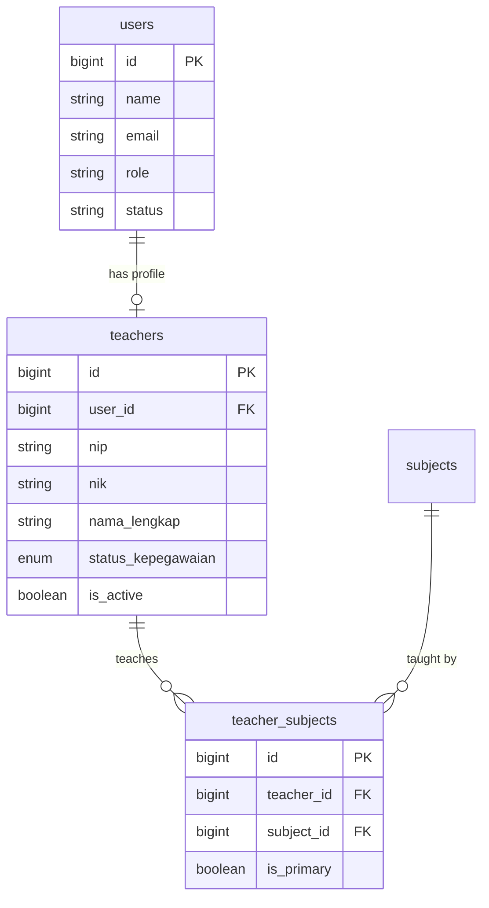

# Sprint 01: Foundation & Teacher CRUD Implementation

## Architecture Overview

The Teacher model will follow a **hybrid approach** where:

- `teachers` table stores teacher-specific data (NIP, NIK, biodata, status_kepegawaian, etc.)
- `users` table stores authentication data (linked via `user_id` FK)
- When creating a teacher, a corresponding User account is auto-created with role `TEACHER`




---

## Phase 1: Database Foundation (TCH-001)

### 1.1 Create StatusKepegawaian Enum

Create PHP Enum at `[app/Enums/StatusKepegawaian.php](app/Enums/StatusKepegawaian.php)`:

```php
enum StatusKepegawaian: string
{
    case TETAP = 'tetap';
    case HONORER = 'honorer';
    case KONTRAK = 'kontrak';
}
```

### 1.2 Create Teachers Migration

Migration: `database/migrations/xxxx_create_teachers_table.php`

Key columns:

- `user_id` - FK to users (nullable, nullOnDelete)
- `nip` - nullable for honorer teachers
- `nik` - required, unique
- `nama_lengkap`, `tempat_lahir`, `tanggal_lahir`, `jenis_kelamin`
- `alamat`, `no_hp`, `email`, `foto`
- `status_kepegawaian` - enum (tetap, honorer, kontrak)
- `tanggal_mulai_kerja`, `tanggal_berakhir_kontrak`
- `kualifikasi_pendidikan`
- `is_active`, `softDeletes`

### 1.3 Modify teacher_subjects Pivot

Create migration to:

1. Add `is_primary` boolean column
2. Update FK from `users.id` to `teachers.id`
3. Handle data migration for existing records

### 1.4 Create Teacher Model

File: `[app/Models/Teacher.php](app/Models/Teacher.php)`

Key relationships:

- `belongsTo(User::class)` - auth account
- `belongsToMany(Subject::class)` - via teacher_subjects with `is_primary` pivot
- Scopes: `scopeActive()`, `scopeByStatus()`, `scopeSearch()`

### 1.5 Create Factories & Seeders

- `TeacherFactory` with realistic Indonesian names/data
- `TeacherSeeder` - 10 sample teachers with subjects

---

## Phase 2: Backend CRUD (TCH-002, TCH-003, TCH-004)

### 2.1 TeacherService

File: `[app/Services/TeacherService.php](app/Services/TeacherService.php)`

Methods:

- `createTeacher(array $data): Teacher` - Creates teacher + user account in transaction
- `updateTeacher(Teacher $teacher, array $data): Teacher` - Updates with photo handling
- `toggleStatus(Teacher $teacher): Teacher` - Toggle is_active
- `syncSubjects(Teacher $teacher, array $subjectIds): void` - Sync teacher_subjects

### 2.2 TeacherController

File: `[app/Http/Controllers/Admin/TeacherController.php](app/Http/Controllers/Admin/TeacherController.php)`

Methods following existing pattern from [StudentController](app/Http/Controllers/Admin/StudentController.php):


| Method         | Route                                           | Description                           |
| -------------- | ----------------------------------------------- | ------------------------------------- |
| `index`        | GET `/admin/teachers`                           | List with filters, search, pagination |
| `create`       | GET `/admin/teachers/create`                    | Show form with subjects list          |
| `store`        | POST `/admin/teachers`                          | Create teacher + user                 |
| `edit`         | GET `/admin/teachers/{teacher}/edit`            | Show edit form                        |
| `update`       | PUT `/admin/teachers/{teacher}`                 | Update teacher                        |
| `toggleStatus` | PATCH `/admin/teachers/{teacher}/toggle-status` | Toggle active status                  |


### 2.3 Form Requests

**StoreTeacherRequest** - `[app/Http/Requests/Admin/StoreTeacherRequest.php](app/Http/Requests/Admin/StoreTeacherRequest.php)`:

- Validate NIK (16 digits, unique)
- Validate NIP (nullable, unique if provided)
- Validate email (unique across teachers)
- Validate subjects (array of existing subject IDs)
- Custom Indonesian error messages

**UpdateTeacherRequest** - Similar with `ignore()` for unique rules

### 2.4 TeacherResource

File: `[app/Http/Resources/TeacherResource.php](app/Http/Resources/TeacherResource.php)`

Transform teacher data for API/Inertia responses.

### 2.5 Routes

Add to `[routes/admin.php](routes/admin.php)`:

```php
// Teacher Management
Route::patch('teachers/{teacher}/toggle-status', [TeacherController::class, 'toggleStatus'])
    ->name('teachers.toggle-status');
Route::resource('teachers', TeacherController::class)->except(['show', 'destroy']);
```

---

## Phase 3: Frontend Pages (TCH-002, TCH-003, TCH-004)

### 3.1 Index Page

File: `[resources/js/pages/Admin/Teachers/Index.vue](resources/js/pages/Admin/Teachers/Index.vue)`

Features (following [Students/Index.vue](resources/js/pages/Admin/Students/Index.vue) pattern):

- Table columns: Foto, NIP, Nama, Status Kepegawaian, Mata Pelajaran, No HP, Aksi
- Filters: status_kepegawaian, is_active
- Search: nama, nip, nik
- Mobile card view
- Empty state & loading skeleton

### 3.2 TeacherTable Component

File: `resources/js/components/features/teachers/TeacherTable.vue`

- Desktop table + mobile cards
- Debounced search
- Pagination
- Action buttons: Edit, Toggle Status

### 3.3 TeacherFilters Component

File: `resources/js/components/features/teachers/TeacherFilters.vue`

- Status kepegawaian dropdown
- Active/Inactive toggle
- Collapsible on mobile

### 3.4 Create Page

File: `[resources/js/pages/Admin/Teachers/Create.vue](resources/js/pages/Admin/Teachers/Create.vue)`

Following [Students/Create.vue](resources/js/pages/Admin/Students/Create.vue) pattern:

- Header with back button
- TeacherForm component
- Sticky action bar

### 3.5 Edit Page

File: `[resources/js/pages/Admin/Teachers/Edit.vue](resources/js/pages/Admin/Teachers/Edit.vue)`

- Pre-filled form
- Reuse TeacherForm component
- Track dirty state

### 3.6 TeacherForm Component

File: `resources/js/components/features/teachers/TeacherForm.vue`

Sections:

1. **Data Pribadi**: NIK, nama, TTL, jenis kelamin, alamat, no HP, email, foto
2. **Data Kepegawaian**: NIP, status_kepegawaian, tanggal_mulai, tanggal_berakhir
3. **Akademik**: subjects multi-select, kualifikasi_pendidikan

Photo upload with preview using existing patterns.

---

## Phase 4: Testing & Finalization

### 4.1 Feature Tests

File: `tests/Feature/Admin/TeacherTest.php`

Test cases:

- List teachers with filters
- Create teacher creates user account
- Update teacher data
- Toggle teacher status
- Validation errors for invalid data

### 4.2 Generate Wayfinder Routes

Run: `php artisan wayfinder:generate`

### 4.3 Lint & Format

- `vendor/bin/pint --dirty`
- `yarn run lint`
- `yarn run build`

---

## Key Files to Create/Modify


| File                                                           | Action                             |
| -------------------------------------------------------------- | ---------------------------------- |
| `app/Enums/StatusKepegawaian.php`                              | Create                             |
| `database/migrations/xxxx_create_teachers_table.php`           | Create                             |
| `database/migrations/xxxx_update_teacher_subjects_table.php`   | Create                             |
| `app/Models/Teacher.php`                                       | Create                             |
| `app/Models/Subject.php`                                       | Modify (add teachers relationship) |
| `app/Models/User.php`                                          | Modify (add teacher relationship)  |
| `app/Services/TeacherService.php`                              | Create                             |
| `app/Http/Controllers/Admin/TeacherController.php`             | Create                             |
| `app/Http/Requests/Admin/StoreTeacherRequest.php`              | Create                             |
| `app/Http/Requests/Admin/UpdateTeacherRequest.php`             | Create                             |
| `app/Http/Resources/TeacherResource.php`                       | Create                             |
| `database/factories/TeacherFactory.php`                        | Create                             |
| `database/seeders/TeacherSeeder.php`                           | Create                             |
| `routes/admin.php`                                             | Modify                             |
| `resources/js/pages/Admin/Teachers/Index.vue`                  | Create                             |
| `resources/js/pages/Admin/Teachers/Create.vue`                 | Create                             |
| `resources/js/pages/Admin/Teachers/Edit.vue`                   | Create                             |
| `resources/js/components/features/teachers/TeacherForm.vue`    | Create                             |
| `resources/js/components/features/teachers/TeacherTable.vue`   | Create                             |
| `resources/js/components/features/teachers/TeacherFilters.vue` | Create                             |
| `tests/Feature/Admin/TeacherTest.php`                          | Create                             |


