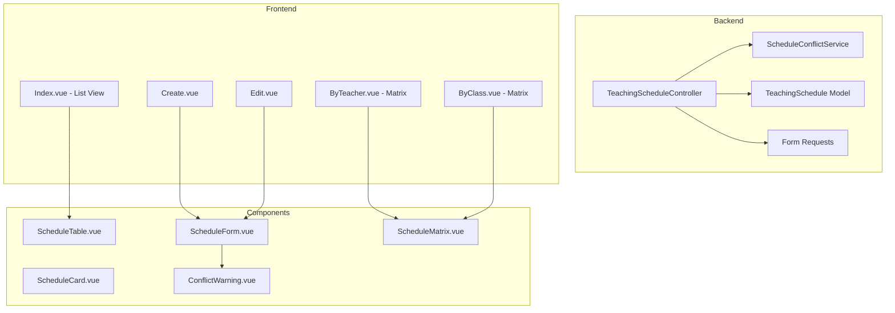

# Sprint 02: Teaching Schedule Implementation Plan

## Overview

This sprint implements a complete teaching schedule management system for the school-app, allowing Admin/TU to manage teacher schedules with matrix views, conflict detection, and export capabilities.

## Architecture




## Database Schema

The `AcademicYear` model already exists at [app/Models/AcademicYear.php](app/Models/AcademicYear.php). We need to create the `TeachingSchedule` model and migration.

### New Migration: `teaching_schedules`

```php
Schema::create('teaching_schedules', function (Blueprint $table) {
    $table->id();
    $table->foreignId('teacher_id')->constrained()->cascadeOnDelete();
    $table->foreignId('subject_id')->constrained()->cascadeOnDelete();
    $table->foreignId('class_id')->constrained('school_classes')->cascadeOnDelete();
    $table->foreignId('academic_year_id')->constrained()->cascadeOnDelete();
    $table->enum('hari', ['senin', 'selasa', 'rabu', 'kamis', 'jumat', 'sabtu']);
    $table->time('jam_mulai');
    $table->time('jam_selesai');
    $table->string('ruangan', 50)->nullable();
    $table->boolean('is_active')->default(true);
    $table->timestamps();
    $table->softDeletes();
    
    // Indexes for conflict detection
    $table->index(['teacher_id', 'hari', 'jam_mulai', 'jam_selesai', 'academic_year_id'], 'idx_teacher_schedule');
    $table->index(['class_id', 'hari', 'jam_mulai', 'jam_selesai', 'academic_year_id'], 'idx_class_schedule');
});
```

### New Enum: `Hari`

Create [app/Enums/Hari.php](app/Enums/Hari.php) following [app/Enums/StatusKepegawaian.php](app/Enums/StatusKepegawaian.php) pattern.

## Backend Implementation

### 1. Model: `TeachingSchedule`

Location: [app/Models/TeachingSchedule.php](app/Models/TeachingSchedule.php)

Key relationships:

- `belongsTo(Teacher::class)`
- `belongsTo(Subject::class)`
- `belongsTo(SchoolClass::class)`
- `belongsTo(AcademicYear::class)`

Key scopes:

- `scopeByTeacher($query, $teacherId)`
- `scopeByClass($query, $classId)`
- `scopeByDay($query, $hari)`
- `scopeByAcademicYear($query, $academicYearId)`
- `scopeActive($query)`
- `scopeHasTimeOverlap($query, $jamMulai, $jamSelesai, $excludeId)`

Add `hasMany(TeachingSchedule::class)` to [app/Models/Teacher.php](app/Models/Teacher.php).

### 2. Service: `ScheduleConflictService`

Location: [app/Services/ScheduleConflictService.php](app/Services/ScheduleConflictService.php)

Following [app/Services/TeacherService.php](app/Services/TeacherService.php) pattern with methods:

- `checkConflicts(array $data, ?int $excludeId = null): array`
- `hasTeacherConflict(int $teacherId, string $hari, string $jamMulai, string $jamSelesai, int $academicYearId, ?int $excludeId): bool`
- `hasClassConflict(int $classId, string $hari, string $jamMulai, string $jamSelesai, int $academicYearId, ?int $excludeId): bool`
- `copyFromPreviousSemester(int $fromAcademicYearId, int $toAcademicYearId): int`

### 3. Controller: `TeachingScheduleController`

Location: [app/Http/Controllers/Admin/TeachingScheduleController.php](app/Http/Controllers/Admin/TeachingScheduleController.php)

Methods:

- `index()` - List view with filters (teacher, class, day, academic_year)
- `create()` - Create form
- `store(StoreTeachingScheduleRequest)` - Store with conflict check
- `edit(TeachingSchedule)` - Edit form
- `update(UpdateTeachingScheduleRequest, TeachingSchedule)` - Update with conflict check
- `destroy(TeachingSchedule)` - Soft delete
- `byTeacher(Teacher)` - Matrix view per teacher
- `byClass(SchoolClass)` - Matrix view per class
- `checkConflict(Request)` - Real-time AJAX conflict check
- `copySemester(Request)` - Copy from previous semester
- `exportPdf(Request)` - PDF export (teacher/class)

### 4. Form Requests

Locations:

- [app/Http/Requests/Admin/StoreTeachingScheduleRequest.php](app/Http/Requests/Admin/StoreTeachingScheduleRequest.php)
- [app/Http/Requests/Admin/UpdateTeachingScheduleRequest.php](app/Http/Requests/Admin/UpdateTeachingScheduleRequest.php)

Validation rules:

- `teacher_id` - required, exists:teachers,id
- `subject_id` - required, exists:subjects,id
- `class_id` - required, exists:school_classes,id
- `academic_year_id` - required, exists:academic_years,id
- `hari` - required, in:senin,selasa,rabu,kamis,jumat,sabtu
- `jam_mulai` - required, date_format:H:i, between:07:00-16:00
- `jam_selesai` - required, date_format:H:i, after:jam_mulai, between:07:00-16:00
- `ruangan` - nullable, string, max:50

### 5. Resource: `TeachingScheduleResource`

Location: [app/Http/Resources/TeachingScheduleResource.php](app/Http/Resources/TeachingScheduleResource.php)

### 6. Routes

Add to [routes/admin.php](routes/admin.php) under teachers group:

```php
Route::prefix('teachers/schedules')->name('teachers.schedules.')->group(function () {
    Route::get('/', [TeachingScheduleController::class, 'index'])->name('index');
    Route::get('create', [TeachingScheduleController::class, 'create'])->name('create');
    Route::post('/', [TeachingScheduleController::class, 'store'])->name('store');
    Route::get('by-teacher/{teacher}', [TeachingScheduleController::class, 'byTeacher'])->name('by-teacher');
    Route::get('by-class/{schoolClass}', [TeachingScheduleController::class, 'byClass'])->name('by-class');
    Route::post('check-conflict', [TeachingScheduleController::class, 'checkConflict'])->name('check-conflict');
    Route::post('copy-semester', [TeachingScheduleController::class, 'copySemester'])->name('copy-semester');
    Route::get('export-pdf', [TeachingScheduleController::class, 'exportPdf'])->name('export-pdf');
    Route::get('{schedule}/edit', [TeachingScheduleController::class, 'edit'])->name('edit');
    Route::put('{schedule}', [TeachingScheduleController::class, 'update'])->name('update');
    Route::delete('{schedule}', [TeachingScheduleController::class, 'destroy'])->name('destroy');
});
```

## Frontend Implementation

### 1. Pages

Location: `resources/js/pages/Admin/Teachers/Schedules/`

- **Index.vue** - List view with filters, following [resources/js/pages/Admin/Teachers/Index.vue](resources/js/pages/Admin/Teachers/Index.vue) pattern
- **Create.vue** - Create form page
- **Edit.vue** - Edit form page
- **ByTeacher.vue** - Matrix view for single teacher
- **ByClass.vue** - Matrix view for single class

### 2. Components

Location: `resources/js/components/features/schedules/`

- **ScheduleTable.vue** - Table with filters, following [TeacherTable.vue](resources/js/components/features/teachers/TeacherTable.vue)
- **ScheduleForm.vue** - Form component with real-time conflict detection
- **ScheduleMatrix.vue** - Matrix grid component (days x time slots)
- **ScheduleCard.vue** - Mobile-friendly card for list view
- **ConflictWarning.vue** - Warning banner for conflicts

### 3. Matrix View Design

Time slots: 07:00-16:00 (30-minute increments = 18 slots)
Days: Senin-Sabtu (6 columns)

Matrix cell states:

- Empty (available)
- Occupied (subject color coded)
- Conflict (warning color)

## File Structure Summary

```
app/
├── Enums/
│   └── Hari.php
├── Http/
│   ├── Controllers/Admin/
│   │   └── TeachingScheduleController.php
│   ├── Requests/Admin/
│   │   ├── StoreTeachingScheduleRequest.php
│   │   └── UpdateTeachingScheduleRequest.php
│   └── Resources/
│       └── TeachingScheduleResource.php
├── Models/
│   └── TeachingSchedule.php
└── Services/
    └── ScheduleConflictService.php

database/
├── factories/
│   └── TeachingScheduleFactory.php
├── migrations/
│   └── xxxx_xx_xx_create_teaching_schedules_table.php
└── seeders/
    └── TeachingScheduleSeeder.php

resources/js/
├── pages/Admin/Teachers/Schedules/
│   ├── Index.vue
│   ├── Create.vue
│   ├── Edit.vue
│   ├── ByTeacher.vue
│   └── ByClass.vue
└── components/features/schedules/
    ├── ScheduleTable.vue
    ├── ScheduleForm.vue
    ├── ScheduleMatrix.vue
    ├── ScheduleCard.vue
    └── ConflictWarning.vue

tests/Feature/Admin/
└── TeachingScheduleTest.php
```

## Key Dependencies

- **DomPDF** for PDF export (already installed via `barryvdh/laravel-dompdf`)
- Uses existing models: `Teacher`, `Subject`, `SchoolClass`, `AcademicYear`
- Uses Wayfinder for type-safe routing

## Testing Strategy

Feature tests for:

- CRUD operations (create, read, update, delete)
- Conflict detection (teacher, class, time overlap)
- Copy semester functionality
- PDF export
- Authorization (Admin/Superadmin only)

