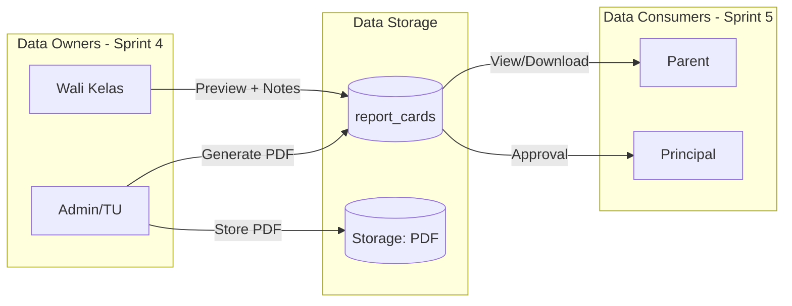
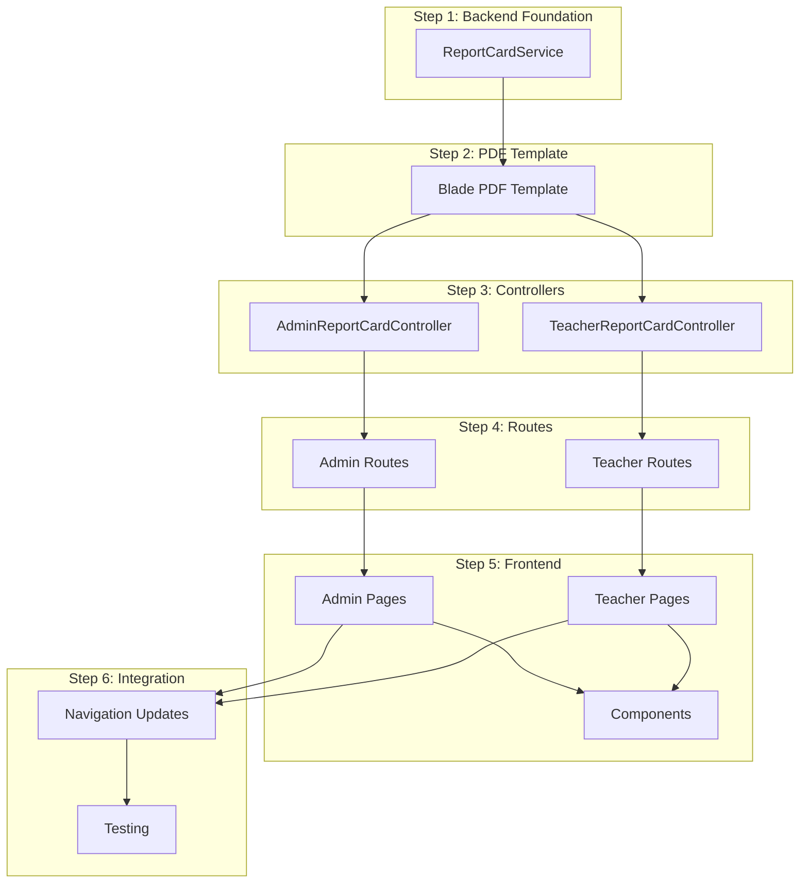

# Sprint 4: Report Card Generation - Implementation Strategy

## Phase 1: Feature Understanding

### Data Flow Overview

Sprint 4 focuses on Report Card Generation, where:

- **Admin/TU** generates report cards in bulk per class
- **Wali Kelas** reviews and adds homeroom notes before submission
- **Principal** (Sprint 5) will approve the report cards
- **Parent** (Sprint 5) will view and download released report cards




---

## Phase 2: Cross-Frontend Impact Mapping


| Feature                  | Owner (Creates)     | Consumer (Views)    | Data Flow                              |
| ------------------------ | ------------------- | ------------------- | -------------------------------------- |
| Generate Report Card PDF | Admin/TU via Wizard | -                   | Generate -> Store PDF -> Create record |
| Preview Report Card      | Admin, Wali Kelas   | Self                | HTML preview before PDF                |
| Homeroom Notes Input     | Wali Kelas          | Parent (via PDF)    | Input -> Store -> Included in PDF      |
| Validate Completeness    | Admin               | Self                | Check grades + attitude complete       |
| Lock Grades              | Admin               | Teacher (read-only) | Lock -> Prevent edits                  |
| Bulk Download ZIP        | Admin               | Self                | Aggregate PDFs -> ZIP                  |


---

## Phase 3: Implementation Checklist

### Already Implemented (Sprint 1-3)

- `Grade` model with relationships and business logic
- `AttitudeGrade` model with homeroom notes
- `ReportCard` model with status workflow (DRAFT -> PENDING_APPROVAL -> APPROVED -> RELEASED)
- `GradeWeightConfig` model with weight calculation
- `GradeCalculationService` with final grade calculation and ranking
- Teacher grade input pages (`Teacher/Grades/Index|Create|Edit.vue`)
- Teacher attitude grade pages (`Teacher/AttitudeGrades/Index|Create.vue`)
- Admin grade summary pages (`Admin/Grades/Index|Summary.vue`)
- `barryvdh/laravel-dompdf` installed

### Missing for Sprint 4

- `ReportCardService` - Core service for PDF generation
- `AdminReportCardController` - Admin report card management
- `TeacherReportCardController` - Wali Kelas preview and notes
- `Admin/ReportCards/Index.vue` - List all report cards
- `Admin/ReportCards/Generate.vue` - Wizard for bulk generation
- `Teacher/ReportCards/Index.vue` - List report cards for wali kelas
- `Teacher/ReportCards/Show.vue` - Preview + notes input
- PDF Blade template `resources/views/pdf/report-card.blade.php`
- Routes for report-cards in `routes/admin.php` and `routes/teacher.php`
- Navigation menu updates for Admin and Teacher

---

## Phase 4: Gap Analysis

### Critical Gaps


| Gap                         | Description                          | Impact               | Priority |
| --------------------------- | ------------------------------------ | -------------------- | -------- |
| No ReportCardService        | PDF generation logic not implemented | Cannot generate PDFs | P0       |
| No Admin ReportCard pages   | No UI for report card management     | Feature unusable     | P0       |
| No Teacher ReportCard pages | Wali kelas cannot add notes          | Incomplete rapor     | P0       |
| No PDF template             | No template for dompdf               | Cannot generate PDFs | P0       |


### Missing Consumer Side (for Sprint 5)

- Principal approval UI (deferred to Sprint 5)
- Parent view report card UI (deferred to Sprint 5)

---

## Phase 5: Implementation Sequencing

### Dependency Graph




### Priority Matrix


| Task                           | Priority | Reason                      |
| ------------------------------ | -------- | --------------------------- |
| ReportCardService              | P0       | Core business logic         |
| PDF Blade Template             | P0       | Required for PDF generation |
| AdminReportCardController      | P0       | Primary entry point         |
| Admin/ReportCards/Generate.vue | P0       | Core wizard UI              |
| TeacherReportCardController    | P0       | Wali kelas flow             |
| Teacher/ReportCards pages      | P0       | Wali kelas notes input      |
| Admin/ReportCards/Index.vue    | P1       | Management view             |
| Navigation updates             | P1       | Discoverability             |
| Reusable components            | P2       | Code reuse                  |


---

## Phase 6: Detailed Implementation

### 1. Backend: ReportCardService

**File:** `app/Services/ReportCardService.php`

Key methods:

- `validateCompleteness(classId, semester)` - Check all grades and attitude grades complete
- `generateReportCard(student, semester)` - Generate single report card
- `generateBulk(class, semester)` - Batch generate for class
- `generatePDF(reportCard)` - Generate PDF using dompdf
- `lockGrades(class, semester)` - Lock all grades after finalization
- `unlockReportCard(reportCard)` - Admin unlock for corrections

Dependencies to inject:

- `GradeCalculationService` - For calculating final grades and rankings

### 2. Backend: AdminReportCardController

**File:** `app/Http/Controllers/Admin/ReportCardController.php`

Routes to implement:

- `GET /admin/report-cards` -> `index()` - List all report cards
- `GET /admin/report-cards/generate` -> `generate()` - Show generation wizard
- `POST /admin/report-cards/validate` -> `validateCompleteness()` - API: validate before generate
- `POST /admin/report-cards/generate` -> `processGenerate()` - Execute bulk generation
- `GET /admin/report-cards/{reportCard}` -> `show()` - Preview single report card
- `POST /admin/report-cards/{reportCard}/unlock` -> `unlock()` - Unlock for corrections
- `GET /admin/report-cards/download-zip` -> `downloadZip()` - Download bulk as ZIP

### 3. Backend: TeacherReportCardController

**File:** `app/Http/Controllers/Teacher/ReportCardController.php`

Routes to implement:

- `GET /teacher/report-cards` -> `index()` - List report cards for wali kelas class
- `GET /teacher/report-cards/{reportCard}` -> `show()` - Preview + notes form
- `PUT /teacher/report-cards/{reportCard}/notes` -> `updateNotes()` - Save homeroom notes
- `POST /teacher/report-cards/{reportCard}/submit` -> `submitForApproval()` - Submit to principal

**Authorization:** Only wali kelas for current class can access

### 4. PDF Template

**File:** `resources/views/pdf/report-card.blade.php`

K13 Format structure:

- Header: School logo, name, address
- Student info: Name, NIS, Class, Academic year, Semester
- Grades table: Subject, Pengetahuan, Keterampilan, Nilai Akhir, Predikat
- Attitude section: Spiritual grade + description, Social grade + description
- Attendance summary: Hadir, Sakit, Izin, Alpha
- Homeroom notes
- Signatures: Wali Kelas, Kepala Sekolah
- Footer: Date, print info

### 5. Frontend: Admin Pages

**Files to create:**

`resources/js/pages/Admin/ReportCards/Index.vue`

- Table: Class, Semester, Status, Generated Date, Actions
- Filters: Academic year, Semester, Status, Class
- Batch actions: Download ZIP, Bulk unlock

`resources/js/pages/Admin/ReportCards/Generate.vue` (Wizard)

- **Step 1 - Selection:** Academic year, Semester, Class (multi-select)
- **Step 2 - Validation:** Student list with completeness status (green check/red X)
  - Show missing data: "Ahmad: UAS Matematika belum diinput"
- **Step 3 - Progress:** Progress bar, success/failure count
- **Step 4 - Result:** Summary, Download ZIP button

Pattern to follow: Use `PromoteWizard.vue` pattern from `resources/js/components/features/students/`

### 6. Frontend: Teacher Pages

**Files to create:**

`resources/js/pages/Teacher/ReportCards/Index.vue`

- Card list per student in wali kelas class
- Status badge: Draft, Pending, Approved
- Quick stats: Total students, Completed, Pending

`resources/js/pages/Teacher/ReportCards/Show.vue`

- HTML Preview of report card (responsive)
- Form: Homeroom notes textarea (max 500 chars)
- Actions: Save Notes, Submit for Approval
- Lock indicator if already submitted

### 7. Reusable Components

**Files to create in `resources/js/components/features/grades/`:**

`ReportCardPreview.vue`

- HTML preview matching PDF format
- Responsive (mobile-friendly)
- Skeleton loading state

`ReportCardStatusBadge.vue`

- Extend `Badge.vue` for report card status colors
- DRAFT: gray, PENDING_APPROVAL: yellow, APPROVED: blue, RELEASED: green

`HomeroomNotesForm.vue`

- Textarea with character counter
- Template suggestions (optional)
- Validation feedback

### 8. Routes Configuration

**Add to `routes/admin.php`:**

```php
// Report Card Management
Route::prefix('report-cards')->name('report-cards.')->group(function () {
    Route::get('/', [ReportCardController::class, 'index'])->name('index');
    Route::get('generate', [ReportCardController::class, 'generate'])->name('generate');
    Route::post('validate', [ReportCardController::class, 'validateCompleteness'])->name('validate');
    Route::post('generate', [ReportCardController::class, 'processGenerate'])->name('process-generate');
    Route::get('download-zip', [ReportCardController::class, 'downloadZip'])->name('download-zip');
    Route::get('{reportCard}', [ReportCardController::class, 'show'])->name('show');
    Route::post('{reportCard}/unlock', [ReportCardController::class, 'unlock'])->name('unlock');
});
```

**Add to `routes/teacher.php`:**

```php
// Report Card (Wali Kelas only)
Route::prefix('report-cards')->name('report-cards.')->group(function () {
    Route::get('/', [ReportCardController::class, 'index'])->name('index');
    Route::get('{reportCard}', [ReportCardController::class, 'show'])->name('show');
    Route::put('{reportCard}/notes', [ReportCardController::class, 'updateNotes'])->name('notes.update');
    Route::post('{reportCard}/submit', [ReportCardController::class, 'submitForApproval'])->name('submit');
});
```

### 9. Navigation Updates

**Admin menu** (`AppLayout.vue` line ~374):
Add under "Penilaian" children:

```javascript
{ name: 'Rapor', route: 'admin.report-cards.index', icon: FileText, badge: 0 },
```

**Teacher menu** (`AppLayout.vue` line ~427):
Add under "Penilaian" children (conditional for wali kelas):

```javascript
{ name: 'Rapor Kelas', route: 'teacher.report-cards.index', icon: FileText, badge: 0 },
```

---

## Phase 7: Example User Journeys

### Journey 1: Admin Generates Report Cards

**Owner Journey (Admin/TU):**

1. Admin navigates to: `/admin/report-cards/generate`
2. Admin selects:
  - Tahun Ajaran: "2025/2026"
  - Semester: 1
  - Kelas: "1A, 1B, 1C" (multi-select)
3. Admin clicks "Validasi Data"
4. System shows:
  - Student list with status (Complete/Incomplete)
  - Incomplete example: "Ahmad - 1A: UAS Matematika belum diinput"
5. Admin clicks "Generate Rapor" (disabled if incomplete)
6. System:
  - Locks all grades for selected classes
  - Generates PDF per student using dompdf
  - Creates `report_cards` records with status DRAFT
  - Stores PDFs in `storage/app/report-cards/`
7. Admin sees: "45 rapor berhasil di-generate"
8. Admin clicks: "Download ZIP" to get all PDFs

### Journey 2: Wali Kelas Adds Notes

**Owner Journey (Wali Kelas):**

1. Teacher navigates to: `/teacher/report-cards`
2. Teacher sees: List of students in their class with report card status
3. Teacher clicks student "Ahmad" card
4. Teacher sees:
  - HTML preview of report card (nilai, sikap, kehadiran)
  - Form input: "Catatan Wali Kelas" textarea
5. Teacher types: "Ahmad menunjukkan peningkatan di semester ini..."
6. Teacher clicks "Simpan Catatan"
7. System saves homeroom notes to `attitude_grades.homeroom_notes`
8. After all students done, teacher clicks "Submit untuk Persetujuan"
9. System updates all report cards to PENDING_APPROVAL status

---

## Files to Create Summary

### Backend

- `app/Services/ReportCardService.php`
- `app/Http/Controllers/Admin/ReportCardController.php`
- `app/Http/Controllers/Teacher/ReportCardController.php`
- `app/Http/Requests/GenerateReportCardRequest.php`
- `app/Http/Requests/UpdateHomeroomNotesRequest.php`
- `resources/views/pdf/report-card.blade.php`

### Frontend

- `resources/js/pages/Admin/ReportCards/Index.vue`
- `resources/js/pages/Admin/ReportCards/Generate.vue`
- `resources/js/pages/Admin/ReportCards/Show.vue`
- `resources/js/pages/Teacher/ReportCards/Index.vue`
- `resources/js/pages/Teacher/ReportCards/Show.vue`
- `resources/js/components/features/grades/ReportCardPreview.vue`
- `resources/js/components/features/grades/ReportCardStatusBadge.vue`
- `resources/js/components/features/grades/HomeroomNotesForm.vue`

### Existing Files to Modify

- `routes/admin.php` - Add report-cards routes
- `routes/teacher.php` - Add report-cards routes
- `resources/js/components/layouts/AppLayout.vue` - Add navigation menu items

---

## Critical Reminders

- **Data completeness validation:** Must check all subjects have grades AND attitude grades before allowing generation
- **PDF storage:** Store in `storage/app/report-cards/{tahun_ajaran}/{semester}/{class_id}/`
- **Lock mechanism:** Once generated, grades should be locked to prevent accidental changes
- **Wali kelas check:** Only wali kelas for the class can add homeroom notes
- **Mobile responsive:** HTML preview must work on mobile for wali kelas reviewing on phone
- **Empty states:** Show helpful message when no report cards exist yet

