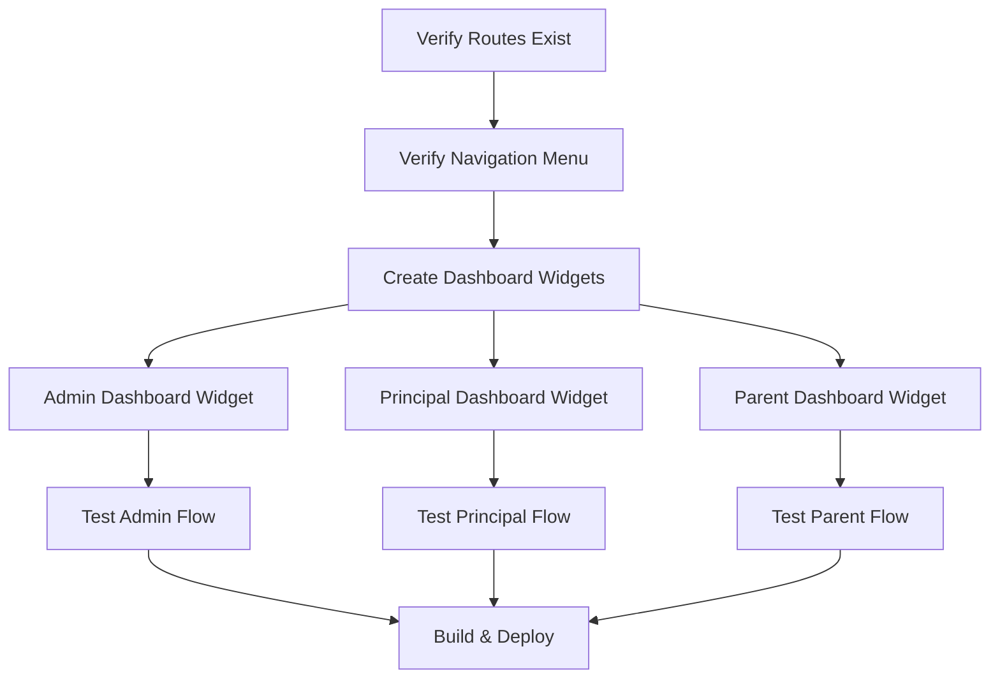

# Sprint 5: Financial Reports - Cross-Frontend Implementation Strategy

## Phase 1: Feature Understanding

### Core Purpose

Sprint 5 fokus pada **Financial Reports** yaitu fitur laporan keuangan yang memungkinkan:

- Admin/TU melihat laporan pemasukan, piutang, dan siswa menunggak
- Principal memonitor kesehatan keuangan sekolah
- Export data untuk pelaporan eksternal

### Key Metrics

- Total Pendapatan (Income)
- Total Piutang (Receivables)
- Kolektibilitas (Collection Rate)
- Breakdown per metode pembayaran
- Breakdown per kategori pembayaran
- Monthly income trend (6 bulan)
- Daftar siswa menunggak dengan detail tagihan

---

## Phase 2: Cross-Frontend Impact Mapping

### Feature Ownership Matrix


| Feature           | Owner (Creates)     | Consumer (Views)         | Status  |
| ----------------- | ------------------- | ------------------------ | ------- |
| Financial Reports | System (Query)      | Admin/TU, Principal      | DONE    |
| Delinquent List   | System (Query)      | Admin/TU, Principal      | DONE    |
| Export Excel/CSV  | Admin/TU, Principal | Download                 | DONE    |
| Dashboard Widget  | System              | Admin, Principal, Parent | PARTIAL |


### Role-Based Feature Access (Sprint 5)


| Feature                  | SuperAdmin | Admin/TU | Principal | Teacher | Parent |
| ------------------------ | ---------- | -------- | --------- | ------- | ------ |
| Financial Reports Page   | Full       | Full     | Read-Only | -       | -      |
| Delinquents List         | Full       | Full     | Read-Only | -       | -      |
| Export Reports           | -          | Full     | Full      | -       | -      |
| Dashboard Summary Widget | -          | NEEDED   | NEEDED    | -       | NEEDED |


---

## Phase 3: Implementation Status Analysis

### DONE (Already Implemented)

**Admin Reports:**

- [app/Http/Controllers/Admin/PaymentController.php](app/Http/Controllers/Admin/PaymentController.php) - `reports()`, `exportReports()`, `delinquents()`
- [resources/js/pages/Admin/Payments/Reports/Index.vue](resources/js/pages/Admin/Payments/Reports/Index.vue) - Full reports page
- [resources/js/pages/Admin/Payments/Reports/Delinquents.vue](resources/js/pages/Admin/Payments/Reports/Delinquents.vue) - Delinquent students list

**Principal Reports:**

- [app/Http/Controllers/Principal/FinancialReportController.php](app/Http/Controllers/Principal/FinancialReportController.php) - `index()`, `export()`, `delinquents()`
- [resources/js/pages/Principal/Financial/Reports.vue](resources/js/pages/Principal/Financial/Reports.vue) - Full reports page
- [resources/js/pages/Principal/Financial/Delinquents.vue](resources/js/pages/Principal/Financial/Delinquents.vue) - Delinquent students list

**Parent Payment Portal:**

- [app/Http/Controllers/Parent/PaymentController.php](app/Http/Controllers/Parent/PaymentController.php) - `index()`, `history()`, `downloadReceipt()`
- [resources/js/pages/Parent/Payments/Index.vue](resources/js/pages/Parent/Payments/Index.vue) - Bills list with summary
- [resources/js/pages/Parent/Payments/History.vue](resources/js/pages/Parent/Payments/History.vue) - Payment history

### GAPS Identified

1. **Dashboard Widgets Not Integrated** - Reports exist but dashboard pages don't show quick financial summary cards
2. **Parent Missing Dashboard Widget** - Parent dashboard should show SPP status card
3. **Teacher Role** - Confirmed NO access needed (privacy requirement)
4. **Navigation Menu** - Need to verify "Laporan Keuangan" is visible in sidebars

---

## Phase 4: Gap Analysis Detail

### Critical Gaps (P0 - Must Fix)


| Gap              | Role      | Issue                              | Resolution                           |
| ---------------- | --------- | ---------------------------------- | ------------------------------------ |
| Dashboard Widget | Admin     | No payment summary on dashboard    | Add PaymentSummaryCard component     |
| Dashboard Widget | Principal | No financial overview on dashboard | Add FinancialSummaryCard component   |
| Dashboard Widget | Parent    | No SPP status card                 | Add SPPStatusCard to ParentDashboard |


### Important Gaps (P1)


| Gap                   | Role            | Issue                         | Resolution                  |
| --------------------- | --------------- | ----------------------------- | --------------------------- |
| Navigation Visibility | Admin           | Verify "Laporan" menu exists  | Check sidebar config        |
| Navigation Visibility | Principal       | Verify "Keuangan" menu exists | Check sidebar config        |
| Print Reports         | Admin/Principal | No direct print option        | Add print button (optional) |


### Enhancement Gaps (P2)


| Gap                | Role      | Issue                                     | Resolution                        |
| ------------------ | --------- | ----------------------------------------- | --------------------------------- |
| Date Range Filter  | Admin     | Only month/year filter                    | Consider adding custom date range |
| Comparison View    | Principal | No month-to-month comparison              | Future enhancement                |
| Notification Badge | Admin     | No indicator for overdue count on sidebar | Future enhancement                |


---

## Phase 5: Implementation Sequencing

### Dependency Graph




### Priority Matrix

**P0 - Critical (Sprint 5 Core):**

1. Verify navigation menu shows "Laporan Keuangan" for Admin/Principal
2. Add `PaymentSummaryCard` to Admin Dashboard
3. Add `FinancialSummaryCard` to Principal Dashboard
4. Add `SPPStatusCard` to Parent Dashboard

**P1 - Important (Complete Feature):**

1. Add loading skeletons for dashboard widgets
2. Add error states for widget data fetch failures
3. Verify mobile responsiveness of dashboard widgets

**P2 - Enhancement (Nice to Have):**

1. Badge indicator on sidebar for overdue bills count
2. Print-friendly report view
3. Date range picker enhancement

---

## Phase 6: Detailed Recommendations

### New Components Needed

**Dashboard Widgets:**

- `resources/js/components/dashboard/PaymentSummaryCard.vue` - For Admin dashboard
- `resources/js/components/dashboard/FinancialSummaryCard.vue` - For Principal dashboard  
- `resources/js/components/dashboard/SPPStatusCard.vue` - For Parent dashboard

### Files to Update

**Admin Dashboard:**

- [resources/js/pages/Dashboard/AdminDashboard.vue](resources/js/pages/Dashboard/AdminDashboard.vue)
  - Import and add `PaymentSummaryCard`
  - Show: Today's income, pending verifications, overdue count, link to reports

**Principal Dashboard:**

- [resources/js/pages/Dashboard/PrincipalDashboard.vue](resources/js/pages/Dashboard/PrincipalDashboard.vue)
  - Import and add `FinancialSummaryCard`
  - Show: Monthly income, piutang, kolektibilitas, link to reports

**Parent Dashboard:**

- [resources/js/pages/Dashboard/ParentDashboard.vue](resources/js/pages/Dashboard/ParentDashboard.vue)
  - Import and add `SPPStatusCard`
  - Show: Total tunggakan, nearest due date, link to payments

### Backend Endpoints Needed for Widgets

**Admin Dashboard API:**

```php
// Add to existing dashboard controller or create new
Route::get('/admin/api/payment-summary', [DashboardController::class, 'paymentSummary']);
```

**Principal Dashboard API:**

```php
Route::get('/principal/api/financial-summary', [DashboardController::class, 'financialSummary']);
```

**Parent Dashboard API:**

```php
Route::get('/parent/api/payment-status', [DashboardController::class, 'paymentStatus']);
```

### Navigation Menu Updates

**Verify these exist in sidebar configuration:**

Admin Sidebar:

- Pembayaran (parent)
  - Kategori Pembayaran
  - Generate Tagihan
  - Catat Pembayaran
  - Verifikasi Transfer
  - **Laporan** (verify link works)

Principal Sidebar:

- **Keuangan** (parent)
  - Laporan Keuangan
  - Siswa Menunggak

---

## Phase 7: Example User Journeys

### Journey 1: Admin Views Financial Report

**User Journey:**

1. Login as Admin/TU
2. Dashboard shows: "Pendapatan Hari Ini: Rp 2,500,000" card
3. Navigate to: Pembayaran > Laporan
4. Default: Current month report loads
5. Filter: Change to previous month
6. Click "Export" > CSV downloads
7. Click "Siswa Menunggak" card > redirects to delinquent list
8. Expand student row to see bill details

### Journey 2: Principal Monitors Financial Health

**User Journey:**

1. Login as Principal
2. Dashboard shows: "Kolektibilitas: 85%" card with green indicator
3. Navigate to: Keuangan > Laporan Keuangan
4. See 6-month trend chart
5. See breakdown by category (SPP, Uang Gedung, etc.)
6. Click "Export Excel" for board meeting
7. Navigate to: Siswa Menunggak
8. Sort by total tunggakan
9. See which classes have most delinquent students

### Journey 3: Parent Checks Payment Status

**User Journey:**

1. Login as Parent
2. Dashboard shows: "SPP Status: 1 tagihan belum bayar" card (amber warning)
3. Click card > navigates to Pembayaran page
4. Tab "Tagihan Aktif" shows: SPP Januari - Rp 300,000 - Due 10 Jan 2026
5. Tab "Riwayat" shows previous payments
6. Click "Download Kwitansi" on completed payment
7. PDF receipt downloads

---

## Summary: Sprint 5 Action Items

### Immediate (This Sprint)

1. **Verify Navigation** - Ensure "Laporan" menus are visible and working
2. **Admin Dashboard Widget** - Add payment summary card with link to reports
3. **Principal Dashboard Widget** - Add financial summary card with key metrics
4. **Parent Dashboard Widget** - Add SPP status card with link to payments

### Backend Changes

Create or update dashboard controllers to provide widget data:

- Admin: Today's income, pending verifications, overdue count
- Principal: Monthly income, piutang, kolektibilitas percentage
- Parent: Total tunggakan, nearest bill info

### Frontend Components

Create 3 reusable dashboard widget components following existing patterns:

- Use existing card styling from reports pages
- Include loading/error states
- Make mobile-responsive
- Add haptic feedback on interactions

### Testing Checklist

- Admin can access reports via menu and dashboard link
- Principal can access reports via menu and dashboard link  
- Parent can see payment status on dashboard
- Export CSV works for Admin
- Export CSV works for Principal
- Mobile view renders correctly
- Dark mode displays correctly
- Empty states show when no data

