# Sprint 6: Payment System Advanced Features

## Executive Summary

Sprint 6 focuses on advanced payment features that enhance operational efficiency and auditability. Based on the strategy plan, these are marked as P2 (Enhancement) features.

---

## Phase 1: Feature Understanding

### Sprint 6 Scope (from Strategy Plan)

1. **Bank Reconciliation** - Upload bank statements, auto-matching, manual matching, verification
2. **Payment Cancellation** - Display cancellation details (currently missing in UI)
3. **Auto Reminders** - WhatsApp/Email reminders at H-5, H-0, H+7 from due date
4. **Audit Trail Enhancements** - Payment action filters, timeline view, missing fields

### Current Implementation State


| Feature              | Backend                                             | Frontend                             | Status |
| -------------------- | --------------------------------------------------- | ------------------------------------ | ------ |
| Bank Reconciliation  | Not implemented                                     | Not implemented                      | 0%     |
| Payment Cancellation | Fully implemented                                   | Cancel modal exists, details missing | 80%    |
| Auto Reminders       | WhatsApp config exists, NotificationService partial | No UI                                | 20%    |
| Audit Trail          | ActivityLog works, payment actions logged           | No payment filters in UI             | 60%    |


---

## Phase 2: Cross-Frontend Impact Mapping

### Feature Ownership Matrix


| Feature                      | Owner (Who Creates/Manages) | Consumer (Who Views)         | Data Flow                                                     |
| ---------------------------- | --------------------------- | ---------------------------- | ------------------------------------------------------------- |
| Bank Reconciliation          | Admin/TU Upload + Match     | Admin/TU Verify              | Upload CSV/Excel → Parse → Auto-match → Manual-match → Verify |
| Payment Cancellation Display | System (existing)           | Admin/TU, Principal          | Cancel → Store → Display details in Show page                 |
| Auto Reminders Config        | System (cron)               | Parent (receives)            | Cron → Query unpaid → Build message → Send WhatsApp/Email     |
| Audit Trail Filters          | System (existing)           | SuperAdmin, Principal, Admin | Query → Filter → Display                                      |


### Role-Based Feature Access (Sprint 6)


| Feature                    | SuperAdmin | Admin/TU | Principal | Teacher | Parent  |
| -------------------------- | ---------- | -------- | --------- | ------- | ------- |
| Bank Reconciliation Upload | -          | Full     | -         | -       | -       |
| Bank Reconciliation View   | Full       | Full     | Read      | -       | -       |
| View Cancellation Details  | Full       | Full     | Read      | -       | -       |
| Auto Reminder Settings     | Full       | -        | -         | -       | -       |
| Receive Payment Reminders  | -          | -        | -         | -       | Receive |
| Payment Audit Trail Filter | Full       | -        | Full      | -       | -       |


---

## Phase 3: Missing Implementation Detection

### Feature 1: Bank Reconciliation

**Backend - Missing:**

- Migration: `create_bank_reconciliations_table.php`
- Migration: `create_bank_reconciliation_items_table.php`
- Model: `app/Models/BankReconciliation.php`
- Model: `app/Models/BankReconciliationItem.php`
- Service: `app/Services/BankReconciliationService.php`
- Controller: `app/Http/Controllers/Admin/BankReconciliationController.php`
- Form Request: `app/Http/Requests/Admin/UploadBankStatementRequest.php`
- Import: `app/Imports/BankStatementImport.php` (using Maatwebsite Excel)

**Frontend - Missing:**

- Page: `resources/js/pages/Admin/Payments/Reconciliation/Index.vue` - Main reconciliation page
- Page: `resources/js/pages/Admin/Payments/Reconciliation/Match.vue` - Manual matching interface
- Component: `resources/js/components/features/payments/ReconciliationUploader.vue`
- Component: `resources/js/components/features/payments/ReconciliationMatchTable.vue`

**Routes - Missing in `routes/admin.php`:**

```php
Route::prefix('payments/reconciliation')->name('payments.reconciliation.')->group(function () {
    Route::get('/', [BankReconciliationController::class, 'index'])->name('index');
    Route::post('upload', [BankReconciliationController::class, 'upload'])->name('upload');
    Route::get('{reconciliation}/match', [BankReconciliationController::class, 'showMatch'])->name('match');
    Route::post('{reconciliation}/match', [BankReconciliationController::class, 'storeMatch'])->name('match.store');
    Route::post('{reconciliation}/verify', [BankReconciliationController::class, 'verify'])->name('verify');
    Route::get('export/{reconciliation}', [BankReconciliationController::class, 'export'])->name('export');
});
```

**Navigation - Add to Admin sidebar under "Pembayaran":**

- Menu item: "Rekonsiliasi Bank" (icon: FileSpreadsheet)

---

### Feature 2: Payment Cancellation Display Enhancement

**Backend - Update needed in `PaymentController::formatPaymentForResponse()`:**

Add to `[app/Http/Controllers/Admin/PaymentController.php](app/Http/Controllers/Admin/PaymentController.php)`:

```php
'canceller' => $payment->canceller ? [
    'id' => $payment->canceller->id,
    'name' => $payment->canceller->name,
] : null,
'cancelled_at' => $payment->cancelled_at?->format('d M Y H:i'),
'cancellation_reason' => $payment->cancellation_reason,
```

**Frontend - Update needed in `Show.vue`:**

Update `[resources/js/pages/Admin/Payments/Payments/Show.vue](resources/js/pages/Admin/Payments/Payments/Show.vue)`:

- Add cancellation details section (canceller, cancelled_at, reason)
- Update Payment TypeScript interface to include cancellation fields
- Add visual indicator for cancelled status (red styling)

---

### Feature 3: Auto Payment Reminders

**Backend - Missing:**

1. Migration: `create_payment_reminder_logs_table.php`
  ```php
   Schema::create('payment_reminder_logs', function (Blueprint $table) {
       $table->id();
       $table->foreignId('bill_id')->constrained()->onDelete('cascade');
       $table->enum('reminder_type', ['h_minus_5', 'due_date', 'h_plus_7']);
       $table->enum('channel', ['whatsapp', 'email']);
       $table->string('recipient');
       $table->text('message');
       $table->enum('status', ['pending', 'sent', 'failed']);
       $table->timestamp('sent_at')->nullable();
       $table->text('error_message')->nullable();
       $table->timestamps();
   });
  ```
2. Model: `app/Models/PaymentReminderLog.php`
3. Job: `app/Jobs/SendPaymentReminderJob.php`
  - Accept Bill and reminder_type
  - Get guardian contact from Student relationship
  - Build message from template
  - Queue via NotificationService
  - Log result to payment_reminder_logs
4. Command: `app/Console/Commands/SendPaymentRemindersCommand.php`
  - Run daily at 06:00 WIB
  - Query bills for H-5 (due in 5 days), H-0 (due today), H+7 (overdue 7 days)
  - Skip bills with existing reminder log for that type
  - Dispatch SendPaymentReminderJob for each
5. Update `app/Services/NotificationService.php`:
  - Add `sendPaymentReminder(Bill $bill, string $type)` method
  - Add message template methods for each reminder type
6. Register in `bootstrap/app.php`:
  ```php
   $schedule->command('payments:send-reminders')
       ->dailyAt('06:00')
       ->timezone('Asia/Jakarta');
  ```

**Frontend - Optional (Admin monitoring):**

- Add reminder log viewer in Reports or as a separate page
- Show last reminder sent per bill in bill detail/list

**Navigation - No changes needed** (runs as cron, no UI interaction required)

---

### Feature 4: Audit Trail Enhancements

**Backend - Update needed:**

1. Add `updated_by` field to payments migration:
  ```php
   $table->foreignId('updated_by')->nullable()->constrained('users');
  ```
2. Update `Payment::boot()` to track updates:
  ```php
   static::updating(function ($payment) {
       $payment->updated_by = auth()->id();
   });
  ```
3. Enhance ActivityLog entries for verify action to include `old_values`

**Frontend - Update needed:**

1. Update `[resources/js/pages/Admin/AuditLogs/Index.vue](resources/js/pages/Admin/AuditLogs/Index.vue)`:
  - Add payment actions to action filter dropdown:
    - `record_payment` - Catat Pembayaran
    - `verify_payment` - Verifikasi Pembayaran
    - `cancel_payment` - Batalkan Pembayaran
2. Optional: Add payment audit timeline component to Show.vue

---

## Phase 4: Gap Analysis

### Critical Gaps Identified

1. **Bank Reconciliation**: Entirely missing - requires full implementation from database to UI
2. **Payment Cancellation UI**: Backend complete, frontend missing display of cancellation details
3. **Auto Reminders**: Infrastructure exists (WhatsApp config, NotificationService), missing payment-specific implementation
4. **Audit Trail**: Core logging works, missing payment-specific filters in UI

### Role-Specific Gaps


| Role       | Gap Description                                                                        |
| ---------- | -------------------------------------------------------------------------------------- |
| Admin/TU   | Cannot reconcile bank statements, cannot see cancellation details in payment show page |
| Principal  | Cannot filter audit logs by payment actions                                            |
| SuperAdmin | Cannot configure reminder settings (optional, can hardcode for MVP)                    |
| Parent     | No visibility into reminder preferences (optional enhancement)                         |
| Teacher    | No gaps (not involved in payment features)                                             |


---

## Phase 5: Implementation Sequencing

### Dependency Graph

```mermaid
flowchart TD
    subgraph F1[Bank Reconciliation]
        A1[DB Migration] --> B1[Models]
        B1 --> C1[Service]
        C1 --> D1[Controller]
        D1 --> E1[Vue Pages]
        E1 --> F1N[Navigation Update]
    end
    
    subgraph F2[Payment Cancellation Display]
        A2[Update Controller] --> B2[Update Vue Show]
        B2 --> C2[Update TypeScript]
    end
    
    subgraph F3[Auto Reminders]
        A3[DB Migration Logs] --> B3[Model]
        B3 --> C3[NotificationService Update]
        C3 --> D3[Job]
        D3 --> E3[Command]
        E3 --> F3N[Register Scheduler]
    end
    
    subgraph F4[Audit Trail Enhancement]
        A4[Migration updated_by] --> B4[Model Boot Update]
        B4 --> C4[Vue Filter Update]
    end
```




### Priority Matrix

**P0 - Critical for Sprint 6:**

1. Payment Cancellation Display (quick win, 80% done)
2. Audit Trail Filter Enhancement (quick win, 60% done)

**P1 - Important:**

1. Auto Payment Reminders (infrastructure exists)
2. Bank Reconciliation Core (upload + auto-match)

**P2 - Enhancement:**

1. Bank Reconciliation Manual Matching UI
2. Reminder preference settings
3. Payment audit timeline in Show page

---

## Phase 6: Detailed Recommendations

### New Files Needed

**Database Migrations:**

- `database/migrations/xxxx_create_bank_reconciliations_table.php` - P1
- `database/migrations/xxxx_create_bank_reconciliation_items_table.php` - P1
- `database/migrations/xxxx_create_payment_reminder_logs_table.php` - P1
- `database/migrations/xxxx_add_updated_by_to_payments_table.php` - P0

**Models:**

- `app/Models/BankReconciliation.php` - P1
- `app/Models/BankReconciliationItem.php` - P1
- `app/Models/PaymentReminderLog.php` - P1

**Services:**

- `app/Services/BankReconciliationService.php` - P1

**Controllers:**

- `app/Http/Controllers/Admin/BankReconciliationController.php` - P1

**Form Requests:**

- `app/Http/Requests/Admin/UploadBankStatementRequest.php` - P1

**Imports (Maatwebsite Excel):**

- `app/Imports/BankStatementImport.php` - P1

**Jobs:**

- `app/Jobs/SendPaymentReminderJob.php` - P1

**Commands:**

- `app/Console/Commands/SendPaymentRemindersCommand.php` - P1

**Vue Pages:**

- `resources/js/pages/Admin/Payments/Reconciliation/Index.vue` - P1
- `resources/js/pages/Admin/Payments/Reconciliation/Match.vue` - P2

**Vue Components:**

- `resources/js/components/features/payments/ReconciliationUploader.vue` - P1
- `resources/js/components/features/payments/ReconciliationMatchTable.vue` - P2
- `resources/js/components/features/payments/CancellationDetails.vue` - P0

### Files to Update

**Backend:**

- `[app/Http/Controllers/Admin/PaymentController.php](app/Http/Controllers/Admin/PaymentController.php)` - Add cancellation fields to response
- `[app/Models/Payment.php](app/Models/Payment.php)` - Add updated_by tracking in boot()
- `[app/Services/NotificationService.php](app/Services/NotificationService.php)` - Add payment reminder methods
- `[routes/admin.php](routes/admin.php)` - Add reconciliation routes
- `[bootstrap/app.php](bootstrap/app.php)` - Register reminder command schedule

**Frontend:**

- `[resources/js/pages/Admin/Payments/Payments/Show.vue](resources/js/pages/Admin/Payments/Payments/Show.vue)` - Add cancellation display
- `[resources/js/pages/Admin/AuditLogs/Index.vue](resources/js/pages/Admin/AuditLogs/Index.vue)` - Add payment action filters
- `[resources/js/components/layouts/AppLayout.vue](resources/js/components/layouts/AppLayout.vue)` - Add Reconciliation menu item

### Navigation Menu Updates

**Admin Sidebar - Update "Pembayaran" dropdown:**

```typescript
{
    name: 'Rekonsiliasi Bank',
    route: 'admin.payments.reconciliation.index',
    icon: FileSpreadsheet,
}
```

---

## Phase 7: Example User Journeys

### Journey 1: Admin Reconciles Bank Statement

**Owner Journey (Admin/TU):**

1. Navigate to: `/admin/payments/reconciliation`
2. Click "Upload Statement" button
3. Select Excel/CSV file from bank (columns: Tanggal, Deskripsi, Jumlah, Referensi)
4. System parses file, shows preview (e.g., "45 transaksi ditemukan")
5. Click "Proses"
6. System auto-matches by amount + date (±1 day tolerance)
7. Results shown:
  - Matched: 38 transaksi (Rp 95,000,000)
  - Unmatched Bank: 4 transaksi
  - Unmatched Payments: 3 pembayaran
8. For unmatched items, Admin clicks "Manual Match"
9. Select bank transaction, select payment from list, click "Match"
10. Click "Verifikasi Semua"
11. System marks matched payments as verified, logs activity
12. Success: "Rekonsiliasi selesai - 41 pembayaran terverifikasi"

**Consumer Journey (Principal):**

1. Navigate to: `/principal/financial/reports`
2. See verified payments reflected in income totals
3. Navigate to: `/admin/audit-logs` (if SuperAdmin)
4. Filter by action: "verify_payment"
5. See bulk verification entries from reconciliation

---

### Journey 2: Parent Receives Payment Reminder

**System Journey (Automated - 06:00 WIB daily):**

1. Cron triggers `payments:send-reminders` command
2. System queries bills with `tanggal_jatuh_tempo = today + 5 days`
3. For each bill:
  - Check if H-5 reminder already sent (skip if yes)
  - Get student's primary guardian phone number
  - Build message: "Yth. Bapak/Ibu Wali Murid, tagihan SPP bulan Februari 2026 sebesar Rp 300.000 akan jatuh tempo pada 10 Februari 2026. Mohon segera melakukan pembayaran. Terima kasih."
  - Queue WhatsApp via Fonnte API
  - Log to payment_reminder_logs

**Consumer Journey (Parent):**

1. Receives WhatsApp message at ~06:05 WIB
2. Message shows: child name, bill type, amount, due date
3. Parent logs into portal
4. Navigates to `/parent/payments`
5. Sees bill with "5 hari lagi jatuh tempo" indicator
6. Takes action (pay at school or upload transfer proof)

---

### Journey 3: Admin Views Cancelled Payment Details

**Consumer Journey (Admin/TU):**

1. Navigate to: `/admin/payments/records`
2. Filter by status: "Dibatalkan"
3. Click on a cancelled payment row
4. Navigate to: `/admin/payments/records/{id}`
5. See payment details with:
  - Status badge: "Dibatalkan" (red)
  - Cancellation section:
    - Dibatalkan oleh: "Ahmad (Admin)"
    - Dibatalkan pada: "15 Jan 2026 14:30"
    - Alasan: "Pembayaran ganda - kelebihan bayar"
6. Can see original payment details above cancellation info

---

## Summary: Build Order

### Week 1: Quick Wins (P0)

- Payment Cancellation Display Enhancement (1 day)
- Audit Trail Filter Enhancement (0.5 day)
- Add `updated_by` migration + model boot (0.5 day)

### Week 2: Auto Reminders (P1)

- Payment reminder logs migration + model (0.5 day)
- NotificationService payment methods (1 day)
- SendPaymentReminderJob (1 day)
- SendPaymentRemindersCommand + scheduler (0.5 day)
- Testing with sandbox WhatsApp (1 day)

### Week 3-4: Bank Reconciliation (P1)

- Database migrations + models (1 day)
- BankReconciliationService + Import (2 days)
- Controller + routes (1 day)
- Vue pages - Index + Upload (2 days)
- Vue pages - Manual Match (2 days)
- Navigation update + integration testing (1 day)

---

## Database Schema Summary

### New Tables

**bank_reconciliations:**

- `id`, `filename`, `uploaded_by`, `bank_name`, `statement_date`, `total_transactions`, `total_amount`, `matched_count`, `verified_at`, `verified_by`, `created_at`, `updated_at`

**bank_reconciliation_items:**

- `id`, `reconciliation_id`, `transaction_date`, `description`, `amount`, `reference`, `payment_id` (nullable), `match_type` (auto/manual/unmatched), `matched_at`, `matched_by`, `created_at`, `updated_at`

**payment_reminder_logs:**

- `id`, `bill_id`, `reminder_type`, `channel`, `recipient`, `message`, `status`, `sent_at`, `error_message`, `created_at`, `updated_at`

### Table Alterations

**payments:**

- Add `updated_by` (foreign key to users, nullable)

---

## Testing Checklist

### Bank Reconciliation

- Upload valid Excel/CSV file
- Upload invalid file format (expect error)
- Auto-match with exact amount + same day
- Auto-match with amount + date ±1 day
- Manual match unmatched items
- Verify matched payments
- Export reconciliation results

### Payment Cancellation Display

- View cancelled payment shows cancellation details
- Cancellation section hidden for non-cancelled payments
- Cancellation reason displays correctly

### Auto Reminders

- H-5 reminders sent 5 days before due
- H-0 reminders sent on due date
- H+7 reminders sent 7 days after due
- Duplicate reminders not sent
- Failed WhatsApp logs error correctly

### Audit Trail

- Filter by `record_payment` shows payment recordings
- Filter by `verify_payment` shows verifications
- Filter by `cancel_payment` shows cancellations
- Combined filters work correctly

