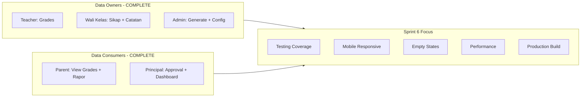
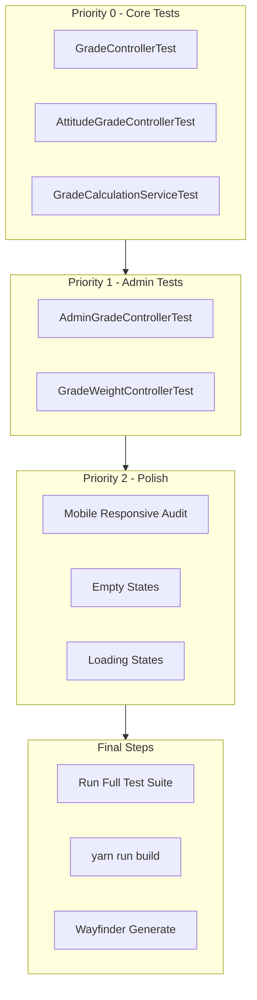

# Sprint 6: Testing, Polish & Integration - Implementation Strategy

## Phase 1: Feature Understanding

### Sprint 6 Goal

Testing menyeluruh, bug fixes, dan polish UI/UX untuk modul Grades & Report Cards.

### Data Flow Verification




## Phase 2: Cross-Frontend Impact Mapping


| Feature                | Owner      | Consumer                 | Current Status | Sprint 6 Action |
| ---------------------- | ---------- | ------------------------ | -------------- | --------------- |
| Input Nilai UH/UTS/UAS | Teacher    | Admin, Principal, Parent | UI Complete    | Add tests       |
| Input Nilai Sikap      | Wali Kelas | Admin, Principal, Parent | UI Complete    | Add tests       |
| Bobot Konfigurasi      | Admin      | All (implicit)           | UI Complete    | Add tests       |
| Generate Rapor         | Admin      | Principal, Parent        | UI Complete    | Tests exist     |
| Approval Rapor         | Principal  | Parent                   | UI Complete    | Tests exist     |
| View Rapor             | Parent     | Self                     | UI Complete    | Tests exist     |
| Dashboard Akademik     | Principal  | Self                     | UI Complete    | Tests exist     |


## Phase 3: Missing Implementation Detection

### Tests That EXIST (No Action Needed)

- `tests/Feature/ReportCard/ReportCardGenerationTest.php` - Admin report card generation
- `tests/Feature/ReportCard/PrincipalApprovalTest.php` - Principal approval flow
- `tests/Feature/ReportCard/ParentViewTest.php` - Parent viewing grades/rapor
- `tests/Feature/ReportCard/WaliKelasNotesTest.php` - Wali kelas notes
- `tests/Feature/Academic/DashboardTest.php` - Principal academic dashboard

### Tests That Are MISSING (Priority P0)

**1. Teacher/GradeController Tests**

- File: `tests/Feature/Teacher/GradeControllerTest.php`
- Test cases:
  - `test_teacher_can_access_grades_index()`
  - `test_teacher_can_access_create_page()`
  - `test_teacher_can_store_grades_bulk()`
  - `test_teacher_can_edit_own_grades()`
  - `test_teacher_can_update_grades()`
  - `test_teacher_can_delete_unlocked_grades()`
  - `test_teacher_cannot_edit_locked_grades()`
  - `test_teacher_can_only_access_own_classes()`
  - `test_grade_validation_score_0_to_100()`

**2. Teacher/AttitudeGradeController Tests**

- File: `tests/Feature/Teacher/AttitudeGradeControllerTest.php`
- Test cases:
  - `test_wali_kelas_can_access_attitude_grades_index()`
  - `test_wali_kelas_can_store_attitude_grades()`
  - `test_non_wali_kelas_cannot_access_attitude_grades()`
  - `test_attitude_grade_validation()`

**3. Admin/GradeController Tests**

- File: `tests/Feature/Admin/GradeControllerTest.php`
- Test cases:
  - `test_admin_can_access_grades_index()`
  - `test_admin_can_view_grades_summary()`
  - `test_admin_can_export_grades_csv()`
  - `test_admin_can_filter_by_class_subject_semester()`

**4. Admin/GradeWeightController Tests**

- File: `tests/Feature/Admin/GradeWeightControllerTest.php`
- Test cases:
  - `test_admin_can_access_grade_weights_config()`
  - `test_admin_can_update_grade_weights()`
  - `test_validation_total_weight_must_equal_100()`
  - `test_default_vs_subject_specific_weights()`

**5. GradeCalculationService Unit Tests**

- File: `tests/Unit/Services/GradeCalculationServiceTest.php`
- Test cases:
  - `test_calculate_final_grade_with_weights()`
  - `test_calculate_class_average()`
  - `test_calculate_ranking()`
  - `test_get_predikat_A_B_C_D()`
  - `test_handles_missing_components()`
  - `test_handles_zero_scores()`

### UI/UX Polish Items (Priority P1)

**Mobile Responsiveness Audit**

- Pages to audit (all exist, need mobile QA):
  - `Teacher/Grades/Index.vue` - Table scroll on mobile
  - `Teacher/Grades/Create.vue` - Wizard steps mobile layout
  - `Teacher/AttitudeGrades/Create.vue` - Form input mobile
  - `Admin/ReportCards/Generate.vue` - Wizard mobile
  - `Parent/Children/Grades.vue` - Expandable rows mobile
  - `Parent/Children/ReportCards/Show.vue` - PDF preview mobile

**Empty States to Add/Verify**

- `Teacher/Grades/Index.vue` - "Belum ada penilaian" state
- `Parent/Children/Grades.vue` - "Nilai belum tersedia" state
- `Parent/Children/ReportCards/Index.vue` - "Rapor belum tersedia" state

**Loading States (Skeleton Loaders)**

- Pattern exists using `<Deferred>` component from Inertia v2
- Verify all deferred props have skeleton loaders

## Phase 4: Gap Analysis


| Gap                                   | Description                         | Impact               | Priority |
| ------------------------------------- | ----------------------------------- | -------------------- | -------- |
| Missing Teacher tests                 | No test coverage for grade CRUD     | Regressions possible | P0       |
| Missing GradeCalculationService tests | No unit tests for calculation logic | Wrong grades         | P0       |
| Missing GradeWeightController tests   | No tests for weight config          | Config bugs          | P1       |
| Mobile responsive not verified        | May have layout issues              | Bad UX               | P1       |
| Edit AttitudeGrades page missing      | Cannot edit after creation          | Feature incomplete   | P2       |


## Phase 5: Implementation Sequencing

### Dependency Graph




### Priority Matrix


| Task                        | Priority | Reason                          |
| --------------------------- | -------- | ------------------------------- |
| GradeControllerTest         | P0       | Core grade input needs coverage |
| AttitudeGradeControllerTest | P0       | Wali kelas flow needs coverage  |
| GradeCalculationServiceTest | P0       | Calculation logic is critical   |
| AdminGradeControllerTest    | P1       | Admin view needs coverage       |
| GradeWeightControllerTest   | P1       | Config integrity                |
| Mobile Responsive Audit     | P1       | User experience                 |
| Empty States                | P2       | Polish                          |
| Loading States              | P2       | Polish                          |


## Phase 6: Detailed Implementation

### Backend: New Test Files

**File: `tests/Feature/Teacher/GradeControllerTest.php**`

- Location: `tests/Feature/Teacher/`
- Pattern: Follow `ReportCardGenerationTest.php` structure
- Key setup: Create teacher, class, subject, student
- Test authorization, CRUD operations, validation, locking

**File: `tests/Feature/Teacher/AttitudeGradeControllerTest.php**`

- Location: `tests/Feature/Teacher/`
- Key setup: Create wali kelas, class, students
- Test wali kelas middleware, CRUD, validation

**File: `tests/Feature/Admin/GradeControllerTest.php**`

- Location: `tests/Feature/Admin/`
- Test index, summary, export, filters

**File: `tests/Feature/Admin/GradeWeightControllerTest.php**`

- Location: `tests/Feature/Admin/`
- Test config CRUD, validation (total=100%)

**File: `tests/Unit/Services/GradeCalculationServiceTest.php**`

- Location: `tests/Unit/Services/`
- Unit tests for pure calculation logic
- Mock dependencies as needed

### Frontend: Polish Items

**Mobile Responsive Patterns (Reference)**

- Grid: `grid-cols-1 sm:grid-cols-2 lg:grid-cols-3`
- Padding: `px-4 sm:px-6 lg:px-8`
- Text: `text-lg sm:text-xl`
- Flex: `flex-col sm:flex-row`
- Touch targets: `min-h-[44px]`

**Empty State Component Pattern**

```vue
<div v-if="!items.length" class="text-center py-12">
  <Icon class="h-12 w-12 text-slate-400 mx-auto" />
  <h3 class="text-lg font-medium">No data</h3>
  <p class="text-slate-500">Description</p>
</div>
```

### Integration Tasks

**Wayfinder Routes**

```bash
php artisan wayfinder:generate
```

**Production Build**

```bash
yarn run build
```

**Full Test Suite**

```bash
php artisan test
```

## Phase 7: Recommended User Journeys to Test

### Journey 1: Teacher Input Nilai (Manual Test)

1. Login as teacher
2. Navigate to `/teacher/grades`
3. Click "Tambah Penilaian"
4. Fill wizard: Kelas, Mapel, Semester, Jenis, Judul
5. Input nilai per siswa (test: 0, 50, 100, invalid)
6. Save and verify in index
7. Edit nilai, verify lock behavior

### Journey 2: Parent View Nilai (Manual Test)

1. Login as parent
2. Navigate to `/parent/children/{id}/grades`
3. Verify table shows correct subjects
4. Expand rows to see breakdown
5. Test on mobile viewport
6. Navigate to `/parent/children/{id}/report-cards`
7. View released rapor
8. Download PDF

### Journey 3: Admin Generate Rapor (Manual Test)

1. Login as admin
2. Navigate to `/admin/report-cards/generate`
3. Select class, verify validation
4. Generate rapor
5. Preview PDF
6. Test unlock/regenerate

## Files to Create

### Tests

- `tests/Feature/Teacher/GradeControllerTest.php`
- `tests/Feature/Teacher/AttitudeGradeControllerTest.php`
- `tests/Feature/Admin/GradeControllerTest.php`
- `tests/Feature/Admin/GradeWeightControllerTest.php`
- `tests/Unit/Services/GradeCalculationServiceTest.php`

### Optional Frontend (P2)

- `resources/js/Pages/Teacher/AttitudeGrades/Edit.vue` (missing edit page)

## Final Checklist

- All P0 tests written and passing
- All P1 tests written and passing
- Mobile responsive verified on all pages
- Empty states added where missing
- Loading states (skeletons) verified
- `php artisan test` passes
- `yarn run build` succeeds
- `php artisan wayfinder:generate` run
- Production build tested

