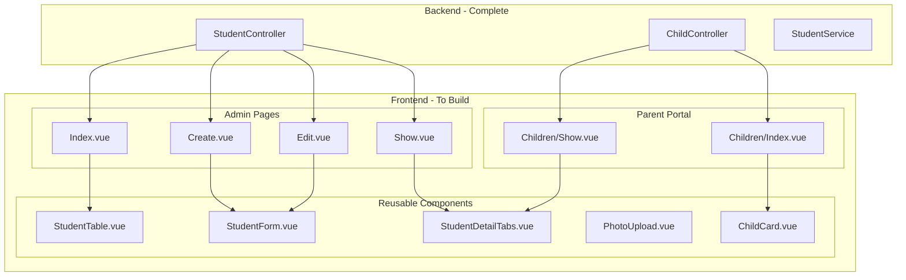

# Student Management Frontend Implementation Plan

## Executive Summary

Backend Student Management sudah complete (30 unit tests passed). Frontend implementation akan mengikuti pattern yang sudah established di User Management module, dengan fokus pada:

- **4 Admin Pages**: Index, Create, Edit, Show
- **2 Parent Portal Pages**: Index, Show
- **5 Reusable Components**: StudentTable, StudentForm, StudentDetailTabs, PhotoUpload, ChildCard
- **Navigation Update**: Menambah menu "Data Siswa" di AppLayout

---

## Architecture Overview



---

## Phase 1: Foundation Components (Priority P0)

### 1.1 StudentTable.vue

**Path**: [`resources/js/components/ui/StudentTable.vue`](resources/js/components/ui/StudentTable.vue)Reusable table component dengan:

- Search (nama, NIS, NISN)
- Multi-filter (kelas, status, tahun ajaran, jenis kelamin)
- Pagination dengan Inertia
- Desktop table + Mobile cards (responsive)
- Action buttons: View, Edit, Delete, Update Status

**Reference Pattern**: [`resources/js/components/ui/UserTable.vue`](resources/js/components/ui/UserTable.vue)

### 1.2 StudentForm.vue

**Path**: [`resources/js/components/ui/StudentForm.vue`](resources/js/components/ui/StudentForm.vue)Multi-section form dengan collapsible sections:

- Section 1: Biodata Siswa (nama, NIK, NISN, TTL, agama)
- Section 2: Alamat Lengkap
- Section 3: Data Akademik (kelas, tahun ajaran)
- Section 4: Data Ayah
- Section 5: Data Ibu
- Section 6: Data Wali (collapsible/optional)

**Validation Fields** (dari [`app/Http/Requests/Admin/StoreStudentRequest.php`](app/Http/Requests/Admin/StoreStudentRequest.php)):

- NIK: 16 digit, unique
- NISN: 10 digit, unique
- Tanggal lahir: umur 5-15 tahun
- Tahun ajaran: format YYYY/YYYY

### 1.3 PhotoUpload.vue

**Path**: [`resources/js/components/ui/PhotoUpload.vue`](resources/js/components/ui/PhotoUpload.vue)Photo upload component dengan:

- Drag & drop support
- Preview before upload
- Max 2MB validation
- Accept: jpg, jpeg, png
- Compression (optional enhancement)

---

## Phase 2: Admin Pages (Priority P0)

### 2.1 Admin/Students/Index.vue

**Path**: [`resources/js/pages/Admin/Students/Index.vue`](resources/js/pages/Admin/Students/Index.vue)**Props dari Controller**:

```typescript
interface Props {
    students: PaginatedData<Student>;
    filters: {
        search?: string;
        kelas_id?: number;
        status?: string;
        tahun_ajaran?: string;
        jenis_kelamin?: string;
    };
}
```

**Features**:

- Header dengan title + "Tambah Siswa" button
- StudentTable component
- Empty state ketika tidak ada data
- Loading skeleton saat fetch

### 2.2 Admin/Students/Create.vue

**Path**: [`resources/js/pages/Admin/Students/Create.vue`](resources/js/pages/Admin/Students/Create.vue)**Form Fields** (total 40+ fields):

- Biodata: 12 fields
- Alamat: 7 fields
- Akademik: 3 fields
- Ayah: 8 fields
- Ibu: 8 fields
- Wali: 8 fields (optional)

**Submit Flow**:

1. Validate all fields
2. POST to `/admin/students`
3. Auto-generate NIS di backend
4. Auto-create parent account
5. Redirect ke Index dengan success message

### 2.3 Admin/Students/Edit.vue

**Path**: [`resources/js/pages/Admin/Students/Edit.vue`](resources/js/pages/Admin/Students/Edit.vue)**Props**:

```typescript
interface Props {
    student: Student & { guardians: Guardian[] };
}
```

**Pre-fill Logic**:

- Map guardians ke form sections (ayah, ibu, wali)
- Display current photo dengan option to replace

### 2.4 Admin/Students/Show.vue

**Path**: [`resources/js/pages/Admin/Students/Show.vue`](resources/js/pages/Admin/Students/Show.vue)**Props**:

```typescript
interface Props {
    student: Student & {
        guardians: Guardian[];
        primaryGuardian: Guardian;
        classHistory: ClassHistory[];
        statusHistory: StatusHistory[];
    };
}
```

**Tabs Structure**:

- Tab 1: Biodata + Foto
- Tab 2: Data Orang Tua/Wali
- Tab 3: Riwayat Kelas
- Tab 4: Riwayat Status (dengan audit trail)

**Actions**:

- Edit button
- Update Status button (modal)
- Delete button (soft delete)

---

## Phase 3: Parent Portal Pages (Priority P1)

### 3.1 Parent/Children/Index.vue

**Path**: [`resources/js/pages/Parent/Children/Index.vue`](resources/js/pages/Parent/Children/Index.vue)**Props**:

```typescript
interface Props {
    children: Student[];
    message?: string; // untuk edge case "Data orang tua tidak ditemukan"
}
```

**Features**:

- Grid of ChildCard components
- Empty state untuk parent tanpa anak terdaftar
- Mobile-optimized card layout

### 3.2 Parent/Children/Show.vue

**Path**: [`resources/js/pages/Parent/Children/Show.vue`](resources/js/pages/Parent/Children/Show.vue)**Features**:

- Read-only view (no edit buttons)
- Same tabs as Admin Show (minus status history)
- Back navigation ke Children Index

---

## Phase 4: Navigation & Routes Update

### 4.1 AppLayout Navigation Update

**File**: [`resources/js/components/layouts/AppLayout.vue`](resources/js/components/layouts/AppLayout.vue)**Changes Required** (line 128-134):

```typescript
// Add to ADMIN menu items:
{ name: 'Data Siswa', route: 'admin.students.index', icon: GraduationCap },
```

**Route Helper Update** (line 59-74):

```typescript
// Add to getRouteUrl function:
'admin.students.index': adminStudentsIndex().url,
```


### 4.2 Wayfinder Routes Generation

Run `php artisan wayfinder:generate` untuk generate routes di:

- `resources/js/routes/admin/students/index.ts`

---

## Phase 5: TypeScript Interfaces

**Path**: [`resources/js/types/student.ts`](resources/js/types/student.ts)

```typescript
interface Student {
    id: number;
    nis: string;
    nisn: string;
    nik: string;
    nama_lengkap: string;
    nama_panggilan?: string;
    jenis_kelamin: 'L' | 'P';
    tempat_lahir: string;
    tanggal_lahir: string;
    agama: string;
    anak_ke: number;
    jumlah_saudara: number;
    status_keluarga: string;
    alamat: string;
    rt_rw?: string;
    kelurahan: string;
    kecamatan: string;
    kota: string;
    provinsi: string;
    kode_pos?: string;
    no_hp?: string;
    email?: string;
    foto?: string;
    kelas_id?: number;
    tahun_ajaran_masuk: string;
    tanggal_masuk: string;
    status: 'aktif' | 'mutasi' | 'do' | 'lulus';
    guardians?: Guardian[];
    primaryGuardian?: Guardian;
}

interface Guardian {
    id: number;
    nik: string;
    nama_lengkap: string;
    hubungan: 'ayah' | 'ibu' | 'wali';
    pekerjaan: string;
    pendidikan: string;
    penghasilan: string;
    no_hp?: string;
    email?: string;
    alamat?: string;
    pivot?: { is_primary_contact: boolean };
}
```

---

## Implementation Sequence

| Order | Task | Dependencies | Parallel ||-------|------|--------------|----------|| 1 | Generate Wayfinder routes | - | - || 2 | Create TypeScript interfaces | - | Yes with 1 || 3 | Create PhotoUpload.vue | - | Yes with 2 || 4 | Create StudentTable.vue | Wayfinder routes | - || 5 | Create StudentForm.vue | PhotoUpload | - || 6 | Create Index.vue | StudentTable | - || 7 | Create Create.vue | StudentForm | Yes with 6 || 8 | Create Edit.vue | StudentForm | Yes with 7 || 9 | Create StudentDetailTabs.vue | - | Yes with 8 || 10 | Create Show.vue | StudentDetailTabs | - || 11 | Update AppLayout navigation | - | Yes with 10 || 12 | Create ChildCard.vue | - | Yes with 11 || 13 | Create Parent/Children/Index.vue | ChildCard | - || 14 | Create Parent/Children/Show.vue | StudentDetailTabs | Yes with 13 || 15 | Run Feature Tests | All pages complete | - |---

## Files to Create

### New Files (14 files):

1. `resources/js/pages/Admin/Students/Index.vue`
2. `resources/js/pages/Admin/Students/Create.vue`
3. `resources/js/pages/Admin/Students/Edit.vue`
4. `resources/js/pages/Admin/Students/Show.vue`
5. `resources/js/pages/Parent/Children/Index.vue`
6. `resources/js/pages/Parent/Children/Show.vue`
7. `resources/js/components/ui/StudentTable.vue`
8. `resources/js/components/ui/StudentForm.vue`
9. `resources/js/components/ui/StudentDetailTabs.vue`
10. `resources/js/components/ui/PhotoUpload.vue`
11. `resources/js/components/ui/ChildCard.vue`
12. `resources/js/components/ui/StatusChangeModal.vue`
13. `resources/js/types/student.ts`
14. `resources/js/routes/admin/students/index.ts` (auto-generated)

### Files to Modify (1 file):

1. `resources/js/components/layouts/AppLayout.vue` - Add navigation menu

---

## Estimated Effort

| Phase | Files | Complexity | Est. Time ||-------|-------|------------|-----------|| Phase 1: Components | 4 | Medium-High | 3-4 hours || Phase 2: Admin Pages | 4 | High | 4-5 hours || Phase 3: Parent Pages | 2 | Low | 1-2 hours || Phase 4: Navigation | 1 | Low | 30 mins || Phase 5: Types | 1 | Low | 30 mins || Testing & Polish | - | Medium | 2 hours || **Total** | **14** | - | **11-14 hours** |---

## Success Criteria