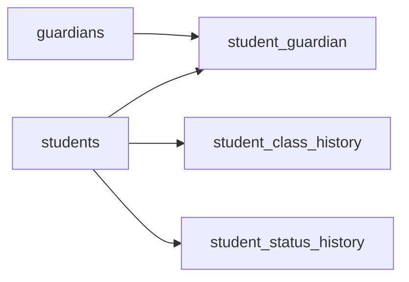

# Backend Implementation Plan - Student Management Module

## Executive Summary

Plan ini fokus pada implementasi **backend-only** untuk modul Student Management berdasarkan requirements di [`02_Student_Management.md`](school-reqs-main/school-reqs-main/02_Functional_Requirements/02_Student_Management.md). Implementasi mengikuti pattern yang sudah ada di codebase (referensi: [`UserController.php`](app/Http/Controllers/Admin/UserController.php)).---

## Current State Analysis

### Existing Infrastructure

- Database: SQLite dengan `users`, `activity_logs` tables
- Models: `User`, `ActivityLog`, `PasswordHistory`, `FailedLoginAttempt`
- Controllers: `UserController` dengan CRUD + activity logging pattern
- Form Requests: `StoreUserRequest`, `UpdateUserRequest`
- No `Services` folder exists yet

### Critical Gaps

- No `students` table/model
- No `guardians` (parents) table/model  
- No student-parent relationship tables
- No history tracking tables
- No StudentController or related endpoints

---

## Implementation Sequence

### Phase 1: Database Layer (Migrations)



**5 migrations diperlukan:**

1. **`create_students_table`** - Biodata siswa, alamat, data akademik
2. **`create_guardians_table`** - Data orang tua/wali (menggunakan "Guardian" untuk avoid PHP reserved word "Parent")
3. **`create_student_guardian_table`** - Pivot table dengan `is_primary_contact`
4. **`create_student_class_history_table`** - Riwayat kelas siswa
5. **`create_student_status_history_table`** - Riwayat perubahan status

### Phase 2: Model Layer

**4 Eloquent models:**

1. **`Student`** - dengan relationships ke Guardian, ClassHistory, StatusHistory
2. **`Guardian`** - dengan relationship ke User (untuk portal account) dan Students
3. **`StudentClassHistory`** - belongs to Student
4. **`StudentStatusHistory`** - belongs to Student dan User (changed_by)

### Phase 3: Service Layer

**`StudentService`** untuk business logic:

- NIS auto-generation (`{tahun_masuk}{nomor_urut}`)
- Auto-create parent account
- Bulk class promotion logic
- Status change dengan history tracking

### Phase 4: Controller & Routes

**`StudentController`** dengan methods:

- `index()` - List dengan filter/search/pagination
- `create()` / `store()` - Tambah siswa + auto-create parent account
- `show()` - Detail profil siswa
- `edit()` / `update()` - Edit data siswa
- `destroy()` - Soft delete
- `promote()` - Bulk naik kelas
- `updateStatus()` - Update status (Aktif/Mutasi/DO/Lulus)
- `export()` - Export Excel
- `import()` / `importPreview()` - Import Excel dengan preview

**`ParentChildController`** untuk parent portal:

- `index()` - List anak untuk parent
- `show()` - Detail anak (read-only)

### Phase 5: Form Requests & Validation

**4 Form Request classes:**

- `StoreStudentRequest` - Validation untuk create student
- `UpdateStudentRequest` - Validation untuk update student
- `UpdateStudentStatusRequest` - Validation untuk status change
- `BulkPromoteRequest` - Validation untuk bulk naik kelas

---

## Database Schema Detail

### students table

```javascript
id, nis (unique), nisn (unique), nik (unique)
nama_lengkap, nama_panggilan, jenis_kelamin
tempat_lahir, tanggal_lahir, agama
anak_ke, jumlah_saudara, status_keluarga
alamat, rt_rw, kelurahan, kecamatan, kota, provinsi, kode_pos
no_hp, email, foto
kelas_id (nullable), tahun_ajaran_masuk, tanggal_masuk
status (enum: aktif, mutasi, do, lulus)
deleted_at, timestamps
```


### guardians table

```javascript
id, nik (unique), nama_lengkap
hubungan (enum: ayah, ibu, wali)
pekerjaan, pendidikan, penghasilan
no_hp, email, alamat
user_id (nullable FK to users)
timestamps
```


### student_guardian (pivot)

```javascript
id, student_id, guardian_id, is_primary_contact
timestamps
```


### student_class_history

```javascript
id, student_id, kelas_id
tahun_ajaran, wali_kelas
timestamps
```


### student_status_history

```javascript
id, student_id
status_lama, status_baru
tanggal, alasan, keterangan, sekolah_tujuan (nullable)
changed_by (FK to users)
timestamps
```

---

## Routes Structure

```php
Route::prefix('admin')->middleware(['auth', 'role:SUPERADMIN,ADMIN'])->group(function () {
    // Student CRUD
    Route::resource('students', StudentController::class);
    
    // Additional student actions
    Route::post('students/{student}/update-status', [StudentController::class, 'updateStatus']);
    Route::post('students/promote', [StudentController::class, 'promote']);
    Route::get('students/export', [StudentController::class, 'export']);
    Route::post('students/import/preview', [StudentController::class, 'importPreview']);
    Route::post('students/import', [StudentController::class, 'import']);
});

Route::prefix('parent')->middleware(['auth', 'role:PARENT'])->group(function () {
    Route::get('children', [ParentChildController::class, 'index']);
    Route::get('children/{student}', [ParentChildController::class, 'show']);
});
```

---

## Files to Create

### Migrations (5 files)

- `database/migrations/xxxx_create_students_table.php`
- `database/migrations/xxxx_create_guardians_table.php`
- `database/migrations/xxxx_create_student_guardian_table.php`
- `database/migrations/xxxx_create_student_class_history_table.php`
- `database/migrations/xxxx_create_student_status_history_table.php`

### Models (4 files)

- `app/Models/Student.php`
- `app/Models/Guardian.php`
- `app/Models/StudentClassHistory.php`
- `app/Models/StudentStatusHistory.php`

### Controllers (2 files)

- `app/Http/Controllers/Admin/StudentController.php`
- `app/Http/Controllers/Parent/ChildController.php`

### Form Requests (4 files)

- `app/Http/Requests/Admin/StoreStudentRequest.php`
- `app/Http/Requests/Admin/UpdateStudentRequest.php`
- `app/Http/Requests/Admin/UpdateStudentStatusRequest.php`
- `app/Http/Requests/Admin/BulkPromoteRequest.php`

### Services (1 file)

- `app/Services/StudentService.php`

### Factories (2 files)

- `database/factories/StudentFactory.php`
- `database/factories/GuardianFactory.php`

### Files to Modify

- `routes/web.php` - Tambah student routes

---

## Key Business Logic Implementation

### NIS Auto-Generation

```php
// Format: {tahun_masuk}{4-digit nomor urut}
// Example: 20250001
$lastNis = Student::where('nis', 'like', $year.'%')->max('nis');
$nextNumber = $lastNis ? (int)substr($lastNis, 4) + 1 : 1;
$nis = $year . str_pad($nextNumber, 4, '0', STR_PAD_LEFT);
```


### Auto-Create Parent Account

```php
// Username: nomor HP (normalized)
// Password: Ortu{NIS}
// Role: PARENT
// Link guardian ke user_id
```


### Bulk Class Promotion

```php
// 1. Validate kelas asal dan tujuan
// 2. Get students by kelas_id
// 3. Update kelas_id untuk selected students
// 4. Insert student_class_history records
// 5. Return success count


```