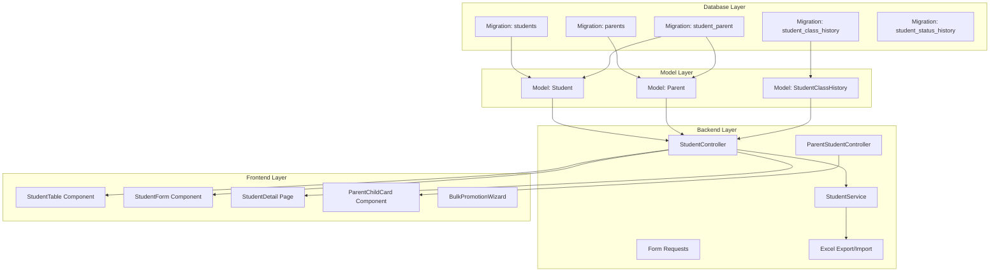

# Student Management - Development Strategy & Implementation Plan

## Phase 1: Feature Understanding

### Data yang Dikelola

- **Student Profile**: Biodata siswa (NIS, NISN, NIK, nama, TTL, alamat, foto)
- **Parent/Guardian Data**: Data orang tua/wali (ayah, ibu, wali)
- **Academic Data**: Kelas, tahun ajaran, status siswa
- **History Records**: Riwayat kelas, riwayat status, audit trail

### Primary User Goals

| Role | Goal ||------|------|| TU/Admin | CRUD data siswa, naik kelas, export/import, manage status || Guru | View profil siswa di kelas yang diajar || Kepala Sekolah | View semua data siswa + summary pembayaran || Orang Tua | View profil anak sendiri (read-only) |---

## Phase 2: Cross-Frontend Impact Mapping

| Feature | Owner (Who Creates) | Consumer (Who Views) | Data Flow ||---------|---------------------|----------------------|-----------|| Tambah Siswa | TU @ `/admin/students/create` | TU, Guru, Principal @ list/detail | Form → API → DB → List || Edit Siswa | TU @ `/admin/students/{id}/edit` | All roles @ detail page | Form → API → DB → Refresh || Nonaktifkan Siswa | TU @ detail page | TU @ filtered list | Action → API → Status Change || Lihat Profil Siswa | - | TU, Guru, Principal @ `/admin/students/{id}` | DB → API → Detail Page || Data Orang Tua | TU @ student form | Parent @ portal, TU @ detail | Form → API → DB → Portal || Upload Foto | TU @ student form | All @ list/detail/card | Upload → Storage → Display || Filter & Search | - | TU, Guru, Principal @ list | Query → API → Filtered Results || Export Excel | TU @ list page | TU (download) | Query → Excel → Download || Import Excel | TU @ list page | TU (preview) | Upload → Validate → Preview → Insert || Naik Kelas | TU @ bulk action | TU (preview/confirm) | Select → Preview → Bulk Update || Portal Orang Tua | - | Parent @ `/parent/children` | DB → API → Parent Dashboard |---

## Phase 3: Missing Implementation Detection

### Owner Side (Data Creation) Checklist

| Requirement | Status | Notes ||-------------|--------|-------|| UI form untuk create student | Missing | Perlu buat form lengkap dengan multi-section || Validation rules | Missing | NIK 16 digit, NISN 10 digit, umur 5-15 tahun || Edit/Update capability | Missing | Form edit dengan pre-filled data || Delete/Archive (soft delete) | Missing | Soft delete dengan konfirmasi || Preview before publishing | N/A | Direct save || Bulk operations (naik kelas) | Missing | Wizard 3-step untuk bulk promotion || Upload foto | Missing | Drag-drop, compress, preview |

### Consumer Side (Data Display) Checklist

| Requirement | Status | Notes ||-------------|--------|-------|| List page dengan table | Missing | `/admin/students` dengan filter, search, pagination || Detail profile page | Missing | `/admin/students/{id}` dengan tabs || Mobile responsive | Missing | Card-based untuk mobile || Empty states | Missing | Skeleton loading, "Belum ada data" || Loading states | Missing | Spinner, skeleton || Parent portal view | Missing | `/parent/children` dan `/parent/children/{id}` |

### Integration Points Checklist

| Requirement | Status | Notes ||-------------|--------|-------|| API endpoints | Missing | Full CRUD + bulk + export/import || Database schema | Missing | students, parents, student_class_history, etc || State management | Existing | Inertia handles this || Navigation menu | Missing | Perlu tambah menu "Data Siswa" || Search/filter | Missing | Real-time search, multi-filter || Audit trail | Existing | `activity_logs` table sudah ada |---

## Phase 4: Gap Analysis

### Critical Gaps (Data Flow Broken)

| Gap | Impact | Resolution ||-----|--------|------------|| No Student model/table | Owner tidak bisa create data | Create migration + model || No Parent model/table | Parent account tidak bisa dibuat otomatis | Create migration + model || No student routes | Tidak ada endpoint | Create StudentController + routes || No parent portal routes | Parent tidak bisa view anak | Create ParentStudentController || No menu item "Data Siswa" | User tidak bisa navigate | Update navigation component |

### Feature Gaps

| Feature | Owner Has | Consumer Has | Gap ||---------|-----------|--------------|-----|| Student CRUD | No | No | Need full implementation || Parent view child | No | No | Need parent portal pages || Export Excel | No | No | Need export functionality || Import Excel | No | No | Need import with preview || Naik Kelas Bulk | No | No | Need wizard UI || Photo Upload | No | No | Need upload component |---

## Phase 5: Implementation Sequencing

### Dependency Graph




### Priority Matrix

| Task | Priority | Depends On | Parallel With ||------|----------|------------|---------------|| Database migrations | P0 | - | - || Student Model | P0 | migrations | Parent Model || Parent Model | P0 | migrations | Student Model || StudentController (CRUD) | P0 | Models | - || Student List Page | P0 | Controller | Student Form || Student Form (Create/Edit) | P0 | Controller | Student List || Student Detail Page | P0 | Controller | - || Navigation Menu Update | P0 | - | Any frontend || Form Request Validation | P1 | Controller | - || Photo Upload | P1 | Form | - || Filter & Search | P1 | List Page | - || Parent Portal Pages | P1 | Parent Model | - || Export Excel | P1 | List Page | Import Excel || Import Excel | P1 | List Page | Export Excel || Bulk Naik Kelas | P1 | Models | - || Audit Trail Integration | P2 | CRUD | - || Student ID Card Generator | P2 | Detail Page | - |---

## Phase 6: Detailed Recommendations

### New Database Tables

```javascript
students
├── id, nis (auto), nisn, nik
├── nama_lengkap, nama_panggilan
├── jenis_kelamin, tempat_lahir, tanggal_lahir
├── agama, anak_ke, jumlah_saudara, status_keluarga
├── alamat, rt_rw, kelurahan, kecamatan, kota, provinsi, kode_pos
├── no_hp, email, foto
├── kelas_id, tahun_ajaran_masuk, tanggal_masuk
├── status (aktif/mutasi/do/lulus)
├── deleted_at, timestamps

parents
├── id, nik, nama_lengkap
├── hubungan (ayah/ibu/wali)
├── pekerjaan, pendidikan, penghasilan
├── no_hp, email, alamat
├── user_id (nullable, untuk akun portal)
├── timestamps

student_parent (pivot)
├── student_id, parent_id
├── is_primary_contact

student_class_history
├── id, student_id, kelas_id
├── tahun_ajaran, wali_kelas
├── timestamps

student_status_history
├── id, student_id
├── status_lama, status_baru
├── tanggal, alasan, keterangan
├── changed_by (user_id)
├── timestamps
```


### New Pages/Routes

| Route | Page | Purpose | Priority ||-------|------|---------|----------|| `GET /admin/students` | `Admin/Students/Index.vue` | List siswa dengan filter | P0 || `GET /admin/students/create` | `Admin/Students/Create.vue` | Form tambah siswa | P0 || `GET /admin/students/{id}` | `Admin/Students/Show.vue` | Detail profil siswa | P0 || `GET /admin/students/{id}/edit` | `Admin/Students/Edit.vue` | Form edit siswa | P0 || `GET /admin/students/import` | `Admin/Students/Import.vue` | Import wizard | P1 || `GET /admin/students/promote` | `Admin/Students/Promote.vue` | Bulk naik kelas wizard | P1 || `GET /parent/children` | `Parent/Children/Index.vue` | List anak (parent portal) | P1 || `GET /parent/children/{id}` | `Parent/Children/Show.vue` | Detail anak (parent portal) | P1 |

### New Components

| Component | Used By | Priority ||-----------|---------|----------|| `StudentTable.vue` | Index page | P0 || `StudentForm.vue` | Create/Edit pages | P0 || `StudentDetailTabs.vue` | Show page | P0 || `ParentFormSection.vue` | StudentForm | P0 || `PhotoUpload.vue` | StudentForm | P1 || `BulkPromotionWizard.vue` | Promote page | P1 || `ImportPreviewTable.vue` | Import page | P1 || `ChildCard.vue` | Parent portal | P1 |

### Navigation Menu Updates

| Frontend | Menu Item | Parent | Icon | Priority ||----------|-----------|--------|------|----------|| Admin | Data Siswa | - | `Users` | P0 || Admin | - Daftar Siswa | Data Siswa | `List` | P0 || Admin | - Tambah Siswa | Data Siswa | `UserPlus` | P0 || Admin | - Import Data | Data Siswa | `Upload` | P1 || Admin | - Naik Kelas | Data Siswa | `ArrowUpCircle` | P1 || Parent | Anak Saya | - | `Baby` | P1 |---

## Phase 7: Example User Journeys

### Journey 1: TU Tambah Siswa Baru (US-STD-001)

**Owner Journey:**

1. TU login → Dashboard Admin
2. Klik menu "Data Siswa" → "Tambah Siswa"
3. Sistem tampilkan form multi-section:

- Section 1: Biodata (nama, NIK, NISN, TTL, dll)
- Section 2: Alamat
- Section 3: Data Akademik (kelas, tahun ajaran)
- Section 4: Data Ayah
- Section 5: Data Ibu
- Section 6: Data Wali (collapsible)

4. TU isi semua field wajib, upload foto
5. Klik "Simpan"
6. Backend: validate → generate NIS → save student → create parent account
7. TU lihat notifikasi "Siswa berhasil ditambahkan. NIS: 2025001"
8. Redirect ke detail siswa atau list

**Consumer Journey (Guru lihat siswa):**

1. Guru login → Dashboard Guru
2. Klik menu "Data Siswa" (filtered by kelas yang diajar)
3. Lihat table siswa dengan kolom: Foto, NIS, Nama, Kelas, Status
4. Klik nama siswa → Detail profil
5. Lihat tabs: Biodata, Orang Tua, Riwayat Kelas, Absensi (summary)
6. Guru tidak bisa edit (read-only)

### Journey 2: Bulk Naik Kelas (US-STD-010)

**Owner Journey:**

1. TU di halaman "Data Siswa" → klik "Naik Kelas"
2. **Step 1**: Pilih tahun ajaran lama (2024/2025) dan baru (2025/2026)
3. **Step 2**: Pilih kelas asal (1A) dan tujuan (2A)
4. Klik "Lanjut"
5. **Step 3**: Preview table siswa dengan checkbox (semua selected)
6. Uncheck siswa yang tidak naik kelas
7. Lihat summary: "25 dari 28 siswa akan dipindahkan ke 2A"
8. Klik "Proses Naik Kelas"
9. Konfirmasi modal → "Ya, Proses"
10. Backend: bulk update kelas, insert history
11. Success: "25 siswa berhasil dipindahkan ke kelas 2A"

### Journey 3: Orang Tua Lihat Profil Anak (US-STD-011)

**Consumer Journey:**

1. Orang tua login dengan username (no HP) → Dashboard Parent
2. Dashboard tampilkan card anak (jika >1 anak, tampil multiple cards)
3. Card berisi: Foto, Nama, Kelas, Wali Kelas
4. Klik card → Detail profil anak
5. Lihat tabs: Info Pribadi, Absensi (rekap bulanan), Pembayaran (status SPP)
6. Semua read-only, mobile-friendly
7. Bisa switch antar anak via dropdown/tab

---

## Implementation Todos

### Sprint 1: Foundation (Week 1)

1. Create database migrations (students, parents, pivot, history tables)
2. Create Eloquent models with relationships
3. Create StudentController with basic CRUD
4. Create Form Request classes untuk validation
5. Create StudentService untuk business logic

### Sprint 2: Admin Frontend (Week 2)

6. Create StudentTable component dengan filter/search
7. Create StudentForm component (multi-section)
8. Create Student List page (`Index.vue`)
9. Create Student Create page (`Create.vue`)
10. Create Student Edit page (`Edit.vue`)
11. Create Student Detail page (`Show.vue`) dengan tabs
12. Update navigation menu

### Sprint 3: Advanced Features (Week 3)

13. Implement photo upload dengan compression
14. Create Export Excel functionality
15. Create Import Excel dengan preview/validation
16. Create Bulk Naik Kelas wizard
17. Implement soft delete dengan filter

### Sprint 4: Parent Portal (Week 4)

18. Create ParentStudentController
19. Create Parent Children List page
20. Create Parent Child Detail page
21. Auto-create parent account logic
22. Mobile optimization dan testing

---

## Files to Create/Modify

### Backend (Laravel)

**New Files:**

- `database/migrations/xxxx_create_students_table.php`
- `database/migrations/xxxx_create_parents_table.php`
- `database/migrations/xxxx_create_student_parent_table.php`
- `database/migrations/xxxx_create_student_class_history_table.php`
- `database/migrations/xxxx_create_student_status_history_table.php`
- `app/Models/Student.php`
- `app/Models/Parent.php` (atau `Guardian.php` untuk avoid reserved word)
- `app/Models/StudentClassHistory.php`
- `app/Models/StudentStatusHistory.php`
- `app/Http/Controllers/Admin/StudentController.php`
- `app/Http/Controllers/Parent/ChildController.php`
- `app/Http/Requests/Student/StoreStudentRequest.php`
- `app/Http/Requests/Student/UpdateStudentRequest.php`
- `app/Services/StudentService.php`
- `app/Exports/StudentsExport.php`
- `app/Imports/StudentsImport.php`
- `database/factories/StudentFactory.php`
- `database/factories/GuardianFactory.php`

**Modify:**

- `routes/web.php` - tambah student routes

### Frontend (Vue/Inertia)

**New Files:**

- `resources/js/pages/Admin/Students/Index.vue`
- `resources/js/pages/Admin/Students/Create.vue`
- `resources/js/pages/Admin/Students/Edit.vue`
- `resources/js/pages/Admin/Students/Show.vue`
- `resources/js/pages/Admin/Students/Import.vue`
- `resources/js/pages/Admin/Students/Promote.vue`
- `resources/js/pages/Parent/Children/Index.vue`
- `resources/js/pages/Parent/Children/Show.vue`
- `resources/js/components/ui/StudentTable.vue`
- `resources/js/components/ui/StudentForm.vue`
- `resources/js/components/ui/StudentDetailTabs.vue`
- `resources/js/components/ui/ParentFormSection.vue`