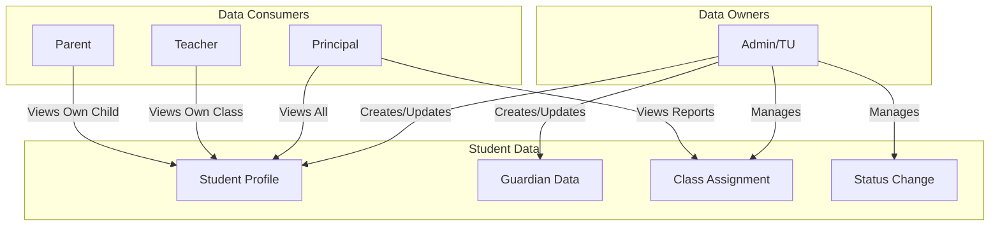

# Student Management - Cross-Frontend Implementation Strategy

## Current State Analysis

Based on the codebase review, the existing implementation covers:

**Backend:**

- `StudentController` with full CRUD, bulk promote, assign class, status update
- `StudentService` for business logic
- `ChildController` for parent portal
- Models: `Student`, `Guardian`, `StudentClassHistory`, `StudentStatusHistory`

**Frontend (Vue Pages):**

- Admin: `Index.vue`, `Create.vue`, `Edit.vue`, `Show.vue`, `Promote.vue`
- Parent: `Children/Index.vue`, `Show.vue`, `Attendance.vue`

**Missing/Incomplete:**

- Principal frontend for student viewing
- Teacher frontend for viewing students in their class
- Export to Excel (TODO in controller)
- Import from Excel (TODO in controller)
- Print ID Card (Phase 2)

---

## Phase 1: Feature-Role Cross Mapping




---

## Phase 2: Role-Based Feature Matrix

### Admin/TU (OWNER - Full Control)

| Feature | Status | Priority | Notes |

|---------|--------|----------|-------|

| Create Student | DONE | P0 | Form lengkap dengan guardians |

| Edit Student | DONE | P0 | Includes foto upload |

| View Student List | DONE | P0 | With filters, search, pagination |

| View Student Detail | DONE | P0 | Tab-based layout |

| Delete Student (Soft) | DONE | P0 | Activity logging |

| Bulk Promote | DONE | P0 | Wizard UI |

| Assign Class | DONE | P0 | Single/bulk |

| Update Status | DONE | P0 | Mutasi/DO/Lulus |

| Export Excel | TODO | P1 | Controller stub exists |

| Import Excel | TODO | P1 | Controller stub exists |

| Reset Parent Password | MISSING | P1 | Not implemented |

| Print Student Profile | MISSING | P2 | PDF generation |

| Print ID Card | MISSING | P2 | Phase 2 feature |

### Principal (CONSUMER - Read + Reports)

| Feature | Status | Priority | Notes |

|---------|--------|----------|-------|

| View All Students | MISSING | P0 | Needs dedicated page |

| View Student Detail | MISSING | P0 | Read-only, includes payment |

| Student Reports | MISSING | P1 | Export capabilities |

| Class Statistics | PARTIAL | P1 | Dashboard has basic stats |

### Teacher (CONSUMER - Own Class Only)

| Feature | Status | Priority | Notes |

|---------|--------|----------|-------|

| View Class Students | MISSING | P0 | Filter by assigned class |

| View Student Detail | MISSING | P0 | Read-only, no payment data |

| Student Search | PARTIAL | P1 | API exists, no UI |

### Parent (CONSUMER - Own Child Only)

| Feature | Status | Priority | Notes |

|---------|--------|----------|-------|

| View Children List | DONE | P0 | Multi-child support |

| View Child Profile | DONE | P0 | Read-only |

| View Attendance | DONE | P0 | Calendar view |

| Switch Between Children | DONE | P1 | Card-based UI |

| Export Attendance PDF | TODO | P2 | Controller stub exists |

---

## Phase 3: Gap Analysis

### Critical Gaps (P0 - Feature Unusable Without)

1. **Principal Cannot View Students**
  - Dashboard shows stats but no way to drill down
  - Missing: `/principal/students` route and page
  - Missing: `/principal/students/{id}` detail page
2. **Teacher Cannot View Class Students**
  - Can only input attendance, cannot view student profiles
  - Missing: `/teacher/students` route and page
  - Missing: `/teacher/students/{id}` detail page (read-only)

### Important Gaps (P1 - Feature Incomplete)

1. **Export Excel Not Implemented**
  - Controller method returns "coming soon"
  - Need Laravel Excel package integration
2. **Import Excel Not Implemented**
  - Template download missing
  - Preview/validation UI missing
3. **Reset Parent Password**
  - Referenced in spec but not implemented
  - Admin should be able to reset from student detail

### Enhancement Gaps (P2 - Nice to Have)

1. **Print Student Profile PDF**
2. **Print ID Card with QR Code**
3. **Document Storage per Student**

---

## Phase 4: Implementation Plan by Role

### 4.1 Principal Frontend (NEW)

**New Routes:**

```php
// routes/web.php - Principal group
Route::get('students', [PrincipalStudentController::class, 'index'])
    ->name('principal.students.index');
Route::get('students/{student}', [PrincipalStudentController::class, 'show'])
    ->name('principal.students.show');
```

**New Controller:**

- `app/Http/Controllers/Principal/StudentController.php`
- Read-only access to all students
- Include payment summary (Principal can see)

**New Vue Pages:**

- `resources/js/pages/Principal/Students/Index.vue`
- `resources/js/pages/Principal/Students/Show.vue`

**Reusable Components:**

- Use existing `StudentTable.vue` with read-only mode
- Use existing `StudentDetailTabs.vue` with full tabs

### 4.2 Teacher Frontend (NEW)

**New Routes:**

```php
// routes/web.php - Teacher group
Route::get('students', [TeacherStudentController::class, 'index'])
    ->name('teacher.students.index');
Route::get('students/{student}', [TeacherStudentController::class, 'show'])
    ->name('teacher.students.show');
```

**New Controller:**

- `app/Http/Controllers/Teacher/StudentController.php`
- Filter by teacher's assigned classes
- Read-only, hide payment data

**New Vue Pages:**

- `resources/js/pages/Teacher/Students/Index.vue`
- `resources/js/pages/Teacher/Students/Show.vue`

**Access Control:**

- Teacher can only view students in classes they teach
- Check via `teacher_class_assignments` or subject teaching

### 4.3 Admin Enhancements

**Export Excel:**

- Install `maatwebsite/excel` package
- Create `StudentExport` class
- Update `export()` method in controller

**Import Excel:**

- Create `StudentImport` class with validation
- Create Import preview Vue component
- Handle duplicate NIK/NISN detection

**Reset Parent Password:**

- Add `resetParentPassword()` to `StudentController`
- Add button in `Show.vue` detail page
- Generate new password and notify via WhatsApp

### 4.4 Navigation Updates

**Principal Sidebar:**

```
- Dashboard
- Data Siswa (NEW)
- Absensi
- Teacher Leave
```

**Teacher Sidebar:**

```
- Dashboard
- Data Siswa (NEW)
- Absensi Harian
- Absensi Per Mapel
- Izin Siswa
- Cuti Saya
```

---

## Phase 5: User Journey Validation

### Journey 1: Principal Views Student with Payment Issues

1. Principal logs in → Dashboard
2. Principal clicks "Data Siswa" in sidebar
3. Principal sees paginated list of all students
4. Principal uses filter: "Status Tunggakan" (if payment integrated)
5. Principal clicks student name → Detail page
6. Principal sees: Biodata, Orang Tua, Akademik, **Pembayaran** tab
7. Principal can print profile PDF for documentation

### Journey 2: Teacher Views Student in Their Class

1. Teacher logs in → Dashboard
2. Teacher clicks "Data Siswa" in sidebar
3. Teacher sees students **only from classes they teach**
4. Teacher can search by name/NIS
5. Teacher clicks student → Detail page (read-only)
6. Teacher sees: Biodata, Orang Tua, Akademik, Absensi
7. **No Pembayaran tab** (hidden for teacher)

### Journey 3: Admin Exports Student Data

1. Admin logs in → Dashboard
2. Admin navigates to Data Siswa
3. Admin applies filter: Kelas 3A, Status Aktif
4. Admin clicks "Export Excel"
5. System downloads `Data_Siswa_2026-01-19.xlsx`
6. File contains filtered students with headers

---

## Phase 6: Database/Schema Considerations

**Existing Tables (No Changes Needed):**

- `students` - Student profile data
- `guardians` - Parent/guardian data
- `student_guardian` - Pivot table
- `student_class_history` - Class movement tracking
- `student_status_history` - Status change tracking

**Potential New Table (For Teacher-Class Assignment):**

- May need `teacher_class_assignments` if not exists
- Used to determine which teachers can view which students

---

## Phase 7: Component Reuse Strategy

| Component | Used By | Mode |

|-----------|---------|------|

| `StudentTable.vue` | Admin, Principal, Teacher | Admin: full actions, Others: read-only |

| `StudentDetailTabs.vue` | Admin, Principal, Teacher, Parent | Admin: edit enabled, Others: read-only |

| `StudentForm.vue` | Admin only | Create/Edit mode |

| `PhotoUpload.vue` | Admin only | - |

| `PromoteWizard.vue` | Admin only | - |

| `AssignClassModal.vue` | Admin only | - |

| `StatusChangeModal.vue` | Admin only | - |

---

## File Structure Summary

```
app/Http/Controllers/
├── Admin/
│   └── StudentController.php (existing - enhance export/import)
├── Principal/
│   └── StudentController.php (NEW)
├── Teacher/
│   └── StudentController.php (NEW)
└── Parent/
    └── ChildController.php (existing - OK)

resources/js/pages/
├── Admin/Students/ (existing - OK)
├── Principal/
│   └── Students/
│       ├── Index.vue (NEW)
│       └── Show.vue (NEW)
├── Teacher/
│   └── Students/
│       ├── Index.vue (NEW)
│       └── Show.vue (NEW)
└── Parent/Children/ (existing - OK)
```

---

## Priority Sequencing

1. **Sprint 1 (P0):** Principal & Teacher student viewing (2-3 days)
2. **Sprint 2 (P1):** Export Excel implementation (1 day)
3. **Sprint 3 (P1):** Import Excel with preview (2 days)
4. **Sprint 4 (P1):** Reset parent password feature (0.5 day)
5. **Sprint 5 (P2):** Print PDF profile (1 day)
6. **Future:** ID Card generation with QR

