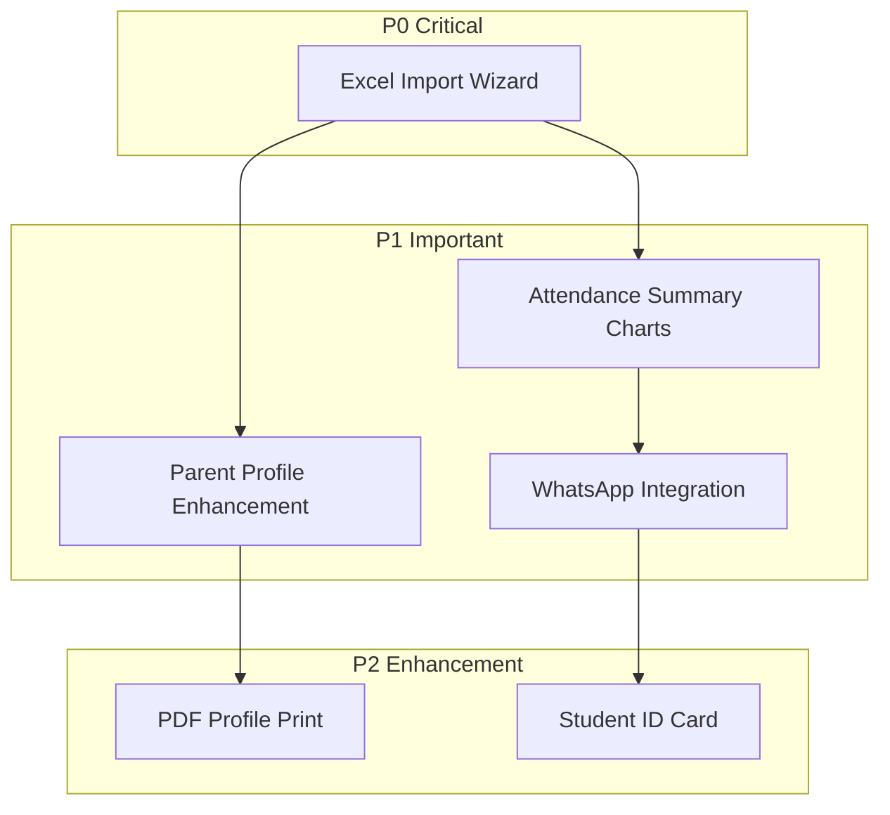

# Student Management Cross-Frontend Implementation Strategy

## Phase 1: Feature Understanding

### Core Objectives

- Centralize student data in one system
- Enable TU (Admin) to manage student data efficiently
- Provide accurate data for other modules (attendance, grades, payments)
- Track student status (active, transfer, graduated, dropout)
- Manage parent/guardian data with auto-portal account creation

---

## Phase 2: Cross-Frontend Impact Mapping

### Data Flow by Feature

| Feature             | Owner (Creates)              | Consumer (Views)                | Data Flow                           |
| ------------------- | ---------------------------- | ------------------------------- | ----------------------------------- |
| Student CRUD        | Admin - Full CRUD            | Principal/Teacher/Parent - Read | Admin creates -> All view           |
| Guardian Management | Admin - Create/Edit          | Parent - View own               | Admin creates -> Parent portal      |
| Class Assignment    | Admin - Assign/Promote       | Teacher - Class roster          | Admin assigns -> Teacher sees class |
| Status Updates      | Admin - Change status        | Principal/Teacher - Filter      | Admin updates -> Status filters     |
| Attendance Summary  | Teacher - Records attendance | Parent - Views summary          | Teacher records -> Parent dashboard |
| Payment Summary     | Admin - Creates bills        | Principal/Parent - View         | Admin bills -> Parent pays          |
| Excel Export        | Admin - Exports              | N/A                             | Admin only                          |
| Photo Upload        | Admin - Uploads              | All roles - View                | Admin uploads -> All see photo      |

---

## Phase 3: Implementation Status Check

### Already Implemented (Based on Codebase Analysis)

**Admin Portal (`Admin/Students/`):**

- `Index.vue` - List with search, filter, pagination
- `Create.vue` - Full create form with guardian data
- `Edit.vue` - Edit student form
- `Show.vue` - Detail view with tabs (Biodata, Alamat, Orang Tua, Riwayat Kelas, Riwayat Status)
- `Promote.vue` - Bulk class promotion wizard
- Export to Excel functionality
- Status update (Aktif/Mutasi/DO/Lulus)
- Auto-generate NIS
- Auto-create parent account

**Principal Portal (`Principal/Students/`):**

- `Index.vue` - Read-only list with payment summary
- `Show.vue` - Read-only detail with payment info

**Teacher Portal (`Teacher/Students/`):**

- `Index.vue` - Read-only, filtered by assigned classes
- `Show.vue` - Read-only detail (no payment data)

**Parent Portal (`Parent/Children/`):**

- `Index.vue` - List own children (multi-child support)
- `Show.vue` - Child profile view
- `Attendance.vue` - Child attendance history

---

## Phase 4: Gap Analysis

### Missing/Incomplete Features

**Admin Portal Gaps:**

- **Import from Excel** - Template download and bulk import (marked TODO)
- **Print Student Profile (PDF)** - FR-STD-007 requires PDF export
- **Print ID Card** - Could Have (Phase 2)
- **Attendance Summary Tab** - In Show.vue, needs chart visualization
- **Grades Summary Tab** - Placeholder, depends on Grades module
- **WhatsApp Welcome Message** - Auto-send credentials to parent

**Principal Portal Gaps:**

- **Attendance Summary** - Show.vue should display attendance chart/summary
- **Grades Summary** - Depends on Grades module implementation

**Teacher Portal Gaps:**

- **Attendance Summary** - Show.vue needs attendance statistics for student
- **Grades Summary** - Depends on Grades module

**Parent Portal Gaps:**

- **Grades/Report Card Tab** - Not implemented (Grades module dependency)
- **Academic History** - Riwayat Kelas information
- **Payment Summary in Child Profile** - Should link to payment module

### Cross-Role Integration Gaps

| Feature               | Gap Description                                                | Priority |
| --------------------- | -------------------------------------------------------------- | -------- |
| WhatsApp Notification | No integration for welcome message when parent account created | P1       |
| Attendance Chart      | No visual chart for attendance summary in student detail       | P1       |
| Print PDF Profile     | No PDF generation for student profile                          | P2       |
| Excel Import          | Import functionality marked TODO                               | P1       |
| Grades Integration    | Grades module not built yet                                    | P2       |

---

## Phase 5: Implementation Sequencing

### P0 - Critical (Feature Unusable Without)

1. **Excel Import** - Admin needs bulk data entry
  - File: `Admin/Students/Import.vue` (new)
  - Controller: Add `importPreview()`, `import()` methods

### P1 - Important (Feature Incomplete Without)

1. **Attendance Summary Charts** - Visual feedback for student performance
  - Enhance: `Admin/Students/Show.vue`, `Principal/Students/Show.vue`, `Teacher/Students/Show.vue`
  - Add: Chart component for attendance visualization
2. **Parent Child Profile Enhancement**
  - Enhance: `Parent/Children/Show.vue`
  - Add: Academic history tab, payment summary link
3. **WhatsApp Welcome Notification**
  - Integrate WhatsApp API when parent account auto-created
  - Service: Extend `StudentService.php`

### P2 - Enhancement (Nice to Have)

1. **Print PDF Profile**
  - New: PDF generation controller method
  - Uses: Laravel DomPDF or similar
2. **Student ID Card Generation** (Phase 2)
  - New page for batch ID card printing

---

## Phase 6: Detailed Recommendations by Frontend

### Admin Portal Updates

**New Pages/Routes:**

- `Admin/Students/Import.vue` - Excel import wizard with preview (P1)
  - Route: `admin.students.import`

**Updates to Existing Pages:**

- `Admin/Students/Show.vue` - Add attendance chart component in Riwayat tab (P1)
- `Admin/Students/Show.vue` - Add "Print PDF" button (P2)
- `Admin/Students/Create.vue` - Trigger WhatsApp notification after save (P1)

**Backend Updates:**

- `StudentController@importPreview` - Validate Excel and return preview (P1)
- `StudentController@import` - Process validated import (P1)
- `StudentService` - Add WhatsApp notification method (P1)

### Principal Portal Updates

**Updates to Existing Pages:**

- `Principal/Students/Show.vue` - Add attendance chart in detail view (P1)
- `Principal/Students/Index.vue` - Ensure payment summary badge shows correctly (P1)

### Teacher Portal Updates

**Updates to Existing Pages:**

- `Teacher/Students/Show.vue` - Add attendance summary chart for student (P1)
- `Teacher/Students/Index.vue` - Add quick attendance badge per student (P2)

### Parent Portal Updates

**Updates to Existing Pages:**

- `Parent/Children/Show.vue` - Add "Riwayat Kelas" section (P1)
- `Parent/Children/Show.vue` - Add link to payment history (P1)
- `Parent/Children/Index.vue` - Show attendance summary badge per child (P2)

### Navigation/Menu Changes

All menus already configured correctly - no changes needed.

### Component Library Additions

- `AttendanceSummaryChart.vue` - Reusable chart for attendance data (P1)
- `ExcelImportWizard.vue` - Multi-step import component (P1)
- `StudentPrintProfile.vue` - PDF-ready profile template (P2)

---

## Phase 7: User Journey Examples

### Journey 1: Admin Creates New Student (Owner)

1. Admin navigates to: Dashboard -> Data Siswa -> Tambah Siswa
2. Admin clicks: "Tambah Siswa Baru" button
3. Admin fills:
  - Section 1: Biodata (nama, NIK, NISN, TTL, alamat, foto)
  - Section 2: Akademik (kelas, tahun ajaran)
  - Section 3-4: Data Orang Tua (ayah, ibu)
  - Section 5: Wali (optional)
4. System does:
  - Validates all fields
  - Auto-generates NIS (format: `{year}{4-digit}`)
  - Creates student record
  - Creates parent account (username: phone, password: `Ortu{NIS}`)
  - Sends WhatsApp notification to parent (TODO)
5. Admin sees: Success toast "Data siswa berhasil ditambahkan"

### Journey 2: Parent Views Child Profile (Consumer)

1. Parent navigates to: Dashboard (shows child cards)
2. Parent sees: Card(s) with child photo, name, class
3. Parent clicks: Child card
4. Parent sees:
  - Tab Biodata: Photo, name, NIS, class, status
  - Tab Orang Tua: Guardian info
  - Tab Absensi: Attendance summary with chart
  - (TODO) Tab Akademik: Class history
5. Parent achieves: Full visibility of child's school data

### Journey 3: Admin Bulk Promotes Students (Owner)

1. Admin navigates to: Data Siswa -> Naik Kelas
2. Admin selects:
  - Tahun Ajaran Asal: 2024/2025
  - Tahun Ajaran Tujuan: 2025/2026
  - Kelas Asal: 1A
  - Kelas Tujuan: 2A
3. Admin sees: Preview table with all students, checkboxes enabled
4. Admin unchecks: Students who don't pass (tinggal kelas)
5. Admin clicks: "Proses Naik Kelas"
6. System does:
  - Updates `kelas_id` for selected students
  - Creates `StudentClassHistory` records
  - Updates `tahun_ajaran`
7. Admin sees: "25 dari 26 siswa berhasil dipindahkan ke Kelas 2A"

---

## Recommended Implementation Order

---

## Files to Create/Modify

### New Files

- `resources/js/pages/Admin/Students/Import.vue` - Excel import page
- `resources/js/components/features/students/AttendanceSummaryChart.vue` - Chart component
- `resources/js/components/features/students/ExcelImportWizard.vue` - Import wizard

### Files to Modify

- `app/Http/Controllers/Admin/StudentController.php` - Add import methods
- `app/Services/StudentService.php` - Add WhatsApp notification
- `resources/js/pages/Admin/Students/Show.vue` - Add attendance chart
- `resources/js/pages/Principal/Students/Show.vue` - Add attendance chart
- `resources/js/pages/Teacher/Students/Show.vue` - Add attendance chart
- `resources/js/pages/Parent/Children/Show.vue` - Add class history, payment link
- `routes/admin.php` - Add import routes

---

## Summary

The Student Management module is **largely complete** for MVP. The main gaps are:

1. **Excel Import** - Critical for bulk data entry
2. **Visual Attendance Charts** - Important for all roles to see student performance
3. **WhatsApp Notification** - Important for parent onboarding
4. **PDF Print** - Nice to have for administrative needs

All role-based access control is properly implemented. The cross-frontend data flow is correct with Admin as data owner and other roles as consumers with appropriate view restrictions.
