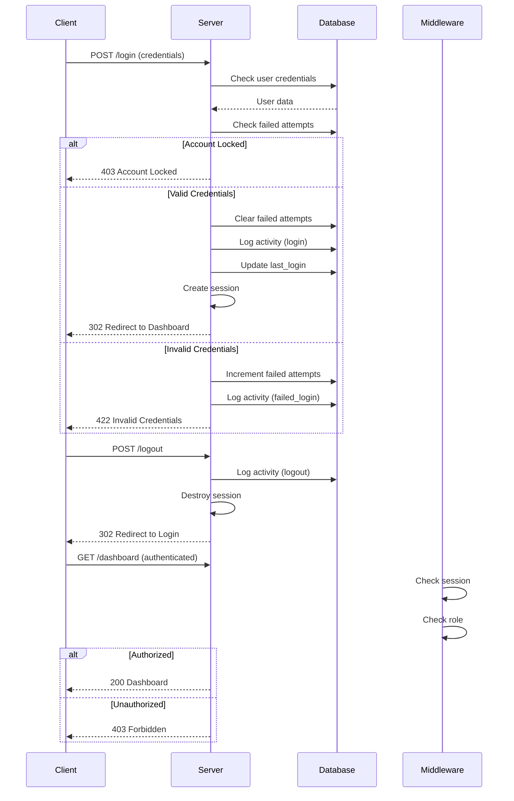

# API Documentation: Authentication

## Overview

API untuk mengelola authentication user dalam sistem, yaitu: login, logout, dan session management dengan role-based access control.

**Base URL:** `http://localhost:8000`

**Authentication Method:** Laravel Session-based (Cookie)

---

## Authentication Flow



---

## Endpoints

### 1. Show Login Form

Menampilkan halaman login dengan form authentication.

**Endpoint:** `GET /login`

**Authentication:** Guest only (redirect jika sudah login)

**Response:** `200 OK` - Inertia render

```json
{
  "component": "Auth/Login",
  "props": {},
  "url": "/login"
}
```

**Example Request:**
```bash
curl -X GET http://localhost:8000/login
```

---

### 2. Login User

Melakukan authentication user dengan credentials (username atau email) dan password.

**Endpoint:** `POST /login`

**Authentication:** Guest only

**Request Body:**

```json
{
  "identifier": "bu.siti",
  "password": "Sekolah123",
  "remember": false
}
```

**Field Validation:**

| Field | Type | Required | Validation | Description |
|-------|------|----------|------------|-------------|
| identifier | string | Yes | Required | Username atau email |
| password | string | Yes | Required | Password user |
| remember | boolean | No | Boolean | Remember me checkbox |

**Success Response:** `302 Redirect`

```
Location: /dashboard (→ auto redirect ke role-specific dashboard)
Set-Cookie: laravel_session=...
Set-Cookie: XSRF-TOKEN=...
```

**Redirect Destinations berdasarkan Role:**
- SUPERADMIN/ADMIN → `/admin/dashboard`
- PRINCIPAL → `/principal/dashboard`
- TEACHER → `/teacher/dashboard`
- PARENT → `/parent/dashboard`
- STUDENT → `/student/dashboard`

**Error Responses:**

#### Invalid Credentials (422 Unprocessable Entity)
```json
{
  "message": "Username/email atau password salah.",
  "errors": {
    "identifier": [
      "Username/email atau password salah."
    ]
  }
}
```

#### Account Locked (422 Unprocessable Entity)
```json
{
  "message": "Akun terkunci karena terlalu banyak percobaan login gagal. Silakan coba lagi dalam 12 menit.",
  "errors": {
    "identifier": [
      "Akun terkunci karena terlalu banyak percobaan login gagal. Silakan coba lagi dalam 12 menit."
    ]
  }
}
```

#### Inactive User (422 Unprocessable Entity)
```json
{
  "message": "Akun Anda telah dinonaktifkan. Hubungi administrator.",
  "errors": {
    "identifier": [
      "Akun Anda telah dinonaktifkan. Hubungi administrator."
    ]
  }
}
```

**Side Effects:**
1. Session created dengan user_id
2. `last_login_at` dan `last_login_ip` updated
3. ActivityLog record created (action='login', status='success')
4. FailedLoginAttempt deleted (jika ada)
5. Session regenerated untuk security

**Failed Login Side Effects:**
1. FailedLoginAttempt created atau incremented
2. ActivityLog record created (action='failed_login', status='failed')
3. Account locked setelah 5 percobaan (locked_until = now + 15 minutes)

**Example Request:**
```bash
curl -X POST http://localhost:8000/login \
  -H "Content-Type: application/json" \
  -H "X-CSRF-TOKEN: {token}" \
  -d '{
    "identifier": "bu.siti",
    "password": "Sekolah123",
    "remember": false
  }'
```

---

### 3. Show First Login Form

Menampilkan halaman first login untuk user yang baru pertama kali login dan harus mengubah password default.

**Endpoint:** `GET /first-login`

**Authentication:** Authenticated users only (dengan `is_first_login = true`)

**Response:** `200 OK` - Inertia render

```json
{
  "component": "Auth/FirstLogin",
  "props": {
    "user": {
      "name": "Budi Santoso",
      "username": "pak.budi",
      "email": "budi@sekolah.app"
    }
  },
  "url": "/first-login"
}
```

**Authorization Rules:**
- User HARUS sudah authenticated
- User HARUS memiliki `is_first_login = true`
- Jika `is_first_login = false` → redirect ke `/dashboard`
- Jika guest → redirect ke `/login`

**Example Request:**
```bash
curl -X GET http://localhost:8000/first-login \
  -b cookies.txt
```

---

### 4. Update Password (First Login)

Mengupdate password user pada first login dengan validation ketat, activity logging, dan automatic flag update.

**Endpoint:** `POST /first-login`

**Authentication:** Authenticated users only (dengan `is_first_login = true`)

**Request Body:**

```json
{
  "password": "NewSecure123!@#",
  "password_confirmation": "NewSecure123!@#"
}
```

**Validation Rules:**

| Field | Rules | Error Messages |
|-------|-------|----------------|
| `password` | required, string, confirmed, min:8, mixed case, numbers, symbols, uncompromised | "Password baru wajib diisi." |
| `password_confirmation` | required, matches password | "Konfirmasi password tidak cocok." |

**Password Requirements:**
- Minimal 8 karakter
- Harus mengandung huruf besar (uppercase)
- Harus mengandung huruf kecil (lowercase)
- Harus mengandung minimal 1 angka
- Harus mengandung minimal 1 simbol (!@#$%^&*)
- Tidak boleh ada di leaked password database (haveibeenpwned.com)

**Response Success:** `302 Redirect`

Redirect destination berdasarkan role:
- **SUPERADMIN / ADMIN** → `/admin/dashboard`
- **PRINCIPAL** → `/principal/dashboard`
- **TEACHER** → `/teacher/dashboard`
- **PARENT** → `/parent/dashboard`
- **STUDENT** → `/login` (dashboard not implemented)

```json
{
  "redirect": "/teacher/dashboard",
  "message": "Password berhasil diubah. Selamat datang!"
}
```

**Response Errors:**

**400 Bad Request** - Validation Failed
```json
{
  "message": "The password field confirmation does not match.",
  "errors": {
    "password": [
      "Konfirmasi password tidak cocok."
    ]
  }
}
```

**403 Forbidden** - Authorization Failed
```json
{
  "message": "This action is unauthorized."
}
```

User dengan `is_first_login = false` tidak bisa akses endpoint ini.

**401 Unauthorized** - Not Authenticated
```json
{
  "message": "Unauthenticated."
}
```

**Side Effects:**
1. User password di-hash dengan bcrypt dan disimpan
2. `is_first_login` flag diubah menjadi `false`
3. Activity log tercatat:
   - `action`: `"first_login_password_change"`
   - `status`: `"success"`
   - `ip_address`: Client IP
   - `user_agent`: Client User Agent

**Example Request:**
```bash
# Get CSRF Token
CSRF_TOKEN=$(curl -s http://localhost:8000/first-login \
  -b cookies.txt \
  | grep -oP 'csrf-token" content="\K[^"]+')

# Update Password
curl -X POST http://localhost:8000/first-login \
  -H "Content-Type: application/json" \
  -H "X-CSRF-TOKEN: $CSRF_TOKEN" \
  -b cookies.txt \
  -c cookies.txt \
  -d '{
    "password": "NewSecure123!@#",
    "password_confirmation": "NewSecure123!@#"
  }'
```

**Example Response:**
```
HTTP/1.1 302 Found
Location: /teacher/dashboard
Set-Cookie: laravel_session=...
```

---

### 5. Universal Dashboard Redirect

Smart redirect ke dashboard sesuai dengan role user untuk akses yang lebih user-friendly.

**Endpoint:** `GET /dashboard`

**Authentication:** Required (all authenticated users)

**Request:** None

**Success Response:** `302 Redirect`

Behavior:
- SUPERADMIN/ADMIN → Redirect ke `/admin/dashboard`
- PRINCIPAL → Redirect ke `/principal/dashboard`
- TEACHER → Redirect ke `/teacher/dashboard`
- PARENT → Redirect ke `/parent/dashboard`
- STUDENT → Redirect ke `/student/dashboard`
- Unauthenticated → Redirect ke `/login`

**Example Request:**
```bash
curl -X GET http://localhost:8000/dashboard \
  -H "Cookie: laravel_session={session_id}" \
  -L  # Follow redirects
```

**Use Case:**
User dapat bookmark `/dashboard` dan otomatis diarahkan ke dashboard mereka tanpa perlu tahu route spesifik berdasarkan role.

---

### 6. Logout User

Melakukan logout user dengan destroy session dan redirect ke login page.

**Endpoint:** `POST /logout`

**Authentication:** Authenticated user only

**Request Body:** None

**Success Response:** `302 Redirect`

```
Location: /login
Message: "Anda telah keluar dari sistem."
```

**Side Effects:**
1. ActivityLog record created (action='logout', status='success')
2. Session invalidated
3. CSRF token regenerated

**Example Request:**
```bash
curl -X POST http://localhost:8000/logout \
  -H "Cookie: laravel_session={session_id}" \
  -H "X-CSRF-TOKEN: {token}"
```

---

### 7. Access Dashboard (Admin)

Mengakses dashboard admin dengan role-based access control.

**Endpoint:** `GET /admin/dashboard`

**Authentication:** Required (SUPERADMIN or ADMIN role)

**Response:** `200 OK` - Inertia render

```json
{
  "component": "Dashboard/AdminDashboard",
  "props": {
    "auth": {
      "user": {
        "id": 3,
        "name": "Siti Nurhaliza",
        "username": "bu.siti",
        "email": "siti@sekolah.app",
        "role": "ADMIN",
        "status": "active",
        "is_first_login": false,
        "last_login_at": "2025-12-22T10:30:00.000000Z",
        "last_login_ip": "127.0.0.1"
      }
    },
    "stats": {
      "total_students": 0,
      "total_payments": 0,
      "pending_psb": 0,
      "total_users": 0
    }
  }
}
```

**Error Response:** `403 Forbidden`

```json
{
  "message": "Anda tidak memiliki akses ke halaman ini."
}
```

---

### 8. Access Dashboard (Principal)

**Endpoint:** `GET /principal/dashboard`

**Authentication:** Required (PRINCIPAL role)

**Props:**
```json
{
  "stats": {
    "total_students": 0,
    "total_teachers": 0,
    "total_classes": 0,
    "attendance_rate": 0
  }
}
```

---

### 7. Access Dashboard (Teacher)

**Endpoint:** `GET /teacher/dashboard`

**Authentication:** Required (TEACHER role)

**Props:**
```json
{
  "stats": {
    "my_classes": 0,
    "total_students": 0,
    "pending_grades": 0,
    "today_schedule": []
  }
}
```

---

### 8. Access Dashboard (Parent)

**Endpoint:** `GET /parent/dashboard`

**Authentication:** Required (PARENT role)

**Props:**
```json
{
  "stats": {
    "children": [],
    "pending_payments": 0,
    "recent_grades": [],
    "attendance_summary": []
  }
}
```

---

### 9. Access Dashboard (Student)

**Endpoint:** `GET /student/dashboard`

**Authentication:** Required (STUDENT role)

**Props:** TBD (basic implementation)

---

## Authentication State

### Shared Props (All Pages)

Setiap Inertia page menerima auth state:

```json
{
  "auth": {
    "user": {
      "id": 1,
      "name": "User Name",
      "username": "username",
      "email": "user@example.com",
      "role": "ADMIN",
      "status": "active",
      "is_first_login": false,
      "last_login_at": "2025-12-22T10:00:00.000000Z",
      "last_login_ip": "127.0.0.1",
      "phone_number": "+62812345678"
    }
  }
}
```

---

## Error Codes

| HTTP Status | Message | Cause | Action |
|-------------|---------|-------|--------|
| 401 Unauthorized | "Unauthenticated." | Session expired atau tidak ada | Redirect ke `/login` |
| 403 Forbidden | "Anda tidak memiliki akses..." | User role tidak sesuai | Show 403 error page |
| 419 Page Expired | "CSRF token mismatch." | CSRF token invalid | Refresh page dan coba lagi |
| 422 Unprocessable Entity | Validation errors | Form validation gagal | Display error messages |
| 429 Too Many Requests | "Too Many Attempts." | Rate limiting triggered | Wait dan retry |

---

## Security Headers

### Request Headers

| Header | Value | Description |
|--------|-------|-------------|
| X-CSRF-TOKEN | {token} | CSRF protection token |
| X-Requested-With | XMLHttpRequest | Identify AJAX requests |
| Accept | application/json | Request JSON response |
| Content-Type | application/json | JSON request body |

### Response Headers

| Header | Value | Description |
|--------|-------|-------------|
| Set-Cookie | laravel_session | Session cookie (HttpOnly, Secure in production) |
| X-Frame-Options | SAMEORIGIN | Clickjacking protection |
| X-Content-Type-Options | nosniff | MIME-sniffing protection |
| X-XSS-Protection | 1; mode=block | XSS protection |

---

## Rate Limiting

### Login Endpoint

- **Limit:** 5 attempts per identifier + IP combination
- **Window:** 15 minutes
- **Behavior:** Account locked setelah 5 failed attempts
- **Reset:** Automatic setelah 15 menit atau manual via admin

### General API

- **Limit:** 60 requests per minute per IP (Laravel default)
- **Response:** `429 Too Many Requests`

---

## Session Management

### Session Configuration

| Setting | Value | Description |
|---------|-------|-------------|
| Driver | database | Session stored in database |
| Lifetime | 120 minutes | Session expires after 2 hours |
| Expire on Close | false | Session persist after browser close (if remember=true) |
| Cookie Name | laravel_session | Session cookie name |
| Cookie HttpOnly | true | JavaScript cannot access cookie |
| Cookie Secure | false (local), true (production) | HTTPS only in production |
| Cookie SameSite | lax | CSRF protection |

### Session Data

```php
[
    '_token' => 'csrf_token_here',
    '_previous' => ['url' => 'http://...'],
    '_flash' => [],
    'login_web_59ba36addc2b2f9401580f014c7f58ea4e30989d' => 3, // user_id
]
```

---

## Activity Logging

### Logged Actions

| Action | Trigger | Status | Logged Data |
|--------|---------|--------|-------------|
| login | Successful login | success | user_id, ip_address, user_agent |
| failed_login | Failed login attempt | failed | identifier, attempts, ip_address |
| logout | User logout | success | user_id, ip_address, user_agent |

### Activity Log Structure

```json
{
  "id": 1,
  "user_id": 3,
  "action": "login",
  "ip_address": "127.0.0.1",
  "user_agent": "Mozilla/5.0...",
  "old_values": null,
  "new_values": null,
  "status": "success",
  "created_at": "2025-12-22T10:30:00.000000Z",
  "updated_at": "2025-12-22T10:30:00.000000Z"
}
```

---

## Test Accounts

| Username | Email | Password | Role | Status |
|----------|-------|----------|------|--------|
| superadmin | superadmin@sekolah.app | Sekolah123 | SUPERADMIN | active |
| kepala.sekolah | kepala@sekolah.app | Sekolah123 | PRINCIPAL | active |
| bu.siti | siti@sekolah.app | Sekolah123 | ADMIN | active |
| pak.budi | budi@sekolah.app | Sekolah123 | TEACHER | active |
| ibu.ani | ani@parent.com | Sekolah123 | PARENT | active |
| raka.pratama | raka@student.com | Sekolah123 | STUDENT | active |

---

## Integration Examples

### JavaScript (Inertia + Vue)

```javascript
import { useForm } from '@inertiajs/vue3';
import login from '@/routes/login';

// Login
const form = useForm({
    identifier: 'bu.siti',
    password: 'Sekolah123',
    remember: false,
});

form.post(login.post().url, {
    onSuccess: () => {
        // Redirect handled by server
    },
    onError: (errors) => {
        console.error('Login failed:', errors);
    },
});

// Logout
import { router } from '@inertiajs/vue3';
import { logout } from '@/routes';

router.post(logout().url);
```

**Note:** Project ini menggunakan **Laravel Wayfinder** untuk type-safe routing, bukan Ziggy. Routes di-generate otomatis di `resources/js/routes/` saat build.

### cURL

```bash
# Get CSRF Token
CSRF_TOKEN=$(curl -s http://localhost:8000/login \
  | grep -oP 'csrf-token" content="\K[^"]+')

# Login
curl -X POST http://localhost:8000/login \
  -H "Content-Type: application/json" \
  -H "X-CSRF-TOKEN: $CSRF_TOKEN" \
  -c cookies.txt \
  -d '{
    "identifier": "bu.siti",
    "password": "Sekolah123",
    "remember": false
  }'

# If is_first_login = true, user will be redirected to /first-login
# Update password on first login
curl -X POST http://localhost:8000/first-login \
  -H "Content-Type: application/json" \
  -H "X-CSRF-TOKEN: $CSRF_TOKEN" \
  -b cookies.txt \
  -c cookies.txt \
  -d '{
    "password": "NewSecure123!@#",
    "password_confirmation": "NewSecure123!@#"
  }'

# Access Protected Route
curl -X GET http://localhost:8000/admin/dashboard \
  -b cookies.txt

# Logout
curl -X POST http://localhost:8000/logout \
  -H "X-CSRF-TOKEN: $CSRF_TOKEN" \
  -b cookies.txt
```

---

## Related Documentation

- **Feature Documentation:**
  - [AUTH-P0 Authentication](../features/auth/AUTH-P0-authentication.md)
  - [AUTH-P1 First Login](../features/auth/AUTH-P1-first-login.md)
- **Test Plans:**
  - [AUTH-P0 Test Plan](../testing/AUTH-P0-test-plan.md)
  - [AUTH-P1 Test Plan](../testing/AUTH-P1-first-login-test-plan.md)
- **Database Schema:** Migration files in `database/migrations/`

---

*Last Updated: 2025-12-23*
*API Version: 1.1 (P0 + P1 Implementation)*


