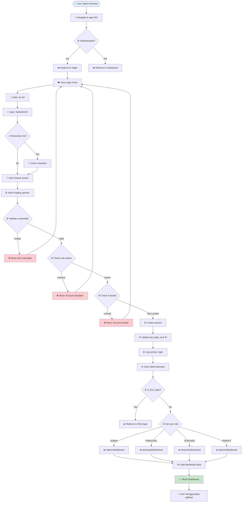

# User Journeys: Authentication & Authorization

> **Feature:** AUTH-P0 | **Version:** 1.0 | **Last Updated:** 2025-12-22

---

## Overview

Dokumen ini menjelaskan user journeys untuk Authentication & Authorization system yang mencakup login flow, logout flow, role-based navigation, dan error scenarios untuk membantu memahami complete user experience dari sudut pandang setiap role.

---

## Journey Map Legend

```
📍 = Starting point
🔵 = User action
⚙️ = System process
✅ = Success state
❌ = Error state
🔀 = Decision point
➡️ = Navigation/redirect
```

---

## 1. Happy Path: Successful Login Journey

### Journey 1.1: Admin Login (First Time User)



**Step-by-Step Narrative:**

1. **START**: User membuka browser dan navigate ke `http://localhost:8000`
2. **SYSTEM**: Check authentication status
   - Jika belum login → redirect ke `/login`
   - Jika sudah login → redirect ke dashboard sesuai role
3. **USER**: Melihat halaman login dengan form
   - Field identifier (username/email)
   - Field password (hidden dengan dots)
   - Checkbox "Ingat saya"
   - Button "Masuk"
4. **USER**: Mengisi form
   - Input username: `bu.siti`
   - Input password: `Sekolah123`
   - Optional: check "Ingat saya"
5. **USER**: Click button "Masuk"
6. **SYSTEM**: Loading state
   - Button disabled
   - Spinner muncul
   - Text berubah ke "Memproses..."
7. **SYSTEM**: Validasi credentials
   - Query database untuk user dengan username/email = 'bu.siti'
   - Check password dengan Hash::check()
8. **SYSTEM**: Security checks
   - ✅ Password match
   - ✅ Status = 'active'
   - ✅ Not locked (failed_login_attempts)
9. **SYSTEM**: Login success actions
   - Create session dengan user_id
   - Update `last_login_at` = now()
   - Update `last_login_ip` = request IP
   - Insert activity_log (action='login', status='success')
   - Delete failed_login_attempt record (if exists)
   - Regenerate session untuk security
10. **SYSTEM**: Check first login
    - `is_first_login` = false → proceed
    - (If true → redirect to first-login page, P1 feature)
11. **SYSTEM**: Role-based redirect
    - Role = 'ADMIN' → `/admin/dashboard`
12. **BROWSER**: Navigate ke dashboard
    - Load dashboard component
    - Fetch stats data (placeholder)
    - Render navigation dengan user info
13. **SUCCESS**: User melihat Admin Dashboard
    - Stats cards: students, payments, PSB, users
    - Navigation bar dengan menu items
    - User info di top-right: "Siti Nurhaliza - ADMIN"
    - "Keluar" button

**Estimated Time:** 5-10 seconds (including typing)

---

### Journey 1.2: Teacher Login (Returning User with Remember Me)

```
📍 START: Teacher opens browser (3 days after last login)
    │
    ├─▶ Navigate to: http://localhost:8000
    │   ⚙️ Laravel checks session cookie
    │   └─ Cookie exists, not expired (Remember Me was checked)
    │
    ├─▶ ⚙️ Auto-authenticate from session
    │   └─ User ID: 4 (pak.budi)
    │
    ├─▶ ⚙️ Check role: TEACHER
    │   └─ Redirect to: /teacher/dashboard
    │
    ├─▶ ✅ Teacher Dashboard loads
    │   └─ Stats: my_classes, total_students, pending_grades, today_schedule
    │
    └─▶ END: Direct access tanpa perlu login ulang

⏱️ Time: ~2 seconds (no typing, auto-redirect)
```

---

## 2. Error Scenarios: Failed Login Journeys

### Journey 2.1: Invalid Password (3 Attempts)

```
📍 START: User at /login page
    │
    ├─▶ Attempt 1:
    │   ├─ 🔵 Input: bu.siti / WrongPassword1
    │   ├─ 🔵 Click: "Masuk"
    │   ├─ ⚙️ Hash::check() fails
    │   ├─ ⚙️ Create/increment failed_login_attempts (attempts = 1)
    │   ├─ ⚙️ Log activity: failed_login (status='failed')
    │   └─ ❌ Error: "Username/email atau password salah."
    │
    ├─▶ Attempt 2:
    │   ├─ 🔵 Input: bu.siti / WrongPassword2
    │   ├─ 🔵 Click: "Masuk"
    │   ├─ ⚙️ Hash::check() fails
    │   ├─ ⚙️ Increment failed_login_attempts (attempts = 2)
    │   ├─ ⚙️ Log activity: failed_login
    │   └─ ❌ Error: "Username/email atau password salah."
    │
    ├─▶ Attempt 3:
    │   ├─ 🔵 Input: bu.siti / WrongPassword3
    │   ├─ 🔵 Click: "Masuk"
    │   ├─ ⚙️ Hash::check() fails
    │   ├─ ⚙️ Increment failed_login_attempts (attempts = 3)
    │   └─ ❌ Error: "Username/email atau password salah."
    │
    ├─▶ Attempt 4:
    │   ├─ 🔵 Realize password salah, check email
    │   ├─ 🔵 Input: bu.siti / Sekolah123 (correct)
    │   ├─ 🔵 Click: "Masuk"
    │   ├─ ⚙️ Hash::check() success
    │   ├─ ⚙️ Delete failed_login_attempts record
    │   ├─ ⚙️ Log activity: login (status='success')
    │   └─ ✅ Redirect to /admin/dashboard
    │
    └─▶ END: Login berhasil pada attempt ke-4

💡 Learning: Failed attempts di-track tapi not locked (belum 5x)
```

---

### Journey 2.2: Account Locked After 5 Failed Attempts

```
📍 START: Malicious user trying to brute force
    │
    ├─▶ Attempts 1-5: Sequential failed logins
    │   └─ ⚙️ Each attempt increments counter
    │
    ├─▶ Attempt 5:
    │   ├─ ⚙️ failed_login_attempts.attempts = 5
    │   ├─ ⚙️ Set locked_until = now() + 15 minutes
    │   ├─ ⚙️ Save to database
    │   └─ ❌ Error: "Akun terkunci karena terlalu banyak percobaan
    │              login gagal. Silakan coba lagi dalam 15 menit."
    │
    ├─▶ Attempt 6 (30 seconds later):
    │   ├─ 🔵 User tries again dengan correct password
    │   ├─ ⚙️ Check failed_login_attempts
    │   ├─ ⚙️ locked_until = 2025-12-22 10:45:00 (still future)
    │   ├─ ⚙️ Calculate remaining: 14 minutes
    │   └─ ❌ Error: "Akun terkunci... coba lagi dalam 14 menit."
    │
    ├─▶ Wait 15 minutes...
    │   └─ ⏰ locked_until = past
    │
    ├─▶ Attempt 7 (after 15 minutes):
    │   ├─ 🔵 Input correct credentials
    │   ├─ ⚙️ Check locked_until → expired (is past)
    │   ├─ ⚙️ Allow login
    │   ├─ ⚙️ Delete failed_login_attempts record
    │   └─ ✅ Login berhasil
    │
    └─▶ END: Access granted after lockout period

🔒 Security: 15 minutes lockout prevents brute force attacks
```

---

### Journey 2.3: Inactive User Attempt

```
📍 START: Former employee tries to login
    │
    ├─▶ 🔵 Input: pak.budi / Sekolah123
    │   └─ (Admin has set status='inactive' yesterday)
    │
    ├─▶ 🔵 Click: "Masuk"
    │
    ├─▶ ⚙️ System validation:
    │   ├─ ✅ User exists
    │   ├─ ✅ Password correct
    │   └─ ❌ Status check: status='inactive'
    │
    ├─▶ ❌ Show error:
    │   └─ "Akun Anda telah dinonaktifkan. Hubungi administrator."
    │
    ├─▶ 🔵 User confused, tries again
    │   └─ Same error message
    │
    ├─▶ 🔵 Contact admin via phone
    │   └─ Admin explains: "Kontrak sudah selesai"
    │
    └─▶ END: Access denied permanently until reactivated

⚠️ Note: No failed_login_attempt logged (correct password)
```

---

## 3. Logout Journey

### Journey 3.1: Normal Logout

```
📍 START: User sedang di dashboard
    │
    ├─▶ 🔵 User wants to logout
    │   └─ Click: "Keluar" button di navigation
    │
    ├─▶ ⚙️ Browser confirmation:
    │   └─ Dialog: "Apakah Anda yakin ingin keluar?"
    │       ├─ [Batal] → Stay on dashboard
    │       └─ [OK] → Proceed
    │
    ├─▶ 🔵 User clicks [OK]
    │
    ├─▶ ⚙️ POST request to /logout
    │   ├─ Include CSRF token
    │   └─ Include session cookie
    │
    ├─▶ ⚙️ Server processes logout:
    │   ├─ Log activity: logout (user_id, IP, user_agent, status='success')
    │   ├─ Destroy session: Auth::logout()
    │   ├─ Invalidate session: $request->session()->invalidate()
    │   ├─ Regenerate CSRF: $request->session()->regenerateToken()
    │   └─ Prepare redirect
    │
    ├─▶ ➡️ Redirect to /login
    │   └─ Flash message: "Anda telah keluar dari sistem."
    │
    ├─▶ ✅ Show login page
    │   └─ Display success message (green banner)
    │
    └─▶ END: User logged out safely

🔐 Security: Session completely destroyed, no traces
```

---

### Journey 3.2: Session Expired (Auto Logout)

```
📍 START: User idle for 120+ minutes
    │
    ├─▶ ⏰ Session lifetime exceeded
    │   └─ Cookie expires (config: 120 minutes)
    │
    ├─▶ 🔵 User tries to navigate
    │   └─ Click: Any menu item
    │
    ├─▶ ⚙️ Middleware checks authentication
    │   ├─ Session::get('user_id') → null
    │   └─ User not authenticated
    │
    ├─▶ ➡️ Auto-redirect to /login
    │   └─ No error message (silent redirect)
    │
    ├─▶ 👁️ User sees login page
    │   └─ Realizes session expired
    │
    ├─▶ 🔵 Login again
    │   └─ Resume work
    │
    └─▶ END: New session created

⏱️ Timeout: 2 hours of inactivity
```

---

## 4. Role-Based Navigation Journeys

### Journey 4.1: Admin Access Pattern

```
📍 START: Admin logged in as bu.siti
    │
    ├─▶ Landing: /admin/dashboard
    │   └─ Stats: students, payments, PSB, users
    │
    ├─▶ Navigation menu shows:
    │   ├─ 🏠 Dashboard
    │   ├─ 👥 Manajemen User
    │   └─ 📊 Log Aktivitas
    │
    ├─▶ Typical workflow:
    │   ├─ View dashboard overview
    │   ├─ Navigate to student management
    │   ├─ Process PSB applications
    │   ├─ Check payment records
    │   ├─ Manage user accounts
    │   └─ Review activity logs
    │
    ├─▶ Restrictions (403 Forbidden):
    │   ├─ ❌ Cannot access /principal/dashboard
    │   ├─ ❌ Cannot access /teacher/dashboard
    │   └─ ❌ Cannot access /parent/dashboard
    │
    └─▶ END: Admin stays within authorized sections

✅ Authorized: ADMIN, SUPERADMIN roles only
```

---

### Journey 4.2: Teacher Access Pattern

```
📍 START: Teacher logged in as pak.budi
    │
    ├─▶ Landing: /teacher/dashboard
    │   └─ Stats: my_classes, students, pending_grades, schedule
    │
    ├─▶ Navigation menu shows:
    │   ├─ 🏠 Dashboard
    │   ├─ 📚 Kelas Saya
    │   └─ 📝 Nilai
    │
    ├─▶ Typical workflow:
    │   ├─ Check today's schedule
    │   ├─ View class roster
    │   ├─ Input attendance
    │   ├─ Enter grades
    │   └─ Generate reports
    │
    ├─▶ Restrictions (403 Forbidden):
    │   ├─ ❌ Cannot access /admin/dashboard
    │   ├─ ❌ Cannot manage users
    │   ├─ ❌ Cannot access payment data
    │   └─ ❌ Cannot process PSB
    │
    └─▶ END: Teacher limited to academic functions

✅ Authorized: TEACHER role only
```

---

### Journey 4.3: Parent Access Pattern

```
📍 START: Parent logged in as ibu.ani
    │
    ├─▶ Landing: /parent/dashboard
    │   └─ Stats: children, pending_payments, grades, attendance
    │
    ├─▶ Navigation menu shows:
    │   ├─ 🏠 Dashboard
    │   ├─ 👶 Anak Saya
    │   └─ 💰 Pembayaran
    │
    ├─▶ Typical workflow:
    │   ├─ View child's grades
    │   ├─ Check attendance history
    │   ├─ Review payment status
    │   ├─ Make online payment
    │   └─ Download payment receipt
    │
    ├─▶ Data isolation:
    │   ├─ ✅ Can only see OWN children's data
    │   ├─ ❌ Cannot see other parents' data
    │   └─ ❌ Cannot see other students
    │
    └─▶ END: Parent limited to own family data

✅ Authorized: PARENT role only, data scoped
```

---

## 5. Cross-Cutting Concerns

### Activity Logging Journey

```
Every user action logged:

📍 User performs action → ⚙️ System logs:
    │
    ├─▶ Login Success:
    │   └─ {user_id, action:'login', IP, user_agent, status:'success'}
    │
    ├─▶ Login Failed:
    │   └─ {user_id:null, action:'failed_login', identifier, attempts, status:'failed'}
    │
    ├─▶ Logout:
    │   └─ {user_id, action:'logout', IP, user_agent, status:'success'}
    │
    ├─▶ Data Modification (via LogActivity middleware):
    │   └─ {user_id, action:route_name, IP, new_values, status}
    │
    └─▶ Stored in activity_logs table for audit

🔍 Purpose: Compliance, debugging, security monitoring
```

---

### Session Management Journey

```
Session Lifecycle:

📍 Login → Session Created
    │
    ├─▶ Session Data:
    │   ├─ _token: CSRF token
    │   ├─ login_web_...: user_id
    │   └─ _previous: last URL
    │
    ├─▶ Cookie Set:
    │   ├─ laravel_session: encrypted session ID
    │   ├─ XSRF-TOKEN: CSRF token
    │   ├─ HttpOnly: true (JavaScript cannot access)
    │   ├─ Secure: true (production, HTTPS only)
    │   └─ SameSite: lax
    │
    ├─▶ Session Valid for:
    │   ├─ 120 minutes (default lifetime)
    │   └─ Or until logout
    │
    ├─▶ On Each Request:
    │   ├─ Middleware checks session
    │   ├─ Validates CSRF token
    │   └─ Refreshes activity timestamp
    │
    └─▶ On Logout:
        ├─ Session invalidated
        ├─ Cookie cleared
        └─ User must login again

⏱️ Lifetime: 2 hours or until logout
```

---

## 6. Mobile Experience Journey

### Journey 6.1: Mobile Login Flow

```
📍 START: User on mobile (375px width)
    │
    ├─▶ 📱 Open browser, navigate to app
    │   └─ Redirect to /login
    │
    ├─▶ 👁️ View mobile-optimized login:
    │   ├─ Full-width form card
    │   ├─ Large touch targets (44x44px minimum)
    │   ├─ Gradient header: "Sistem Sekolah"
    │   └─ Glass effect background
    │
    ├─▶ 🔵 Tap identifier field:
    │   ├─ Keyboard opens (email type)
    │   ├─ Autofocus on field
    │   └─ Placeholder visible
    │
    ├─▶ 🔵 Type credentials:
    │   ├─ bu.siti (autocomplete helps)
    │   ├─ Tap password field
    │   └─ Sekolah123 (password keyboard)
    │
    ├─▶ 🔵 Show password:
    │   ├─ Tap eye icon
    │   └─ Verify password visible
    │
    ├─▶ 🔵 Tap "Masuk" button:
    │   ├─ Button scales down (active:scale-95)
    │   ├─ Haptic feedback (if supported)
    │   └─ Loading spinner
    │
    ├─▶ ⚙️ Login successful
    │
    ├─▶ ➡️ Redirect to mobile dashboard:
    │   ├─ Responsive grid (1 column)
    │   ├─ Stats cards stack vertically
    │   ├─ Burger menu for navigation
    │   └─ Bottom tab bar (optional)
    │
    └─▶ ✅ Mobile dashboard usable

📱 Optimizations: Touch targets, keyboards, gestures
```

---

### Journey 6.2: Mobile Navigation

```
📍 START: User on mobile dashboard
    │
    ├─▶ 🔵 Tap burger icon:
    │   ├─ Slide-in menu from left
    │   ├─ Overlay darkens background
    │   └─ Menu items large, tappable
    │
    ├─▶ 🔵 Tap menu item:
    │   ├─ Menu closes with animation
    │   └─ Navigate to selected page
    │
    ├─▶ 🔵 Tap logout:
    │   ├─ Confirmation dialog (mobile-optimized)
    │   ├─ Large "OK" and "Batal" buttons
    │   └─ Logout if confirmed
    │
    └─▶ END: Smooth mobile experience

📱 Design: iOS-inspired with spring animations
```

---

## 7. Edge Cases & Recovery Journeys

### Journey 7.1: Forgot Username

```
📍 START: User cannot remember username
    │
    ├─▶ ❌ Tries email: siti@sekolah.app
    │   └─ ✅ Login works! (email accepted)
    │
    └─▶ END: Email serves as alternative identifier

💡 Solution: System accepts username OR email
```

---

### Journey 7.2: Browser Back Button After Login

```
📍 START: User logged in successfully
    │
    ├─▶ ➡️ Redirected to /admin/dashboard
    │
    ├─▶ 🔵 User clicks browser back button
    │   └─ Navigate back to /login
    │
    ├─▶ ⚙️ System checks authentication
    │   └─ User already authenticated
    │
    ├─▶ ➡️ Auto-redirect to /admin/dashboard
    │   └─ Prevents seeing login page when logged in
    │
    └─▶ END: User stays on dashboard

✅ Expected behavior: Cannot go back to login when authenticated
```

---

### Journey 7.3: Direct URL Access Without Login

```
📍 START: User not logged in
    │
    ├─▶ 🔵 Types URL directly: /admin/dashboard
    │
    ├─▶ ⚙️ Auth middleware intercepts:
    │   ├─ Check session → not authenticated
    │   └─ Save intended URL
    │
    ├─▶ ➡️ Redirect to /login
    │   └─ Save: intended = '/admin/dashboard'
    │
    ├─▶ 🔵 User logs in successfully
    │
    ├─▶ ⚙️ Check intended URL
    │   └─ Exists: /admin/dashboard
    │
    ├─▶ ➡️ Redirect to intended URL
    │   └─ User lands on originally requested page
    │
    └─▶ ✅ Seamless experience

💡 Laravel's intended() method handles this
```

---

## 8. Performance Journey

### Journey 8.1: Fast Login Experience

```
📍 START: User submits login form
    │
    ├─▶ ⚙️ Backend processing:
    │   ├─ 10ms: Database query (user lookup)
    │   ├─ 5ms: Failed attempts check
    │   ├─ 50ms: Password hash verification
    │   ├─ 8ms: Activity log insert
    │   ├─ 5ms: Session creation
    │   └─ Total: ~80ms backend
    │
    ├─▶ ⚙️ Frontend processing:
    │   ├─ 50ms: Inertia request/response
    │   ├─ 30ms: Page transition
    │   ├─ 40ms: Dashboard render
    │   └─ Total: ~120ms frontend
    │
    └─▶ ✅ Total perceived time: ~200ms

⚡ Target: < 300ms total response time
```

---

## Journey Summary Table

| Journey | Happy Path | Time | Complexity |
|---------|-----------|------|------------|
| Admin First Login | ✅ | ~10s | Low |
| Teacher Remembered | ✅ | ~2s | Very Low |
| Invalid Password (3x) | ⚠️ | ~30s | Medium |
| Account Locked | ❌ | 15+ min | High |
| Inactive User | ❌ | ~10s | Low |
| Normal Logout | ✅ | ~3s | Very Low |
| Session Expired | ⚠️ | Variable | Low |
| Mobile Login | ✅ | ~15s | Medium |
| Forgot Username | ✅ | ~10s | Very Low |
| Direct URL Access | ✅ | ~12s | Low |

---

## Related Documentation

- **Feature Doc:** [AUTH-P0 Authentication](../features/auth/AUTH-P0-authentication.md)
- **Test Plan:** [AUTH-P0 Test Plan](../testing/AUTH-P0-test-plan.md)
- **API Doc:** [Authentication API](../api/authentication.md)

---

## Future Journey Improvements (P1)

### Planned Enhancements:

1. **First Login Journey**
   - Force password change
   - Welcome tutorial

2. **Forgot Password Journey**
   - Email reset link
   - Secure token validation
   - New password setup

3. **Profile Management Journey**
   - Update personal info
   - Change password
   - Upload avatar

4. **Two-Factor Auth Journey** (P2)
   - Setup TOTP
   - SMS verification
   - Backup codes

---

*Last Updated: 2025-12-22*  
*Version: 1.0*  
*Status: Complete untuk P0, akan di-extend untuk P1*

