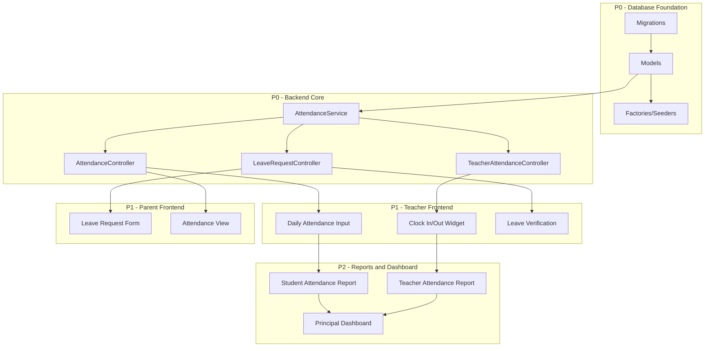

# Attendance System - Cross-Frontend Implementation Strategy

## PHASE 1: Feature Understanding

### Data yang Dikelola

1. **Student Daily Attendance** - Absensi harian siswa (H/I/S/A)
2. **Subject Attendance** - Absensi per mata pelajaran
3. **Leave Requests** - Pengajuan izin/sakit dari orang tua
4. **Teacher Attendance** - Presensi guru (clock in/out)
5. **Teacher Leave** - Pengajuan izin/cuti guru

### Aktor Utama

- **Guru/Wali Kelas**: Input absensi harian, verifikasi izin
- **Guru Mata Pelajaran**: Input absensi per mapel
- **Orang Tua**: Ajukan izin/sakit, lihat rekap absensi anak
- **TU/Admin**: Koreksi absensi, rekap presensi guru, approval izin guru
- **Kepala Sekolah**: Dashboard real-time, rekap semua data, approval izin guru

---

## PHASE 2: Cross-Frontend Impact Mapping

| Feature | Owner (Who Creates) | Consumer (Who Views) | Data Flow |

|---------|---------------------|---------------------|-----------|

| Absensi Harian Siswa | Teacher Frontend - Form Input | Teacher, TU, Principal, Parent | Teacher Input -> DB -> Dashboard/Report |

| Absensi Per Mapel | Teacher Frontend - Form Input | Teacher, TU, Principal | Teacher Input -> DB -> Report |

| Pengajuan Izin | Parent Frontend - Form | Teacher, TU (Verifikasi) | Parent Submit -> Notification -> Teacher Approve -> Update Attendance |

| Presensi Guru | Teacher Frontend - Clock Widget | TU, Principal Dashboard | Teacher Clock -> DB -> Payroll Report |

| Izin/Cuti Guru | Teacher Frontend - Form | TU, Principal (Approval) | Teacher Submit -> Principal Approve -> Update Attendance |

| Rekap Absensi Siswa | System Generated | Teacher, TU, Principal, Parent | DB Query -> Report/Export |

| Rekap Presensi Guru | System Generated | TU, Principal | DB Query -> Payroll Export |

| Dashboard Real-time | System Generated | Principal | Live Query -> Dashboard Cards |

---

## PHASE 3: Missing Implementation Detection

### Current State Analysis

**Database Schema - TIDAK ADA tabel attendance:**

- `student_attendances` - BELUM ADA
- `subject_attendances` - BELUM ADA  
- `leave_requests` - BELUM ADA
- `teacher_attendances` - BELUM ADA
- `teacher_leaves` - BELUM ADA

**Models - BELUM ADA:**

- `StudentAttendance.php`
- `SubjectAttendance.php`
- `LeaveRequest.php`
- `TeacherAttendance.php`
- `TeacherLeave.php`

**Routes - BELUM ADA:**

- `/teacher/attendance/*` - Input absensi siswa
- `/teacher/subject-attendance/*` - Input absensi per mapel
- `/teacher/clock/*` - Clock in/out guru
- `/parent/leave-requests/*` - Pengajuan izin orang tua
- `/admin/attendance/*` - Rekap dan koreksi
- `/admin/teacher-attendance/*` - Rekap presensi guru

**Frontend Pages - BELUM ADA:**

- Teacher: Attendance Input, Subject Attendance, Clock Widget, Leave Form
- Parent: Leave Request Form, Attendance View
- Admin/TU: Attendance Report, Teacher Attendance Report, Leave Verification
- Principal: Real-time Dashboard, All Reports

---

## PHASE 4: Gap Analysis

### Critical Gaps Identified

| Gap | Type | Impact |

|-----|------|--------|

| No attendance tables | Database | BLOCKER - tidak bisa simpan data |

| No attendance models | Backend | BLOCKER - tidak ada business logic |

| No teacher clock widget | Frontend | Teacher tidak bisa presensi |

| No parent leave form | Frontend | Orang tua tidak bisa ajukan izin |

| No attendance input page | Frontend | Guru tidak bisa input absensi |

| No verification page | Frontend | Izin tidak bisa di-approve |

| No notification system | Backend | Stakeholder tidak dapat notifikasi |

### Role-Feature Matrix

```
                        | Teacher | Parent | TU/Admin | Principal |
------------------------|---------|--------|----------|-----------|
Input Absensi Harian    |    C    |   -    |    E     |     -     |
Input Absensi Mapel     |    C    |   -    |    -     |     -     |
Clock In/Out            |    C    |   -    |    E     |     -     |
Ajukan Izin Siswa       |    -    |   C    |    -     |     -     |
Verifikasi Izin Siswa   |    V    |   -    |    V     |     -     |
Ajukan Izin Guru        |    C    |   -    |    -     |     -     |
Approve Izin Guru       |    -    |   -    |    V     |     V     |
Rekap Absensi Siswa     |    R    |   R*   |    R     |     R     |
Rekap Presensi Guru     |    -    |   -    |    R     |     R     |
Dashboard Real-time     |    -    |   -    |    R     |     R     |

C = Create, R = Read, V = Verify/Approve, E = Edit, R* = Read own child only
```

---

## PHASE 5: Implementation Sequencing

### Dependency Graph



### Priority Matrix

| Priority | Component | Estimation | Dependency |

|----------|-----------|------------|------------|

| **P0** | Database Migrations | 1 day | None |

| **P0** | Eloquent Models | 1 day | Migrations |

| **P0** | AttendanceService | 2 days | Models |

| **P0** | Controllers + Routes | 2 days | Service |

| **P1** | Daily Attendance Input (Teacher) | 3 days | Controllers |

| **P1** | Clock In/Out Widget (Teacher) | 2 days | Controllers |

| **P1** | Leave Request Form (Parent) | 2 days | Controllers |

| **P1** | Leave Verification (Teacher/TU) | 2 days | Leave Form |

| **P1** | Attendance View (Parent) | 1 day | Attendance Input |

| **P2** | Subject Attendance Input | 2 days | Daily Attendance |

| **P2** | Student Attendance Report | 2 days | Attendance Data |

| **P2** | Teacher Attendance Report | 2 days | Clock Data |

| **P2** | Principal Real-time Dashboard | 2 days | All Reports |

| **P2** | Notification System | 3 days | All Features |

| **P2** | Export to Excel/PDF | 2 days | Reports |

**Total Estimation: ~27 days (5-6 weeks)**

---

## PHASE 6: Detailed Recommendations

### New Database Tables

```
student_attendances
├── id, student_id, class_id, date, status (H/I/S/A)
├── keterangan, recorded_by, recorded_at
└── timestamps

subject_attendances  
├── id, student_id, class_id, subject_id, teacher_id
├── date, lesson_hour, status (H/I/S/A)
└── timestamps

leave_requests
├── id, student_id, type (izin/sakit), start_date, end_date
├── reason, attachment_path, status (pending/approved/rejected)
├── approved_by, approved_at, rejection_reason
└── timestamps

teacher_attendances
├── id, teacher_id, date, clock_in, clock_out
├── status (hadir/terlambat/izin/sakit/alpha)
├── latitude, longitude, is_late
└── timestamps

teacher_leaves
├── id, teacher_id, type, start_date, end_date
├── reason, attachment_path, status
├── approved_by, approved_at, rejection_reason
└── timestamps
```

### New Pages/Routes Needed

**Teacher Frontend:**

- `GET /teacher/attendance` - Index halaman absensi
- `GET /teacher/attendance/daily` - Input absensi harian
- `POST /teacher/attendance/daily` - Simpan absensi harian
- `GET /teacher/attendance/subject` - Input absensi per mapel
- `POST /teacher/attendance/subject` - Simpan absensi mapel
- `POST /teacher/clock/in` - Clock in
- `POST /teacher/clock/out` - Clock out
- `GET /teacher/leave-requests` - List pengajuan izin siswa
- `POST /teacher/leave-requests/{id}/approve` - Approve izin
- `POST /teacher/leave-requests/{id}/reject` - Reject izin

**Parent Frontend:**

- `GET /parent/leave-requests` - List pengajuan izin
- `GET /parent/leave-requests/create` - Form pengajuan
- `POST /parent/leave-requests` - Submit pengajuan
- `GET /parent/children/{id}/attendance` - Lihat absensi anak

**Admin/TU Frontend:**

- `GET /admin/attendance/students` - Rekap absensi siswa
- `GET /admin/attendance/students/export` - Export Excel
- `GET /admin/attendance/teachers` - Rekap presensi guru
- `GET /admin/attendance/teachers/export` - Export payroll
- `GET /admin/attendance/correction` - Koreksi absensi

**Principal Frontend:**

- `GET /principal/attendance/dashboard` - Real-time dashboard
- `GET /principal/teacher-leaves` - List pengajuan izin guru
- `POST /principal/teacher-leaves/{id}/approve` - Approve izin guru

### Navigation Menu Updates

**Teacher Sidebar:**

```
- Dashboard
- Absensi (NEW)
  - Input Harian
  - Input Per Mapel
  - Verifikasi Izin
- Presensi Saya (Clock Widget di Dashboard)
```

**Parent Sidebar:**

```
- Dashboard
- Anak Saya
  - Profil
  - Absensi (NEW)
- Pengajuan Izin (NEW)
```

**Admin Sidebar:**

```
- Dashboard
- Manajemen Siswa
- Absensi (NEW)
  - Rekap Siswa
  - Rekap Guru
  - Koreksi Data
```

**Principal Sidebar:**

```
- Dashboard (Enhanced with real-time attendance)
- Laporan Absensi (NEW)
- Approval Izin Guru (NEW)
```

### Component Library Additions

| Component | Used By | Priority |

|-----------|---------|----------|

| `AttendanceStatusBadge.vue` | All attendance pages | P1 |

| `AttendanceTable.vue` | Reports, Input pages | P1 |

| `ClockWidget.vue` | Teacher Dashboard | P1 |

| `LeaveRequestForm.vue` | Parent, Teacher leave | P1 |

| `LeaveRequestCard.vue` | Verification pages | P1 |

| `AttendanceCalendar.vue` | Detail view per siswa | P2 |

| `AttendanceChart.vue` | Reports, Dashboard | P2 |

| `AttendanceSummaryCard.vue` | Dashboard widgets | P2 |

---

## PHASE 7: Example User Journeys

### Journey 1: Guru Input Absensi Harian (US-ATT-001)

**Owner Journey (Guru):**

1. Guru login, navigasi ke `/teacher/dashboard`
2. Klik menu "Absensi" -> "Input Harian"
3. Sistem auto-select kelas wali (jika wali kelas) atau pilih kelas
4. Sistem load list siswa dengan default status "Hadir"
5. Guru ubah status siswa yang tidak hadir (klik radio H/I/S/A)
6. Guru klik "Simpan Absensi"
7. Sistem validasi (tidak duplikat), simpan ke DB
8. Toast: "Absensi kelas 1A berhasil disimpan. Hadir: 28, Alpha: 2"

**Consumer Journey (Kepala Sekolah):**

1. Kepala Sekolah login, navigasi ke `/principal/dashboard`
2. Dashboard menampilkan card "Absensi Hari Ini" dengan summary
3. Kepala Sekolah lihat: Total Hadir 95%, Alpha 5 siswa
4. Klik card untuk detail per kelas
5. Lihat kelas mana yang belum input absensi (highlight merah)

### Journey 2: Orang Tua Ajukan Izin (US-ATT-003)

**Owner Journey (Orang Tua):**

1. Orang Tua login, navigasi ke `/parent/dashboard`
2. Klik menu "Pengajuan Izin" atau quick action di dashboard
3. Form tampil: Pilih anak, Jenis (Izin/Sakit), Tanggal, Alasan
4. Upload foto surat dokter (opsional)
5. Klik "Kirim Pengajuan"
6. Toast: "Pengajuan izin berhasil dikirim. Menunggu verifikasi."
7. Status: "Pending" terlihat di list pengajuan

**Consumer Journey (Guru/Wali Kelas):**

1. Guru login, lihat badge notification "1 izin pending"
2. Navigasi ke "Absensi" -> "Verifikasi Izin"
3. List pengajuan tampil dengan detail (nama, tanggal, alasan, foto)
4. Klik thumbnail foto untuk preview
5. Klik "Setujui" 
6. Sistem auto-update absensi siswa jadi "Izin"
7. Notifikasi ke orang tua: "Pengajuan izin disetujui"

### Journey 3: Guru Clock In/Out (US-ATT-007)

**Owner Journey (Guru):**

1. Guru login pagi hari, navigasi ke `/teacher/dashboard`
2. Widget "Presensi Hari Ini" tampil: "Belum Clock In"
3. Guru klik tombol "Masuk" (icon jam)
4. Browser request GPS permission
5. Sistem capture timestamp + lokasi
6. Widget update: "Sudah Clock In pada 07:15 WIB"
7. Sore hari, guru klik "Pulang"
8. Widget: "Clock Out 15:30. Total: 8 jam 15 menit"

**Consumer Journey (TU):**

1. TU login, navigasi ke `/admin/attendance/teachers`
2. Tabel rekap tampil: Nama Guru, Jam Masuk, Jam Keluar, Status
3. Guru yang terlambat di-highlight kuning
4. Guru yang alpha di-highlight merah
5. TU klik "Export untuk Payroll"
6. Download Excel dengan data untuk perhitungan gaji

---

## Implementation Recommendation

### Sprint 1 (Week 1-2): Foundation

1. Database migrations untuk semua tabel attendance
2. Eloquent models dengan relationships
3. AttendanceService untuk business logic
4. Basic controllers dan routes
5. Form Request validation classes

### Sprint 2 (Week 3-4): Core Features

1. Daily Attendance Input page (Teacher)
2. Clock In/Out Widget (Teacher Dashboard)
3. Leave Request Form (Parent)
4. Leave Verification page (Teacher/TU)

### Sprint 3 (Week 5-6): Reports and Polish

1. Student Attendance Report dengan export
2. Teacher Attendance Report untuk payroll
3. Principal Real-time Dashboard enhancement
4. Notification integration
5. Testing dan bug fixes

### Key Files to Create/Modify

**Backend:**

- [`database/migrations/xxxx_create_attendance_tables.php`](database/migrations/)
- [`app/Models/StudentAttendance.php`](app/Models/)
- [`app/Models/LeaveRequest.php`](app/Models/)
- [`app/Models/TeacherAttendance.php`](app/Models/)
- [`app/Services/AttendanceService.php`](app/Services/)
- [`app/Http/Controllers/Teacher/AttendanceController.php`](app/Http/Controllers/)
- [`app/Http/Controllers/Parent/LeaveRequestController.php`](app/Http/Controllers/)

**Frontend:**

- [`resources/js/pages/Teacher/Attendance/`](resources/js/pages/)
- [`resources/js/pages/Parent/LeaveRequests/`](resources/js/pages/)
- [`resources/js/pages/Admin/Attendance/`](resources/js/pages/)
- [`resources/js/components/features/Attendance/`](resources/js/components/)

**Routes:**

- [`routes/web.php`](routes/web.php) - Tambah route groups untuk attendance
