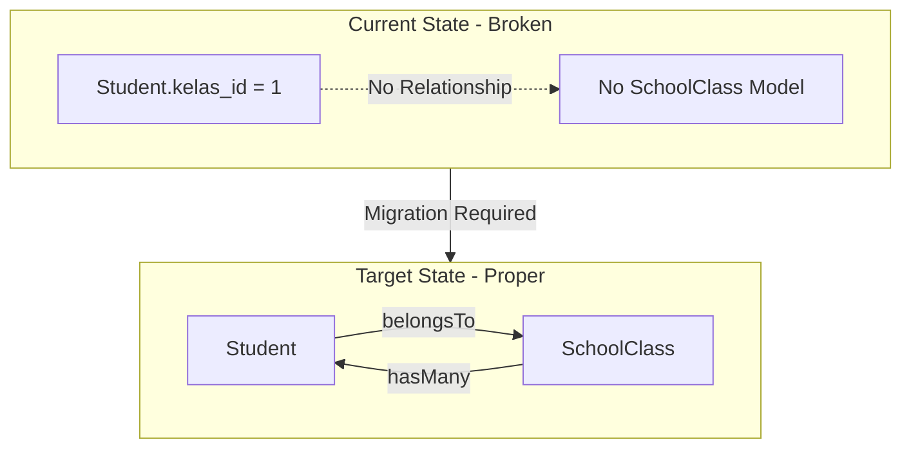
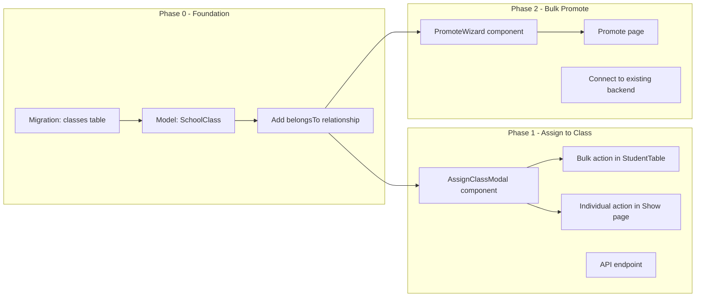

# Assign Student to Class & Bulk Promote - Development Strategy

## Phase 1: Feature Understanding

### Current State Analysis

| Component | Status | Notes |
|-----------|--------|-------|
| Student model | Exists | Has `kelas_id` as raw integer (no FK) |
| SchoolClass model | **MISSING** | Critical dependency |
| classes table | **MISSING** | `kelas_id` has no relationship |
| StudentService | Exists | Has `bulkPromoteStudents()` |
| StudentController | Exists | Has `promote()` endpoint |
| Promote Route | Exists | `POST /admin/students/promote` |
| Promote Frontend | **MISSING** | No wizard UI |
| Assign to Class | **MISSING** | Not implemented at all |

### Key Files Reference

- [`app/Models/Student.php`](app/Models/Student.php) - Has `kelas_id` field, no `belongsTo` relationship
- [`app/Services/StudentService.php`](app/Services/StudentService.php) - Line 209-245: `bulkPromoteStudents()` method exists
- [`app/Http/Controllers/Admin/StudentController.php`](app/Http/Controllers/Admin/StudentController.php) - Line 357-387: `promote()` method exists
- [`resources/js/pages/Admin/Students/Index.vue`](resources/js/pages/Admin/Students/Index.vue) - Uses mock class data (line 23-30)

---

## Phase 2: Cross-Frontend Impact Mapping

| Feature | Owner (Who Creates) | Consumer (Who Views) | Data Flow |
|---------|---------------------|----------------------|-----------|
| Assign Student to Class | TU @ `/admin/students` (bulk action) OR `/admin/students/{id}` (individual) | TU, Guru, Principal @ student list/detail | Select Students -> Choose Class -> Update `kelas_id` + Insert History |
| Bulk Promote (Naik Kelas) | TU @ `/admin/students/promote` wizard | TU @ preview, All roles @ updated list | Step 1: Select Year -> Step 2: Select Class -> Step 3: Preview & Confirm -> Bulk Update |

---

## Phase 3: Gap Analysis

### Critical Prerequisite Gap



### Feature 1: Assign Student to Class (NEW)

| Requirement | Status | Priority |
|-------------|--------|----------|
| SchoolClass model + migration | MISSING | P0 (Blocker) |
| Assign single student UI (modal) | MISSING | P0 |
| Bulk assign UI (from list) | MISSING | P0 |
| StudentService.assignToClass() | MISSING | P0 |
| Class history insert | PARTIAL | Reuse existing |

### Feature 2: Bulk Promote

| Requirement | Status | Priority |
|-------------|--------|----------|
| Backend logic | EXISTS | - |
| 3-step wizard UI | MISSING | P0 |
| Step 1: Year selection | MISSING | P0 |
| Step 2: Class selection | MISSING | P0 |
| Step 3: Preview with checkboxes | MISSING | P0 |
| Success notification | PARTIAL | Exists in controller |

---

## Phase 4: Implementation Sequencing



### Priority Matrix

| Task | Priority | Depends On | Est. Hours |
|------|----------|------------|------------|
| Create `classes` migration | P0 | - | 0.5h |
| Create `SchoolClass` model | P0 | migration | 0.5h |
| Add `belongsTo` to Student | P0 | SchoolClass model | 0.25h |
| Update StudentController.index | P0 | SchoolClass model | 0.5h |
| AssignClassModal.vue | P0 | SchoolClass model | 2h |
| Bulk assign action in table | P0 | AssignClassModal | 1h |
| Individual assign in Show | P1 | AssignClassModal | 1h |
| PromoteWizard.vue | P0 | SchoolClass model | 3h |
| Promote.vue page | P0 | PromoteWizard | 1h |
| Navigation menu update | P1 | Pages ready | 0.5h |

---

## Phase 5: Detailed Recommendations

### New Database Table

```sql
-- classes table
CREATE TABLE classes (
    id BIGINT PRIMARY KEY,
    tingkat TINYINT NOT NULL,           -- 1-6 untuk SD
    nama VARCHAR(10) NOT NULL,          -- A, B, C
    nama_lengkap VARCHAR(20),           -- 1A, 1B (computed/stored)
    wali_kelas_id BIGINT NULL,          -- FK to users (teachers)
    kapasitas INT DEFAULT 30,
    tahun_ajaran VARCHAR(9) NOT NULL,   -- 2024/2025
    is_active BOOLEAN DEFAULT true,
    created_at, updated_at
);
```

### New Files to Create

**Backend:**
- `database/migrations/xxxx_create_classes_table.php`
- `app/Models/SchoolClass.php`
- `app/Http/Controllers/Admin/ClassController.php` (basic CRUD for settings)
- `app/Http/Requests/Admin/AssignClassRequest.php`

**Frontend:**
- `resources/js/pages/Admin/Students/Promote.vue` - Wizard page
- `resources/js/components/features/students/AssignClassModal.vue` - Reusable modal
- `resources/js/components/features/students/PromoteWizard.vue` - 3-step wizard

### Files to Modify

**Backend:**
- [`app/Models/Student.php`](app/Models/Student.php) - Add `kelas()` relationship
- [`app/Http/Controllers/Admin/StudentController.php`](app/Http/Controllers/Admin/StudentController.php) - Add `assignClass()` method, update `index()` to load classes
- [`app/Services/StudentService.php`](app/Services/StudentService.php) - Add `assignStudentsToClass()` method
- [`routes/web.php`](routes/web.php) - Add routes for promote page and assign

**Frontend:**
- [`resources/js/pages/Admin/Students/Index.vue`](resources/js/pages/Admin/Students/Index.vue) - Add bulk assign action, link to promote
- [`resources/js/pages/Admin/Students/Show.vue`](resources/js/pages/Admin/Students/Show.vue) - Add individual assign button
- [`resources/js/components/features/students/StudentTable.vue`](resources/js/components/features/students/StudentTable.vue) - Add checkbox selection, bulk actions

---

## Phase 6: User Journeys

### Journey 1: TU Assign Single Student to Class

1. TU navigates to: `/admin/students/{id}` (student detail)
2. TU clicks: "Pindah Kelas" button
3. Modal opens with:
   - Current class displayed (read-only)
   - Dropdown: Select new class
   - Optional: Textarea for reason
4. TU selects new class, clicks "Simpan"
5. System: Update `kelas_id`, insert `student_class_history`
6. TU sees: Success toast, class updated in UI

### Journey 2: TU Bulk Assign Students to Class

1. TU navigates to: `/admin/students` (list)
2. TU checks multiple student checkboxes
3. TU clicks: "Pindah Kelas" bulk action button
4. Modal opens with:
   - Count: "5 siswa dipilih"
   - Dropdown: Select target class
5. TU selects class, clicks "Pindahkan"
6. System: Bulk update all students
7. TU sees: Success toast with count

### Journey 3: TU Bulk Promote (Naik Kelas Wizard)

1. TU navigates to: `/admin/students` (list)
2. TU clicks: "Naik Kelas" button in header
3. **Step 1 - Pilih Tahun:**
   - Dropdown: Tahun ajaran asal (2024/2025)
   - Dropdown: Tahun ajaran tujuan (2025/2026)
   - Button: "Lanjut"
4. **Step 2 - Pilih Kelas:**
   - Dropdown: Kelas asal (1A)
   - Dropdown: Kelas tujuan (2A)
   - Button: "Lanjut"
5. **Step 3 - Preview:**
   - Table: All students from source class with checkboxes
   - All selected by default
   - TU unchecks students who don't promote
   - Summary: "25 dari 28 siswa akan naik kelas"
   - Button: "Proses Naik Kelas"
6. Confirmation modal: "Yakin?"
7. System: Bulk update via existing `StudentService.bulkPromoteStudents()`
8. TU sees: Success message with count

---

## Phase 7: Implementation Todos

### Sprint Structure

**Sprint 0 (Day 1):** Foundation
- Create `classes` table migration
- Create `SchoolClass` model with relationships
- Update `Student` model with `belongsTo('kelas')`
- Seed sample class data

**Sprint 1 (Day 2-3):** Assign to Class Feature
- Create `AssignClassModal.vue` component
- Implement bulk selection in `StudentTable.vue`
- Add bulk assign action to `Index.vue`
- Add individual assign to `Show.vue`
- Create backend endpoint

**Sprint 2 (Day 4-5):** Bulk Promote Feature
- Create `PromoteWizard.vue` component
- Create `Promote.vue` page
- Connect to existing backend
- Add navigation link

**Sprint 3 (Day 6):** Polish & Testing
- Mobile responsive testing
- Error handling
- Loading states
- Unit/Feature tests
